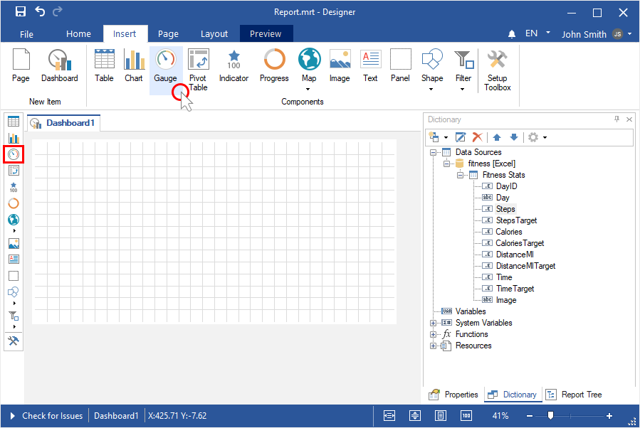
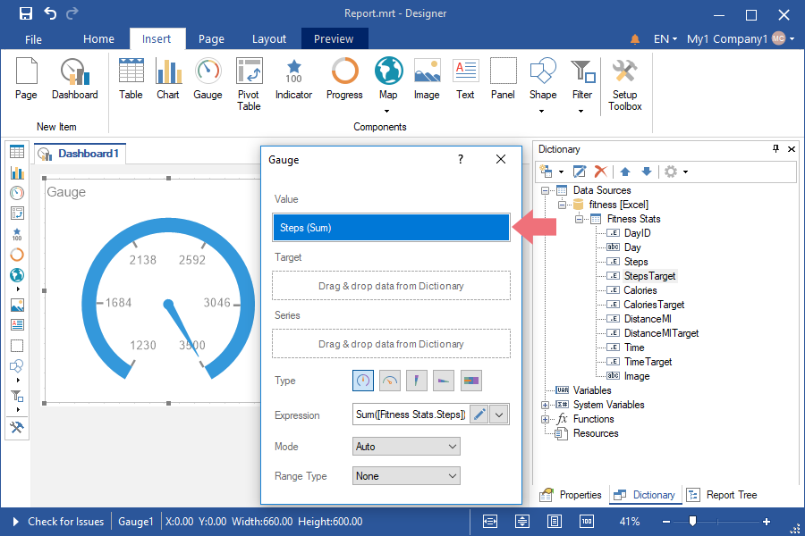
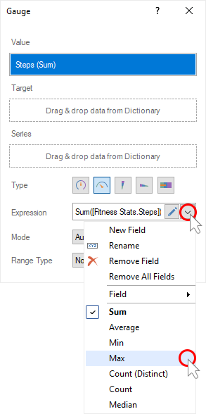
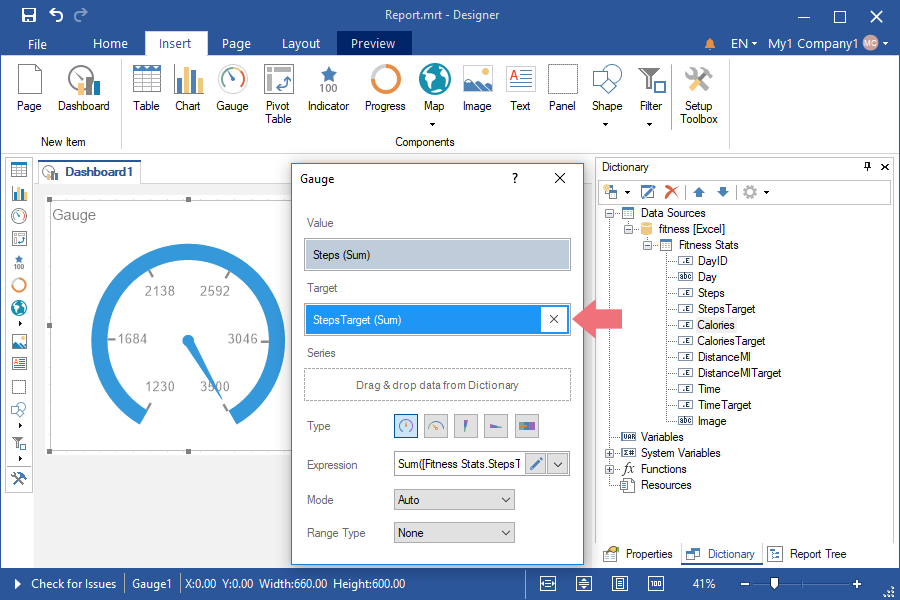
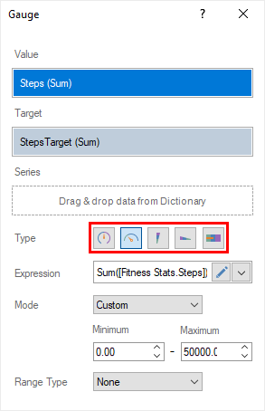
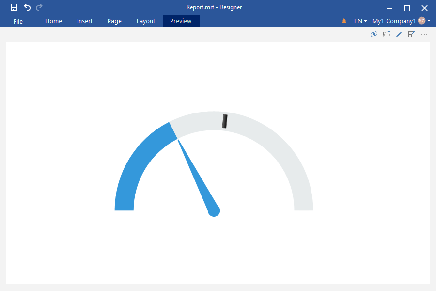
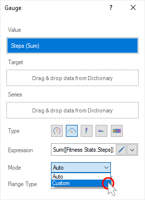
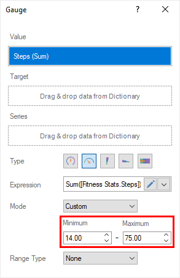
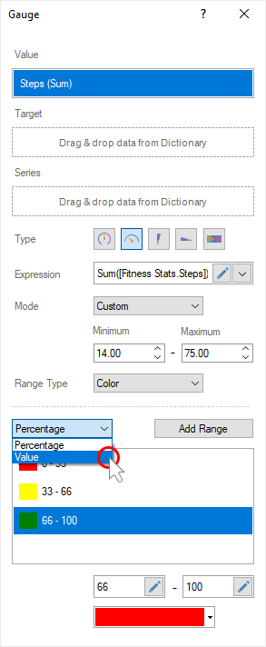
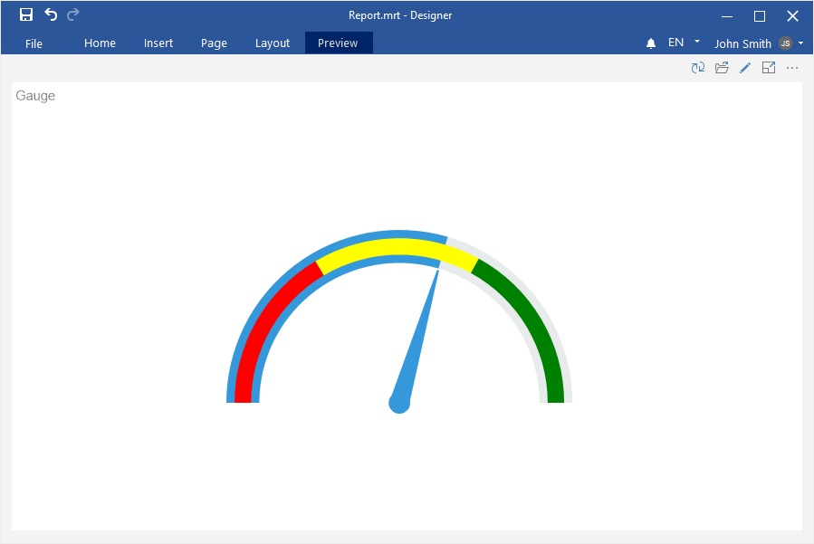

## Dashboard with Gauge

This chapter will cover issues such as:

* [Adding a gauge](#addingagauge);

* [Custom range of values](#customrangeofvalues);

* [Color Range](#colorrange).

**Adding a gauge**

To create an dashboard panel with the [Gauge](../Dashboards/Gauge.md) element, you should do the following steps:

**Step 1**: [Run the report designer](Install_and_First_Run.md#rundesigner);

**Step 2**: [Create a dashboard](Creating_Dashboard.md) or [add it to a current report](Creating_Dashboard.md#addingadashboardtothecurrentreport);

**Step 3**: [Connect data](Connecting_Data.md);

**Step 4**: Select the **Gauge** element in the toolbox of the report designer or on the **Insert** tab;

**Step 5**: Put the item on the dashboard panel;

**Step 6**: If the item editor did not open, double-click on the gauge;

**Step 7**: Drag the required data columns from the data dictionary;

**Step 8**: By default, columns will be added to the **Values** field of the gauge;

**Step 9**: Select the data field;

**Step 10**: Click the **Browse** button in the **Expression** field and select the function of aggregating values, if necessary. By default, the **Sum()** function is used, which sums the values from the specified data column.

**Step 11**: Add a data column to the **Target** field. The target value will be displayed as a tick on the gauge scale.

**Step 12**: Click the **Browse** button in the **Expression** field and select the function of aggregating values, if necessary. By default, the **Sum()** function is used, which sums the values from the specified data column.

**Step 13**: Drag the data column into the Series field, if it is necessary to display a gauge for each value of the series;

**Step 14**: Change the type of the gauge;

**Step 15**: Close the **Gauge** editor;

**Step 16**: Go to Preview.

**Custom range of values**

Do the following to set a custom range of values:

**Step 1**: Call the editor of the gauge;

**Step 2**: Select the **Custom** value for the **Mode** parameter;

**Step 3**: Set the minimum and maximum value of the range of values;

**Step 4**: Close the Gauge editor.

**Color Range**

To enable the color scale of a range of values, you should do the following:

**Step 1**: Call the **Gauge** editor;

**Step 2**: Set the **Color** value for the **Range Type** parameter;

**Step 3**: Choose the option for calculating the color range - **Percentage** or **Value**;

**Step 4**: Add the required number of color ranges;

**Step 5**: Select the color range in the list;

**Step 6**: Set the start and end values of the current color range;

**Step 7**: Choose a color for the current range;

**Step 8**: Repeating steps 5-7, adjust all color ranges;

**Step 9**: Close the **Gauge** editor;

**Step 10**: Go to Preview.

