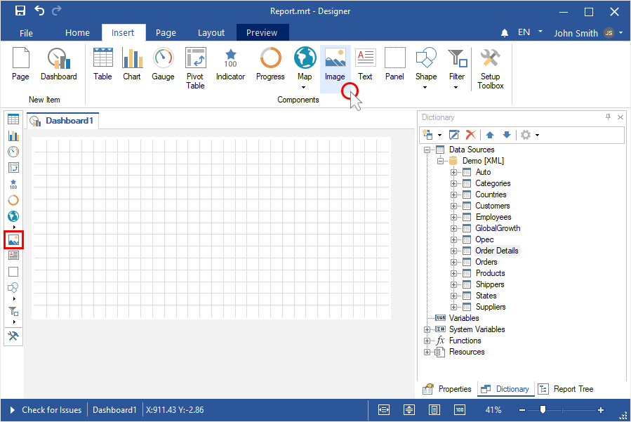
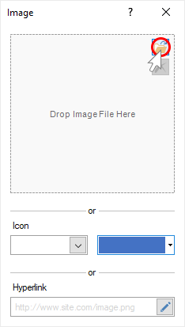
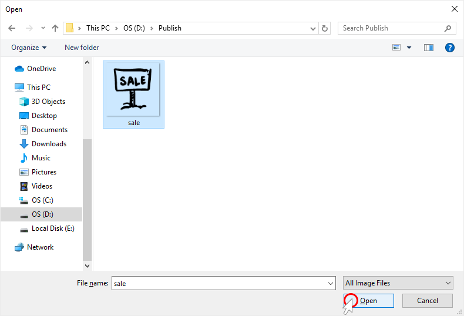
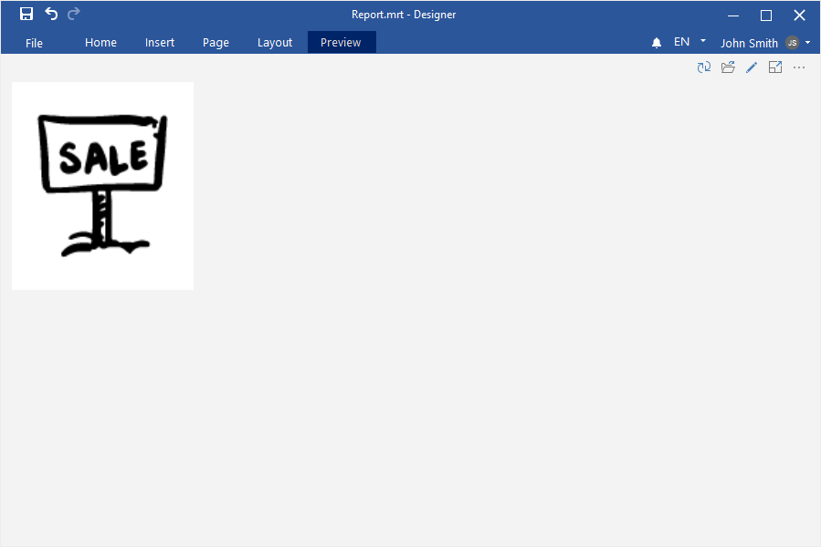
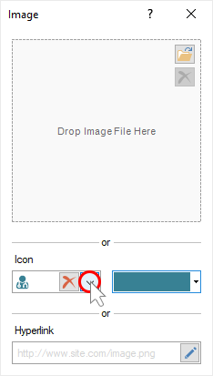
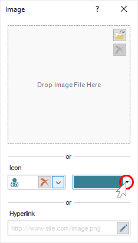
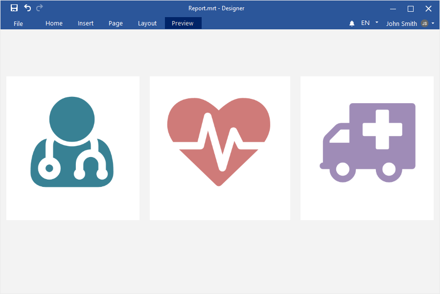
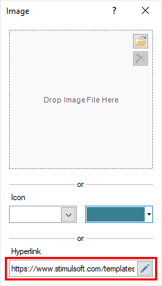
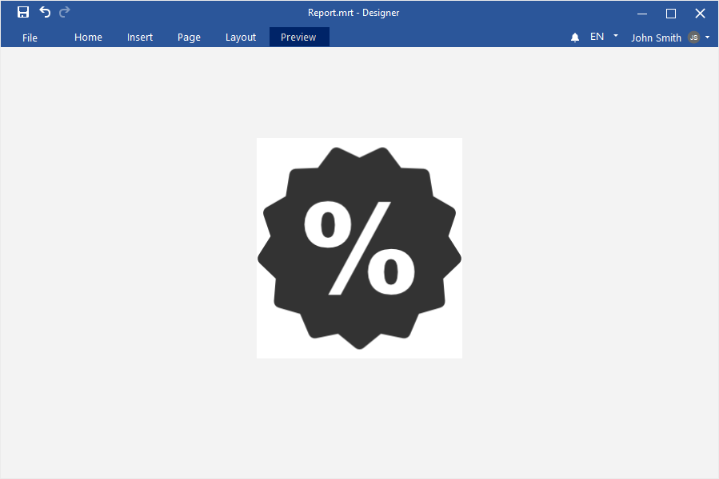
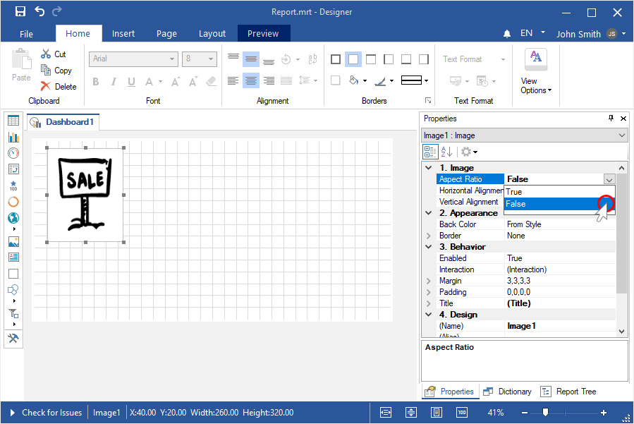

## Dashboard with Images

This chapter will cover the following:

* [Adding an Image element to the dashboard](#addingimage);

* [Download image from a local storage](#loadinganimagefromalocalstorage);

* [Using the icon in the Image element](#aniconintheimageelement);

* [Download image via hyperlink](#animagebyahyperlink);

* [Disabling aspect ratio](#aspectratio).

**Adding Image**

Step 1: [Run the report designer](Install_and_First_Run.md#rundesigner);

Step 2: [Create a dashboard](Creating_Dashboard.md) or [add it to a current report](Creating_Dashboard.md#addingadashboardtothecurrentreport);

Step 3: Select the Image element in the toolbox of the report designer or on the Insert tab;

Step 4: Place the item on the dashboard panel;

Step 5: If the element editor does not open, double-click on the image;

Step 6: Download the image from the [local storage](#loadinganimagefromalocalstorage), select the [icon](#aniconintheimageelement) or specify a [hyperlink](#animagebyahyperlink) to the image.

Loading an image from a local storage

Step 1: Double-click on the Image element to call the editor;

Step 2: Click the Open button;

Step 3: Select an image from the local storage, and click the Open button in the dialog box;

Step 4: Close the element editor;

Step 5: Go to the Preview.

An icon in the Image element

Step 1: Double-click on the Image element to call the editor;

Step 2: Click the Browse button in the Icon field, and select the icon in the drop-down list;

Step 3: Using the color palette element, you can change the color of the icon;

Step 4: Close the element editor;

Step 5: Go to the Preview.

An image by a hyperlink

Step 1: Double-click on the Image element to call the editor;

Step 2: Specify a link to the image in the Hyperlink field;

Step 4: Close the element editor;

Step 5: Go to the Preview.

Aspect ratio

By default, aspect ratio is enabled when loading an image. To disable the aspect ratio, you should do the following:

Step 1: Select the Image element;

Step 2: Set the value to False for the Aspect Ratio property.

