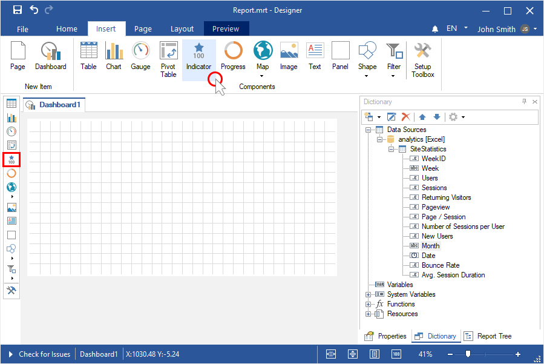
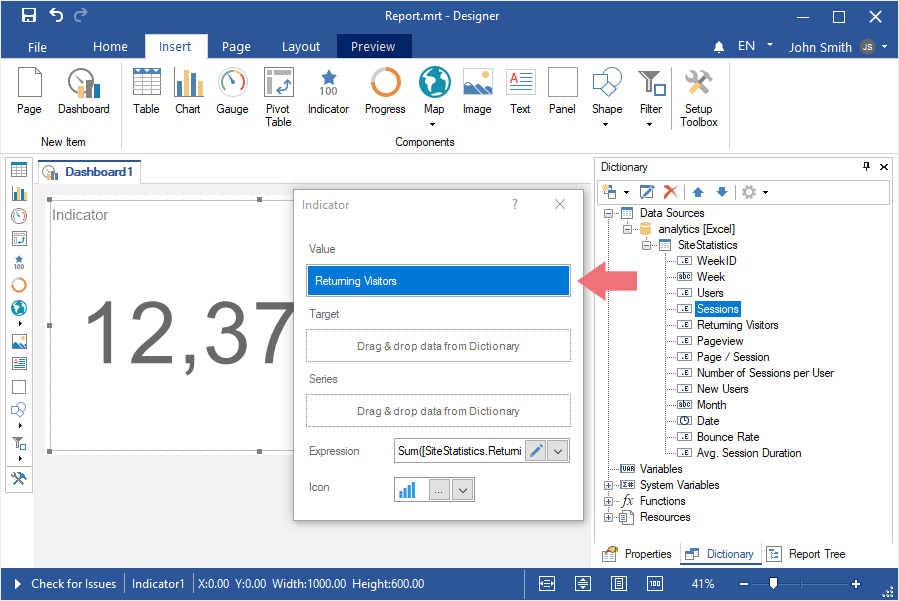
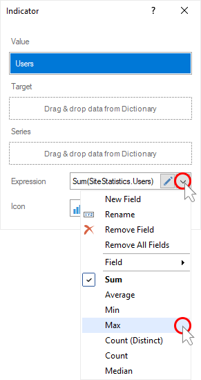
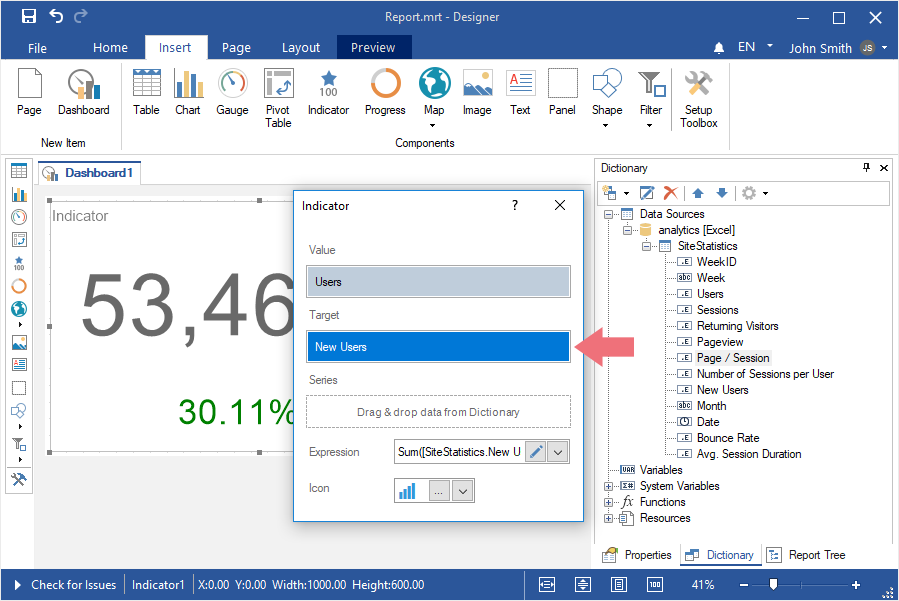
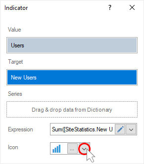
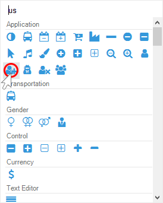
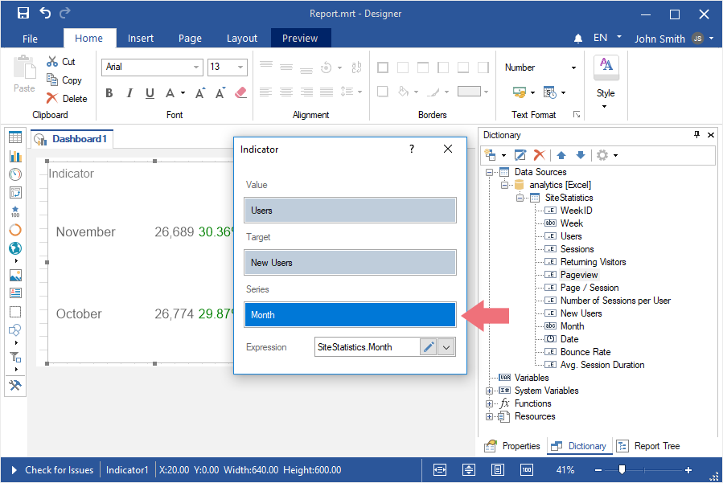
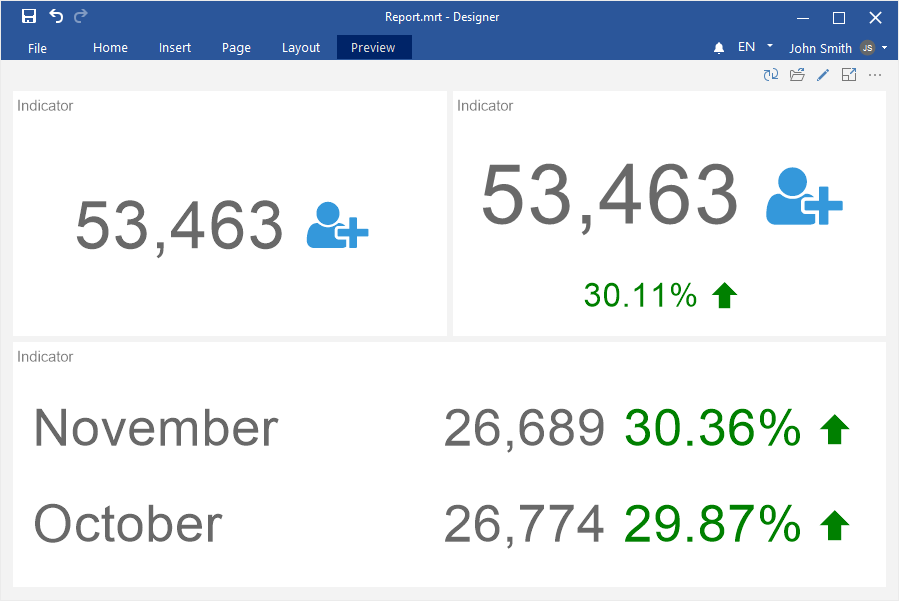

## Dashboard with Indicator

To create a dashboard panel with the [Indicator](../Dashboards/Indicator.md) element, you should do the following:

**Step 1**: [Run the report designer](Install_and_First_Run.md#rundesigner);

**Step 2**: [Create a dashboard](Creating_Dashboard.md) or [add it to a current report](Creating_Dashboard.md#addingadashboardtothecurrentreport);

**Step 3**: [Connect data](Connecting_Data.md);

**Step 4**: Select the **Indicator** element in the toolbox of the report designer or on the **Insert** tab;

**Step 5**: Put the item on the dashboard panel;

**Step 6**: If the item editor did not open, double-click on the indicator;

**Step 7**: Drag the required data columns from the data dictionary;

**Step 8**: By default, columns will be added to the **Values** field of the indicator;

**Step 9**: Click the **Browse** button in the **Expression** field and select the function of aggregating values, if necessary. By default, the **Sum()** function is used. It sums the values from the specified data column.

**Step 10**: Add a column to the **Target** field, if, in addition to the indicator value, it is necessary to calculate and display the deviation value in the current element;

**Step 11**: Click the **Browse** button in the **Expression** field and select the function of aggregating values, if necessary. By default, the **Sum()** function is used, which sums the values from the specified data column.

**Step 12**: Click the **Browse** button in the Icon field;

**Step 13**: Select an image for the indicator value;

**Step 14**: Drag the data column into the **Series** field, if it is necessary to display an indicator for each value of the series;

**Step 15**: Close the editor of the **Indicator** element;

**Step 16**: Go to the **Preview**.

