## Dashboard with Online Map

This chapter will cover the following:

* [Adding an Online Map element to the dashboard](#addinganonlinemap);

* [Online map by location](#onlinemapbylocation);

* [Online map by coordinates](#onlinemapbycoordinates);

* [Chart on an online map](#achartontheonlinemap);

* [Value on the online map](#avalueonanonlinemap);

* [Icon on an online map](#theonlinemapicon);

* [The color of geographic objects](#acolorofgeographicsobjects);

* [Color each](#coloreach);

* [Group color](#groupcolor);

* [Color value](#valuecolor);

* [Map culture](#mapculture).

Adding an online map

To add the Online Map to the dashboard panel, you should do the following steps:

Step 1: [Run the report designer](Install_and_First_Run.md#rundesigner);

Step 2: [Create a dashboard](Creating_Dashboard.md) or [add it to a current report](Creating_Dashboard.md#addingadashboardtothecurrentreport);

Step 3: [Connect data](Connecting_Data.md);

Step 4: Select the Online Map element in the toolbox of the report designer or on the Insert tab;

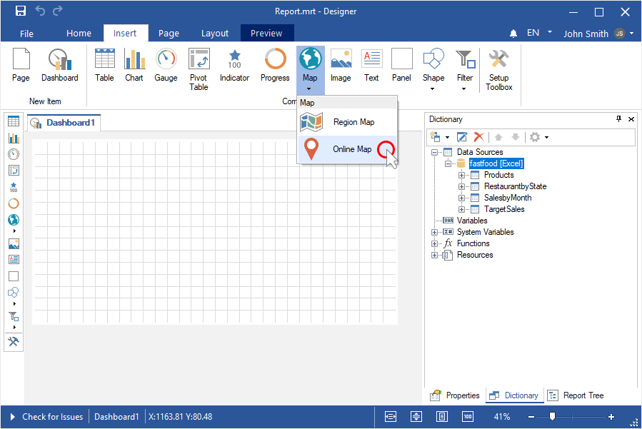

Step 5: Put the item on the analytical panel;

Step 6: If the item editor does not open, double-click on the online map.

Step 7: Add a data column with the [location of geographic elements](#onlinemapbylocation) or a [data columns with their coordinates](#onlinemapbycoordinates).

Online map by location

Step 1: Add a data column with the locations of geographic objects in the Location field;

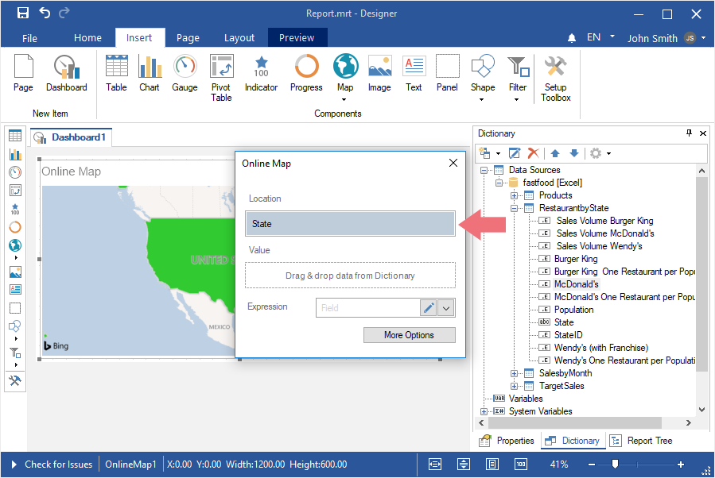

Step 2: Add a data column with the values of geographic objects in the Value field;

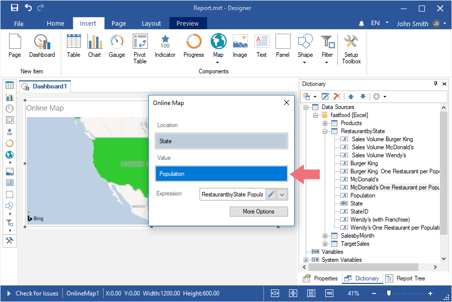

Step 3: Click the More Options button;

Step 4: Select a method for initializing geographic objects using the Type parameter;
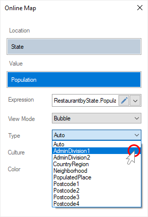

Step 5: Close the Online Map editor;

Step 6: Go to the Preview.

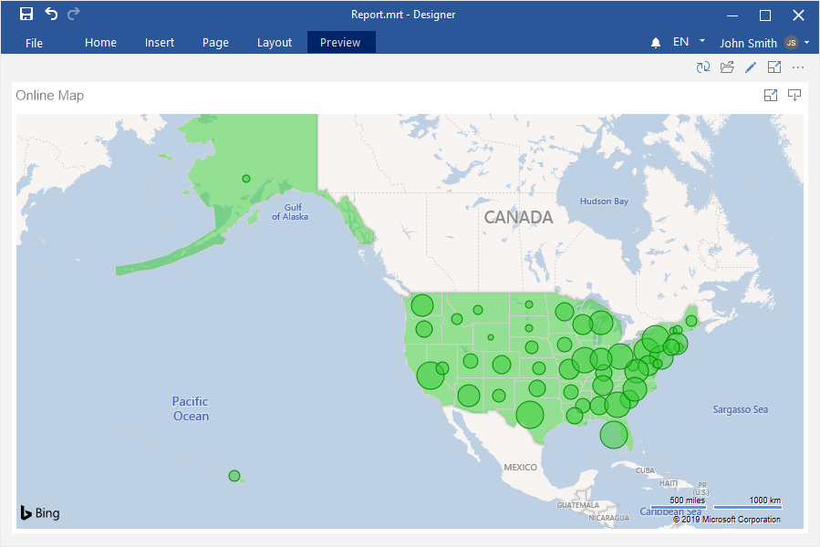

> **Information**
>
> By default, geographic objects are displayed on the map as bubbles. They can also be displayed as a [pie chart](#achartontheonlinemap), [values](#avalueonanonlinemap), [values with an icon](#theonlinemapicon).

Online map by coordinates

An online map by coordinates is used to display geographic objects and mark them with an icon. To display geographic objects by coordinates, you should do the following:

Step 1: Add a data column with the latitude of geographic objects in the Latitude field;

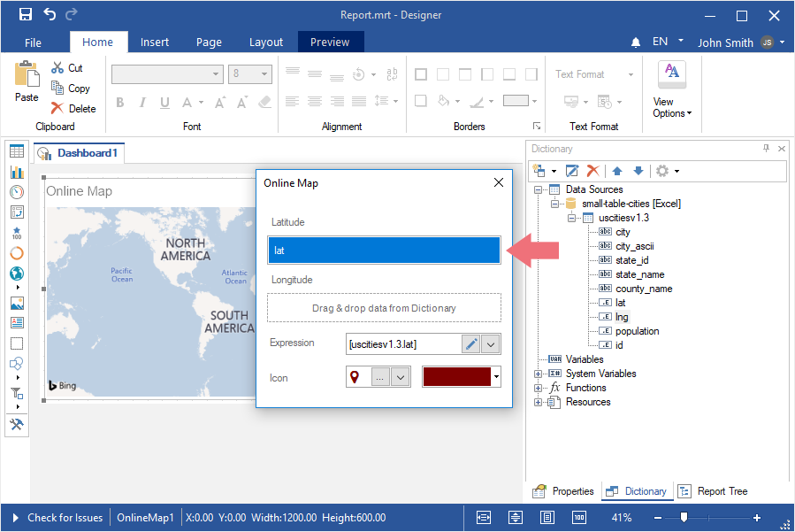

Step 2: Add a data column with the longitude of geographic objects in the Longitude field;

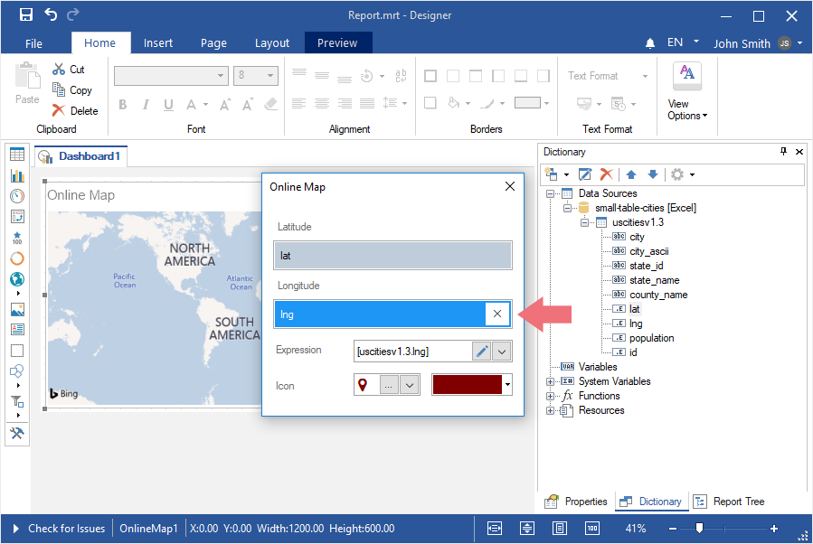

Step 3: In the Icon parameter field, click the Browse button on the local storage to load the user icon, or Browse to open the built-in list of icons;

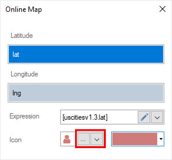

Step 4: If the icon is selected from the predefined list, then using the color palette control, you can change the color of the symbol;

Step 5: Close the element editor;

Step 6: Go to the Preview.

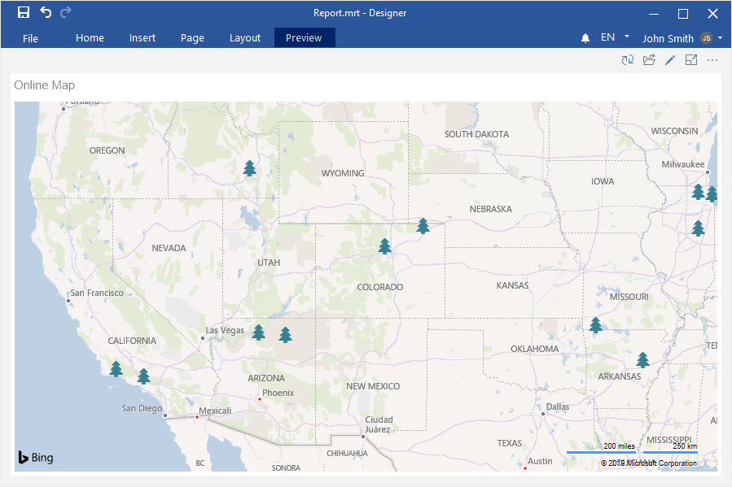

A chart on the Online map

This functionality is available only for [online map by location](#onlinemapbylocation). To display a chart of values on an online map, you should do the following:

Step 1: Double-click on the Online Map to call the editor;

Step 2: Click the More Options button;

Step 3: Select the Chart value for the View Mode parameter;

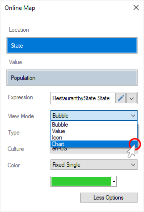

Step 4: Specify a data column with arguments for the chart in the Argument field;

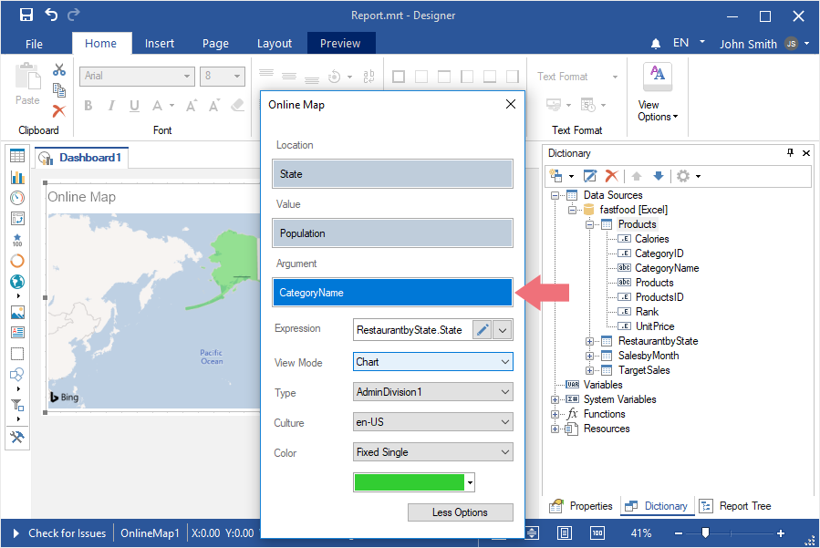

A value on an online map

This option is available only for [online map by location](#onlinemapbylocation). To display the values of geographic objects on an online map, you should do the following:

Step 1: Double-click on the Online Map to call the editor;

Step 2: Click the More Options button;

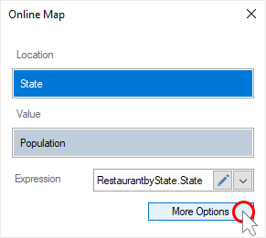

Step 3: Select Value for the View Mode parameter;

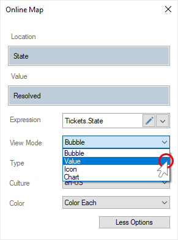

Step 4: Close the Online Map editor;

Step 5: Go to the Preview.

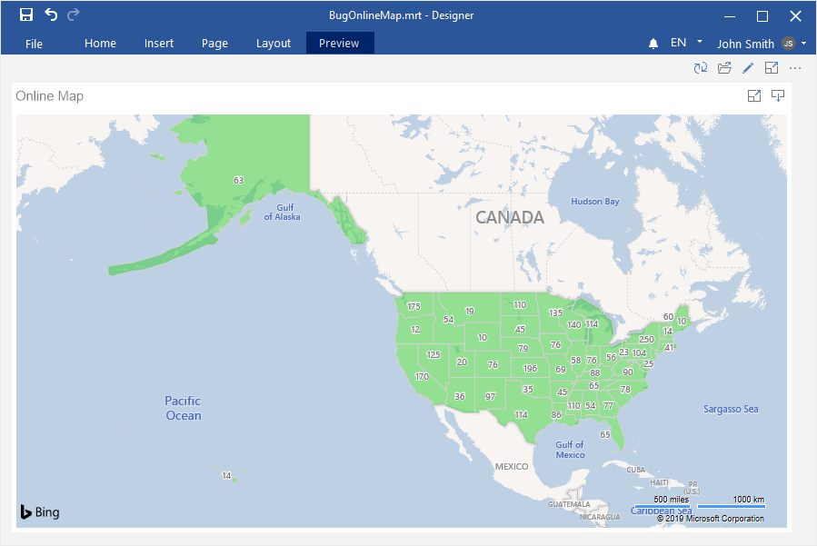

The Online map icon

An icon can be displayed along with the value of the geographic object. To do this, you should do the following:

Step 1: Double-click on the Online Map element to call the editor;

Step 2: Click the More Options button;

Step 3: Select the Icon value for the View Mode parameter;

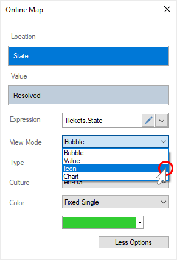

Step 4: In the Icon parameter field, click the Browse button of the local storage to load the user icon, or Browse to open the built-in list of icons;

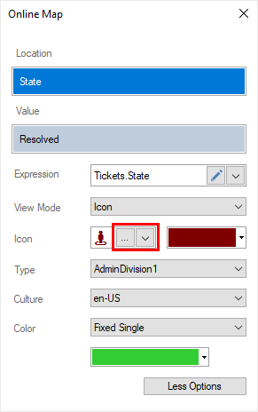

Step 5: If the icon is selected from the predefined list, then using the color palette control, you can change the color of the icon;

Step 6: Close the element editor;

Step 7: Go to the Preview.

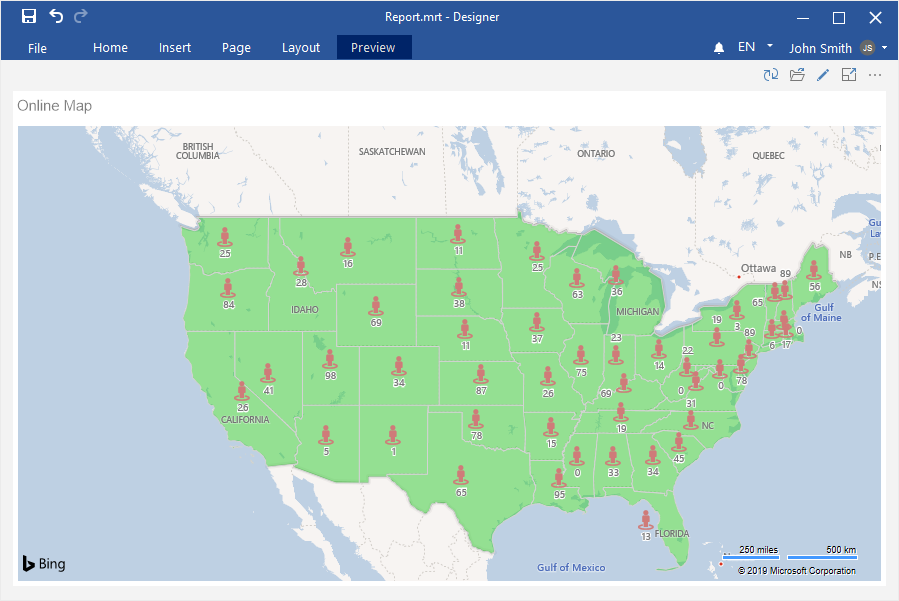

A color of geographic objects

This functionality is available only for [online map by location](#onlinemapbylocation). By default, geographic objects on the online map are colored with green. To change the color of geographic objects, you should do the following:

Step 1: Double-click on the Online Map element to call the editor;

Step 2: Click the More Options button;

Step 3: Set the Fixed Single value for the Color parameter;

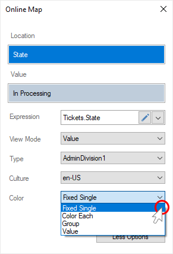

Step 4: Click the Browse button on the color palette control, and select a color for geographic objects;

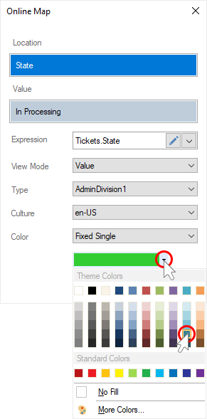

Step 5: Close the element editor;

Step 6: Go to the Preview.

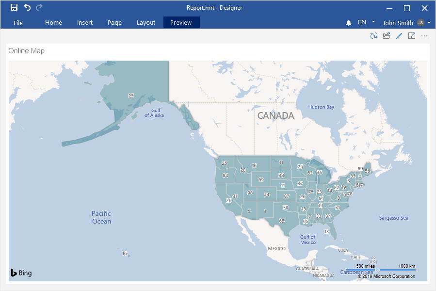

Color each

This functionality is available only for [online map by location](#onlinemapbylocation). On the online map, you can display geographic objects with an individual color. To do this, you should do the following:

Step 1: Double-click on the Online Map item to call the editor;

Step 2: Click the More Options button;

Step 3: Set the Color Each value for the Color parameter;

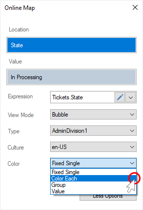

Step 4: Close the element editor;

Step 5: Go to the Preview.

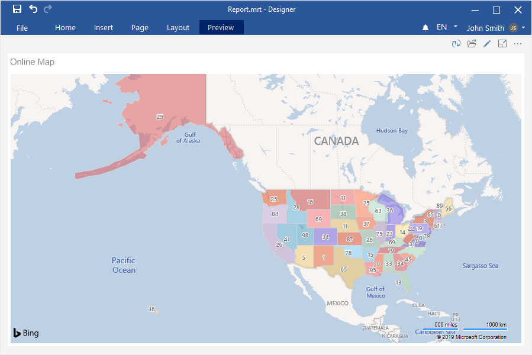

**Group color**

This feature is available only for [online map by location](#onlinemapbylocation). All geographic locations can be grouped by value, and a specific color will be applied to each group. To do this, you should do the following:

Step 1: Double-click on the Online Map item to call the editor;

Step 2: Click the More Options button;

Step 3: Set the Group value for the Color parameter;

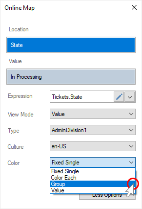

Step 4: Specify the data column with a list of colors for the groups in the Color Group field;

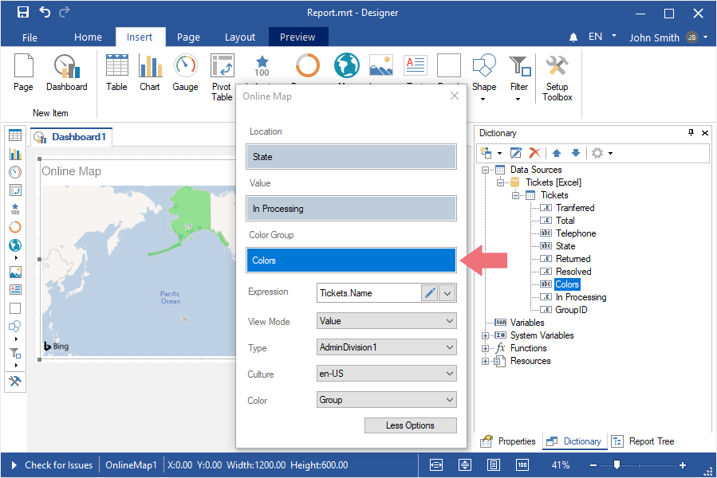

Step 5: Close the element editor;

Step 6: Go to the Preview.

Value color

This option is available only for [online map by location](#onlinemapbylocation). You can set a color for each geographic object. To do this, you should do the following:

Step 1: Double-click on the Online Map item to call the editor;

Step 2: Click the More Options button;

Step 3: Set Value for the Color parameter;

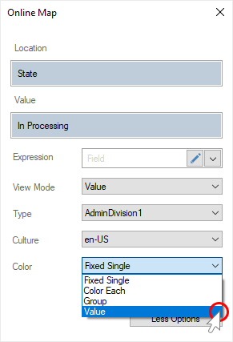

Step 4: Specify a data column with a list of colors for each geographic object in the Color Value field;

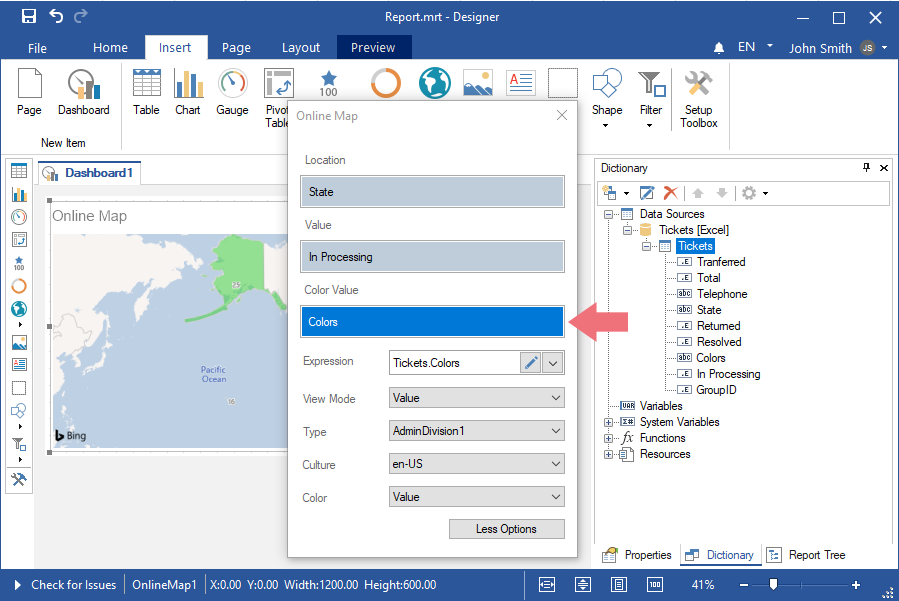

Step 5: Close the item editor;

Step 6: Go to the Preview.

Map culture

This option is available only for [online map by location](#onlinemapbylocation). To change the culture of the map, you should do the following:

Step 1: Double-click on the Online Map item to call the editor;

Step 2: Click the More Options button;

Step 3: Select the necessary culture as the value of the Culture parameter;

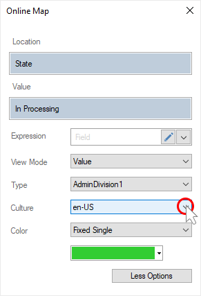

Step 4: Close the element editor;

Step 5: Go to the Preview.
