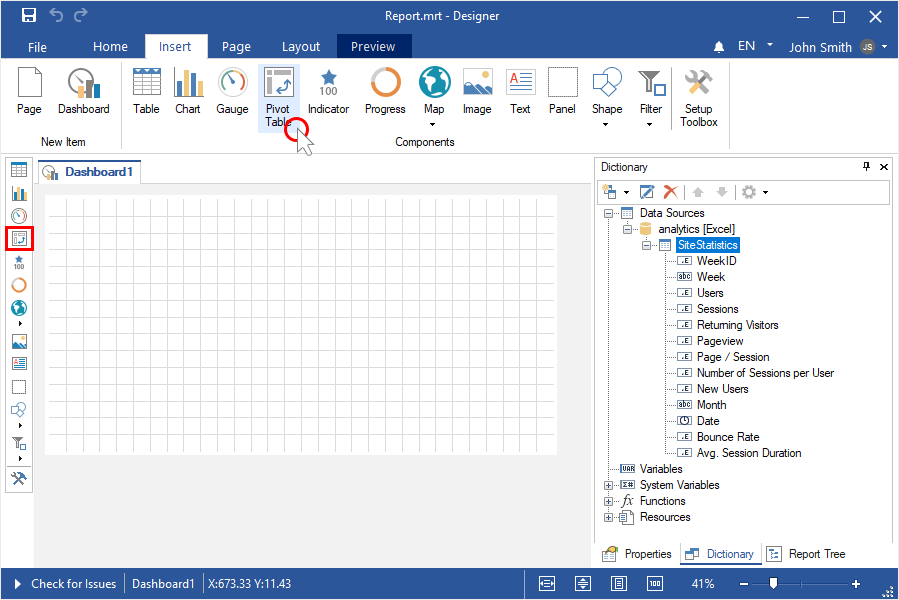
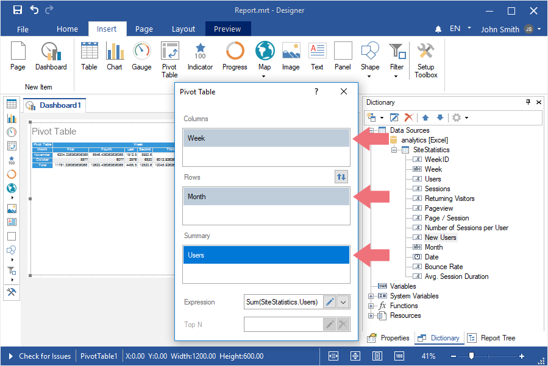
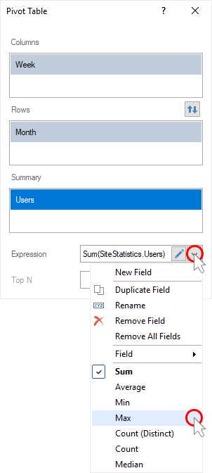
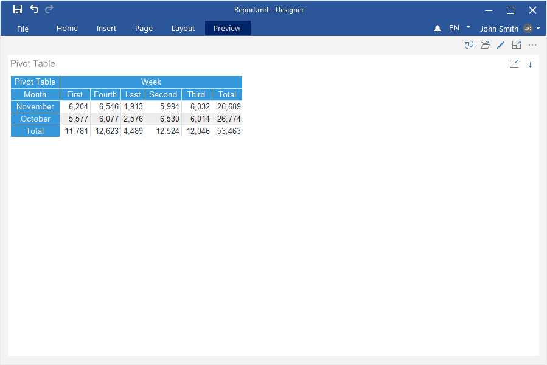
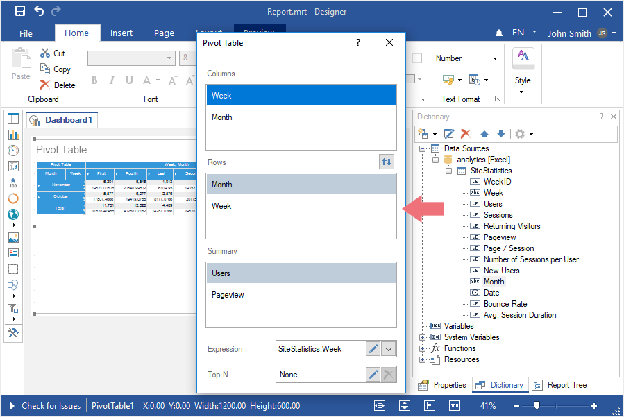
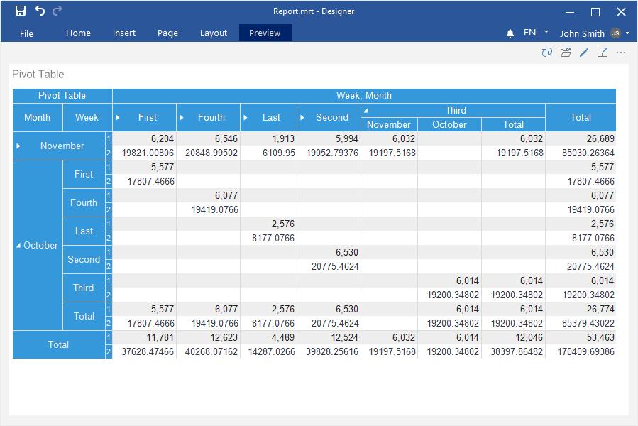

## Dashboard with Pivot Table

This chapter will cover the following:

* [Create a Pivot Table](#createapivottable);

* [Drill-down in a Pivot Table](#drilldowninthepivottable).

**Create a Pivot Table**

To create a dashboard panel with the [Pivot Table](../Dashboards/Pivot_Table.md) element, you should do the following steps:

Step 1: [Run the report designer](Install_and_First_Run.md#rundesigner);

Step 2: [Create a dashboard](Creating_Dashboard.md) or [add it to a current report](Creating_Dashboard.md#addingadashboardtothecurrentreport);

Step 3: [Connect data](Connecting_Data.md);

Step 4: Select the Pivot Table element in the toolbox of the report designer or on the Insert tab;

Step 5: Place the element on the dashboard panel;

Step 6: If the item editor does not open, double-click on the Pivot Table;

Step 7: Drag the necessary data columns from the data dictionary into the Rows, Columns, and Summary fields;

Step 8: Select the data field in the Summary field;

Step 9: Click the Browse button in the Expression field and select the function of aggregating values, if necessary. By default, the Sum() function is used, which sums the values from the specified data column.

Step 10: Close the Pivot editor;

Step 11: Go to Preview.

Drill-down in the Pivot Table

In this element, you can create a data hierarchy for rows or columns. To do this:

Step 1: Double-click on the element;

Step 2: Add several data columns to the Columns or Rows fields, depending on where you want to create a hierarchy;

> **Information**
>
> Please note that the first (upper) data column in the column list of the Columns or Rows fields is the main level for drill-down. The second column from the top is the second level, the third is the third one, etc.
>
>
> To change the level, move the data column up or down in the list of columns in a specific field.

Step 3: Close the Pivot editor;

Step 4: Go to the Preview;

Step 5: Click on a row or column cell to see the details;

