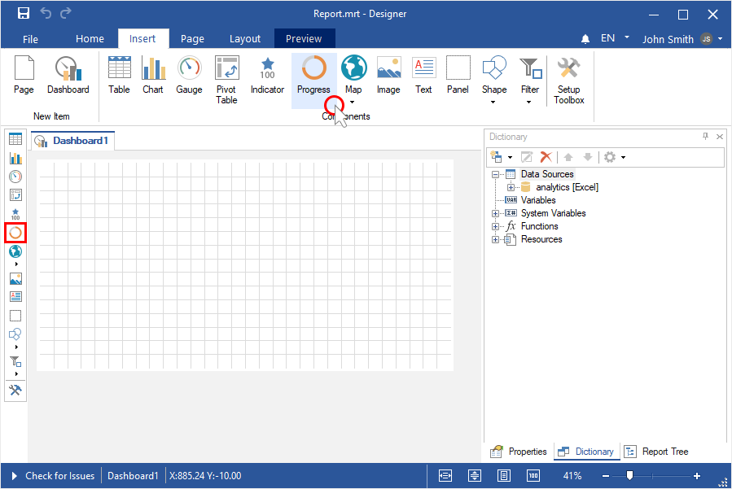
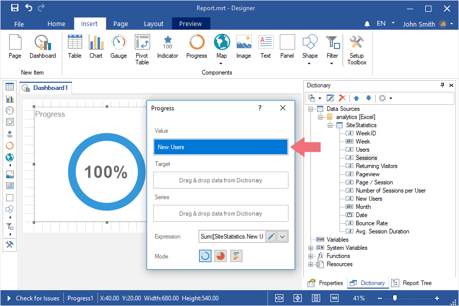
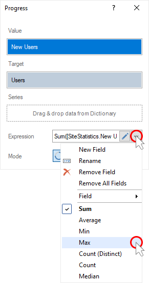
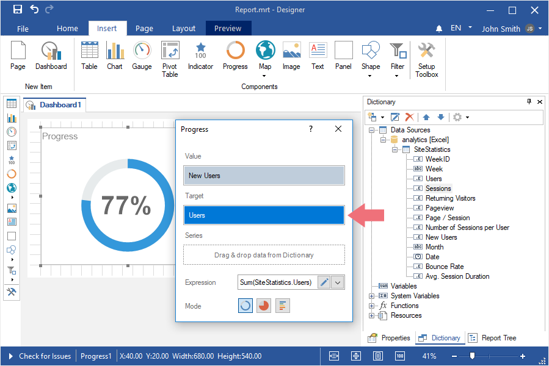
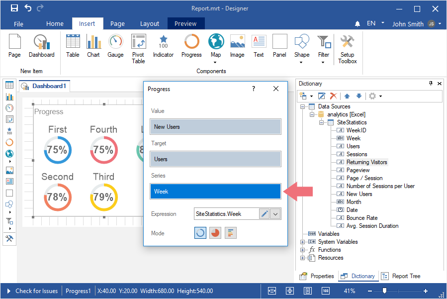
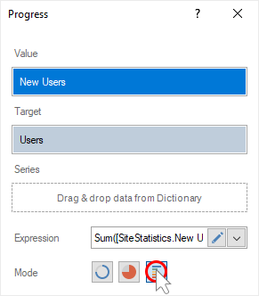
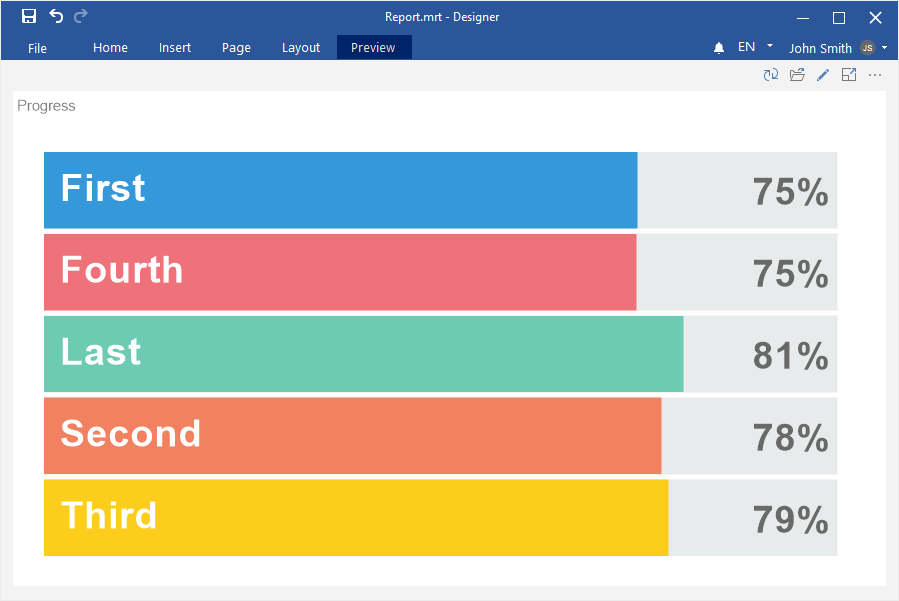

## Dashboard with Progress

To create a dashboard with the [Progress](../Dashboards/Progress.md) element, you should do the following:

Step 1: [Run the report designer](Install_and_First_Run.md#rundesigner);

Step 2: [Create a dashboard](Creating_Dashboard.md) or [add it to a current report](Creating_Dashboard.md#addingadashboardtothecurrentreport);

Step 3: [Connect data](Connecting_Data.md);

Step 4: Select the Indicator element in the toolbox of the report designer or on the Insert tab;

Step 5: Put the item on the dashboard panel;

Step 6: If the item editor did not open, double-click on the progress;

Step 7: Drag the required data columns from the data dictionary;

Step 8: By default, columns will be added to the Values field of the progress;

Step 9: Click the Browse button in the Expression field and select the function of aggregating values, if necessary. By default, the Sum() function is used. It sums the values from the specified data column.

Step 10: Add a column to the Target field to calculate the value of the current element;

Step 11: Click the Browse button in the Expression field and select the function of aggregating values, if necessary. By default, the Sum() function is used, which sums the values from the specified data column.

Step 12: Drag the data column into the Series field if it is necessary to display the progress for each value of the series;

Step 13: Change the type of Progress using the controls;

Step 14: Close the Progress editor;

Step 15: Go to the Preview.

