## Dashboard with Region Map

This chapter will cover issues such as:

* [Creating a Region Map](#creatingaregionmap);

* [Enabling short signatures](#shortsignatures);

* [Disabling values](#disablingvalues);

* [Color each](#coloreach);

* [Heatmap](#heatmap);

* [Map with a group](#amapwithgroup);

* [Heatmap with a group](#heatmapwithgrouping).

Creating a Region Map

To create a dashboard panel with the [Region Map](../Dashboards/Maps/Region_Map.md) element, you should do the following:

Step 1: [Run the report designer](Install_and_First_Run.md#rundesigner);

Step 2: [Create a dashboard](Creating_Dashboard.md) or [add it to a current report](Creating_Dashboard.md#addingadashboardtothecurrentreport);

Step 3: [Connect data](Connecting_Data.md);

Step 4: Select the Region Map element in the toolbox of the report designer or on the Insert tab;

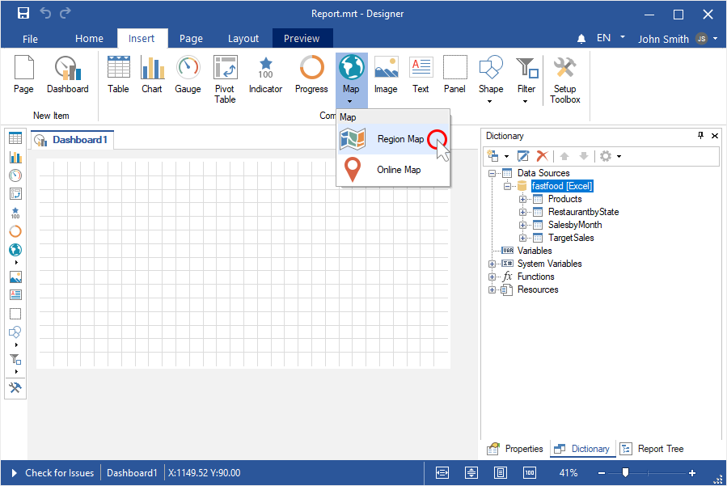

Step 5: Put the item on the dashboard panel;

Step 6: If the item editor did not open, double-click on the region map;
Step 7: Click the control to open the menu with a list of maps;

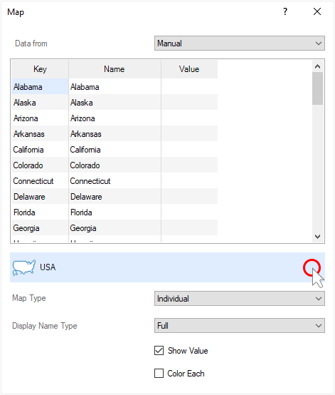

Step 8: Select the required map and click the OK button in this menu;

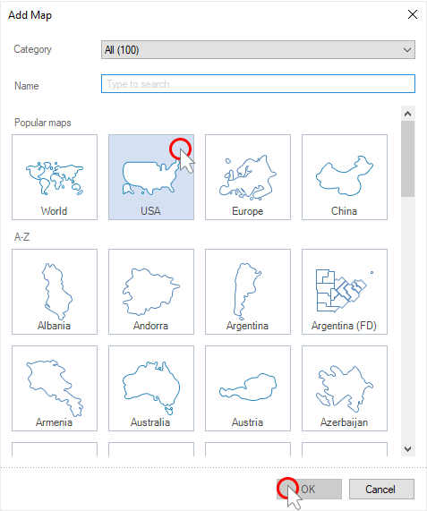

Step 9: Enter manually the values for the geographic objects of the map;

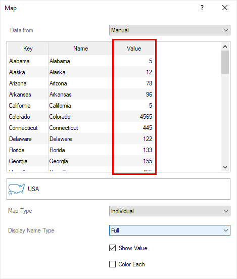

Step 10: Or set the Data from parameter to the Data Columns values;

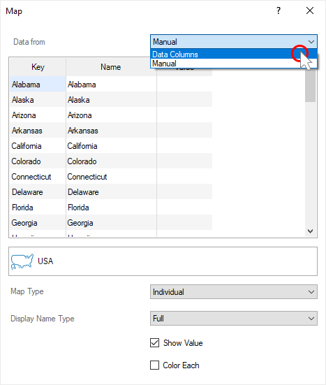

Step 11: Drag the data column with the keys of geographic objects in the Key field;

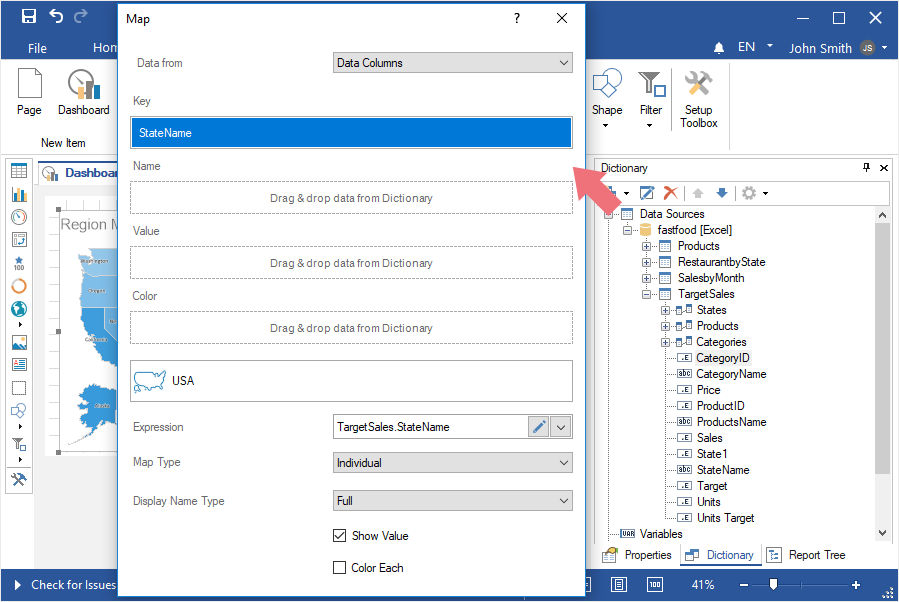

Step 12: Drag the data column with the values in the Value field;

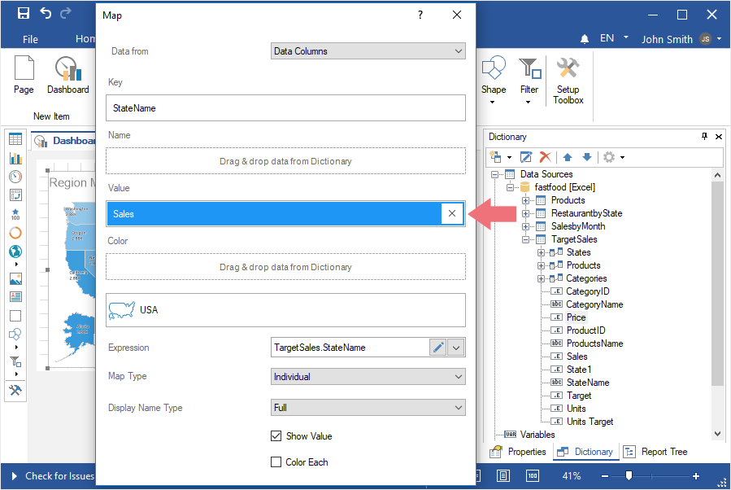

Step 13: You can also specify a data column with the names of geographic objects. If this data column is not specified, then the names of the geographic objects will be their keys.

Step 14: You can specify a data column with colors for geographic objects. If this data column is not specified, then geographic objects use color from the style. When you set a data column with colors of geographic objects, you should also enable the [Color Each](#ColorEach) option.

Step 15: Close the map editor;

Step 16: Go to the Preview.

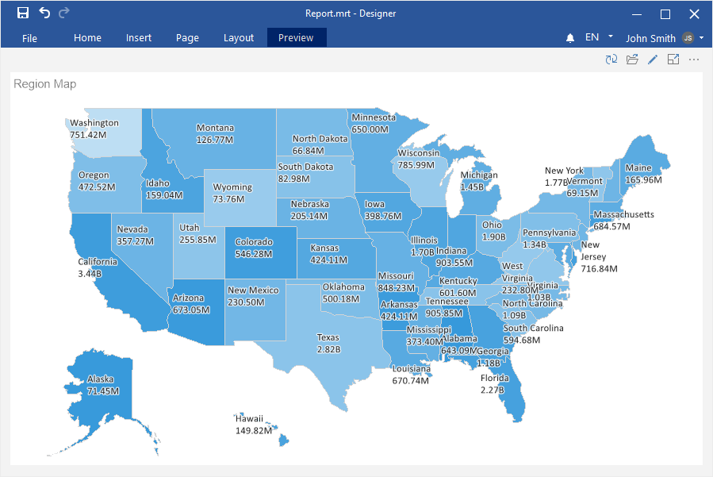

Short signatures

You can display or hide the names of geographic objects in a short form (ISO2). Do the following to achieve this:

Step 1: In the report designer, double-click on the Region map element to call the editor;

Step 2: For the Display Name Type parameter, set the value to None if you want to disable displaying signatures, or Short if you want to display short names of geographic objects.

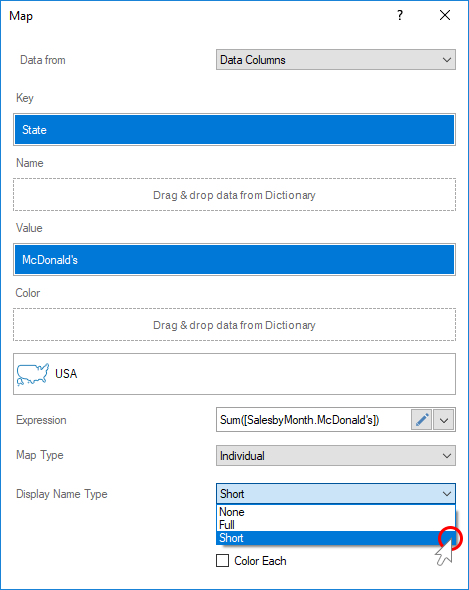

Disabling values

To disable the display of values on the geographic objects of the map, you should:

Step 1: In the report designer, double-click on the Region Map element to call the editor;

Step 2: Uncheck the Show Values option.

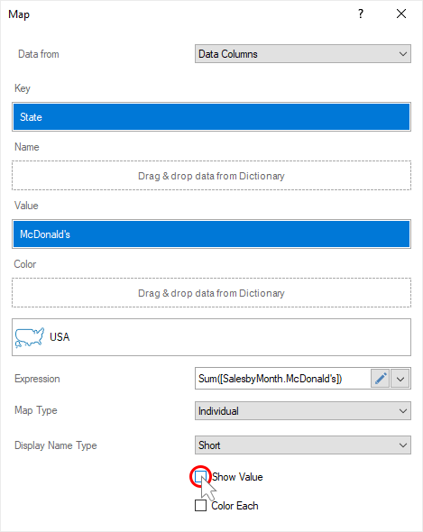

Color each

Each geographic object on the map can have an individual shade. Do the following to achieve this:

Step 1: In the report designer, double-click on the Region Map element to call the editor;

Step 2: Enable the Color Each option;

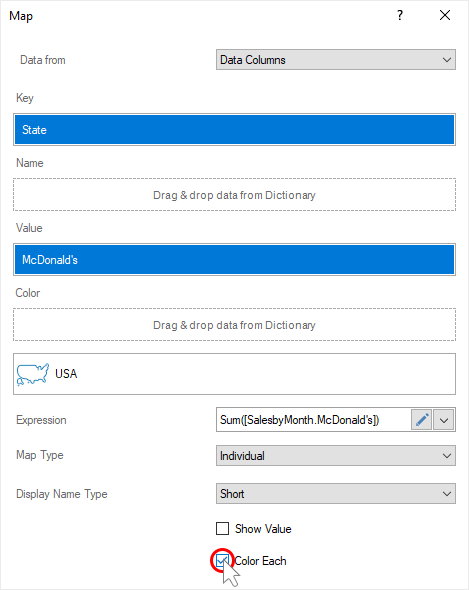

Step 3: Close the map editor;

Step 4: Go to the Preview.

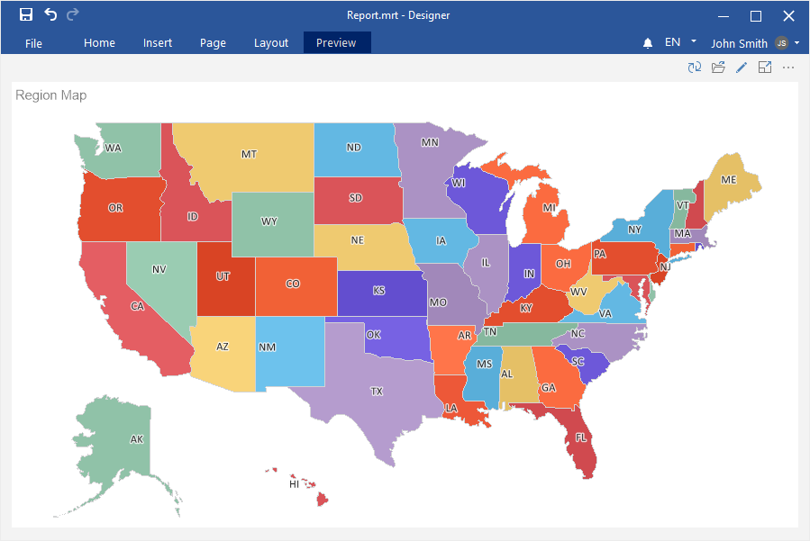

> **Information**
>
> Also, this parameter should be enabled if a data column with the colors of geographic objects in the Color field is specified.

Heatmap

To change the type of a regional map from individual to heatmap, you should:

Step 1: In the report designer, double-click on the Region Map element to call the editor;

Step 2: Set the Heatmap value for the Map Type parameter;

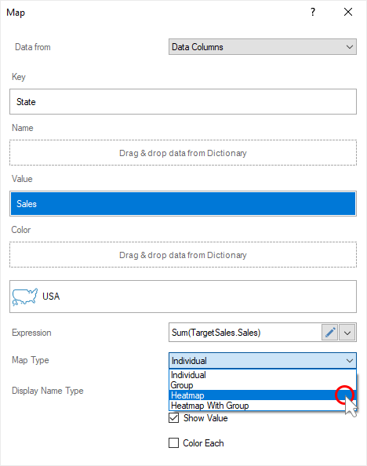

Step 3: Close the Map editor;

Step 4: Go to the Preview.

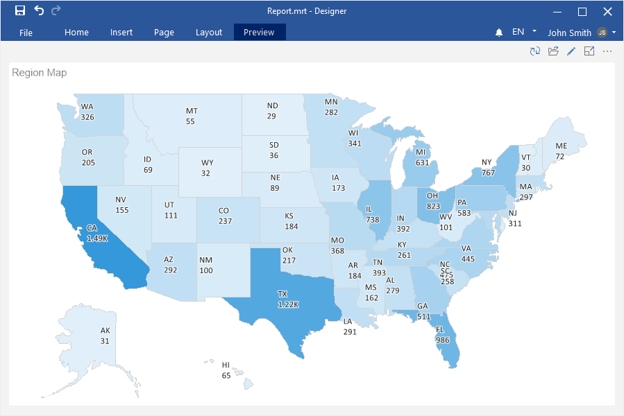

> **Information**
>
> To create a heatmap, the values of geographic objects should be specified manually or from data columns.

A map with a group

Geographic objects can be grouped on the map for any value. To do this:

Step 1: In the report designer, double-click on the Region map element to call the editor;

Step 2: Set the Group value of the Map Type parameter;

Step 3: Set the data column by the values of which geographic objects will be grouped in the Group field;

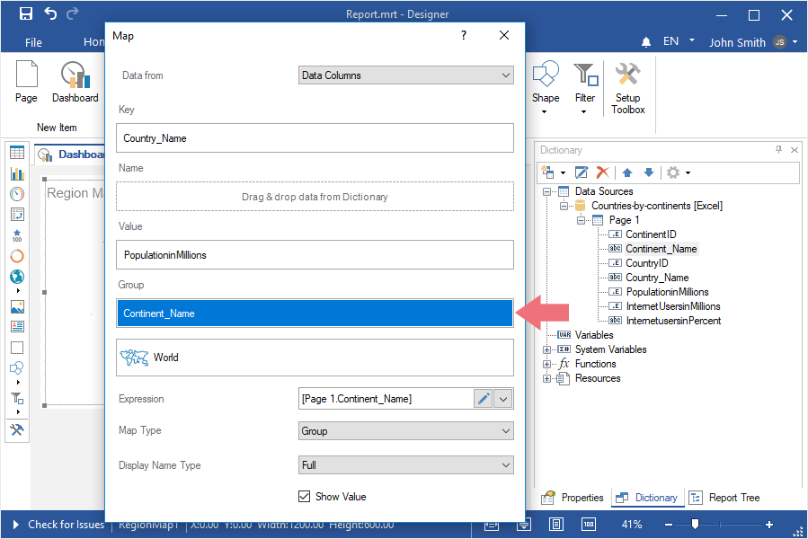

Step 4: Close the Map editor;

Step 5: Go to the Preview.

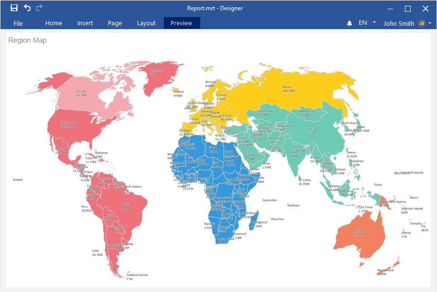

Heatmap with grouping

The geographic objects of the heatmap can be combined on the map for any value. To do this:

Step 1: Double-click on the Region map element in the report designer and call the editor;

Step 2: Set the Heatmap with Group value for the Map Type parameter;

Step 3: Specify the data column by the values of which geographic objects will be grouped in the Group field;

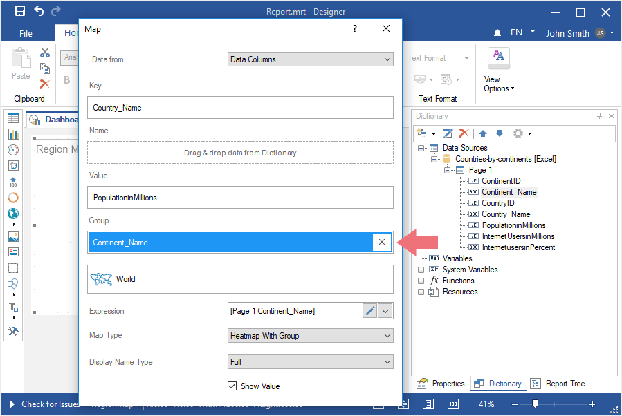

Step 4: Close the Map editor;

Step 5: Go to the Preview.

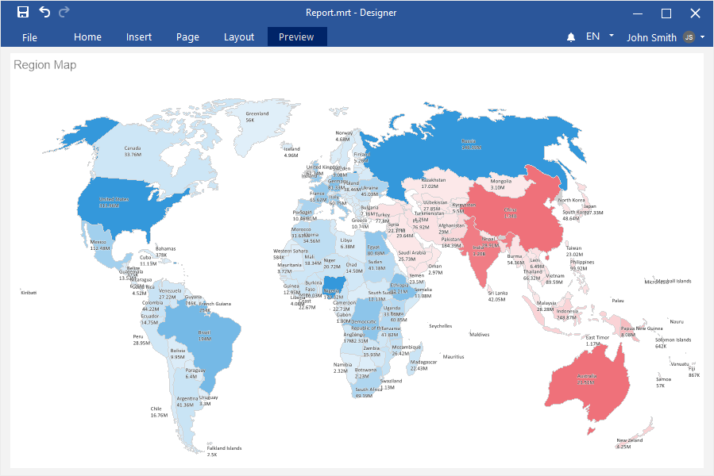
