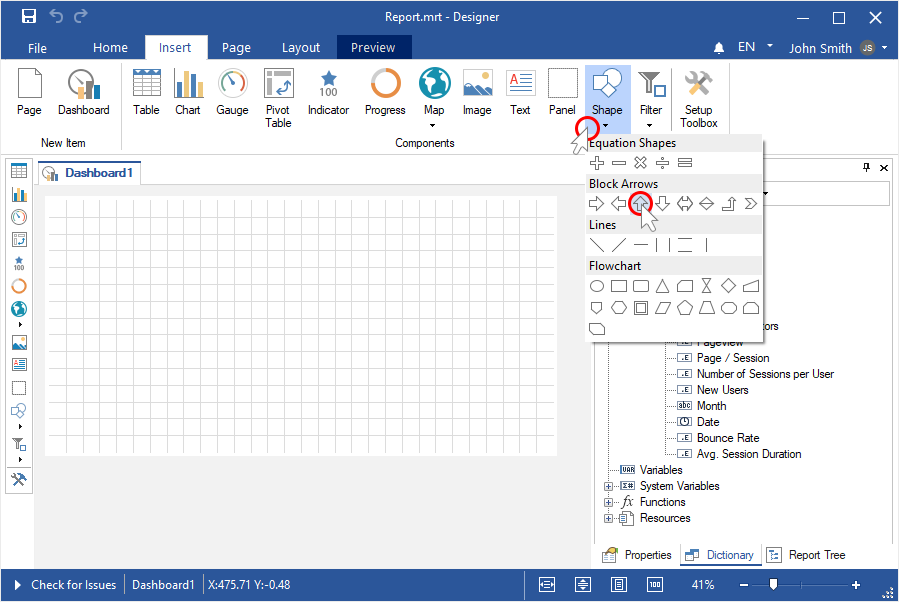
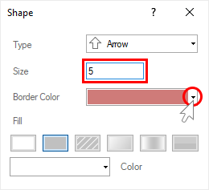
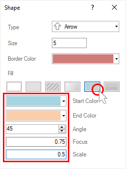
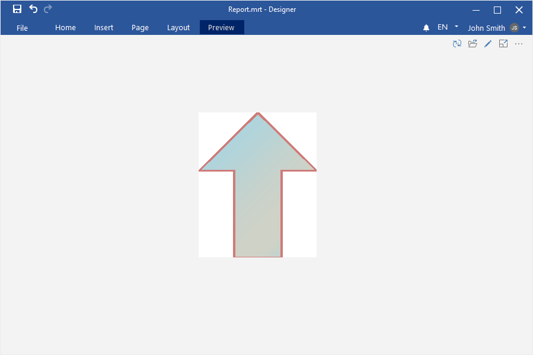

## Dashboards with Shapes

To create a dashboard with the [Shape element](../Dashboards/Shape.md), you should make the following actions:

Step 1: [Launch the report designer](Install_and_First_Run.md);
Step 2: [Create a dashboard](Creating_Dashboard.md) or [add it to an existing report](Creating_Dashboard.md#addingadashboardtothecurrentreport);

Step 3: Click on the Shape element in the Toolbox of the report designer or on the Insert tab;

Step 4: Select the type of the Shape;

Step 5: Place an element on the dashboard;
Step 6: If the element editor is not displayed, you should double click on the text;
Step 7: Specify stroke size of the current shape;

Step 8: Select stroke color with the help of the color palette element;

Step 9: Select the type of fill brush of the current shape;

Step 10: Depending on the type of brush you select, you should set the fill of the current shape with the help of parameters and controls;

Step 11: Close the element editor;
Step 12: Go to the Preview tab.

