## Sorting on a dashboard

The following questions will be considered in this chapter:

* [Sorting element data in the designer](#SortinInDesigner);

* [Sorting element data when viewing dashboards](#SortingInViewer);

* [Disable or enable the sort button when viewing](#AllowUserSorting);

* [Sorting data in a table](#SortingInTable);

* [Disable or enable sorting in a table](#AllowUserSortingInTable).

**Sorting element data in the designer**

To set element sorting you should make the following actions:
**Step 1**: Create or open a dashboard with [chart](Dashboard_with_Chart.md), [gauge](Dashboard_with_Gauge.md), [indicator](Dashboard_with_Indicator.md), [progress](Dashboard_with_Progress.md);

**Step 2**: Select an element;

**Step 3**: Move the cursor over this element and click the sort button;

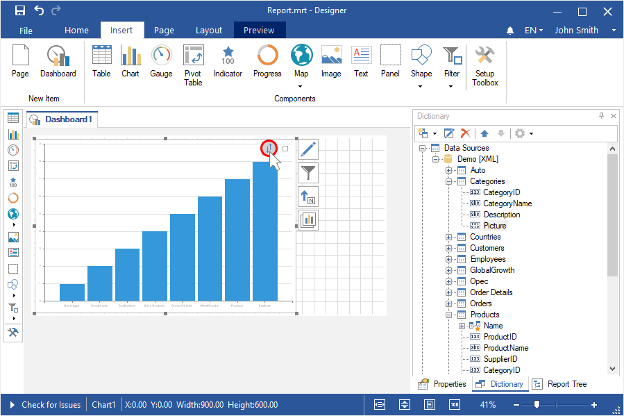

**Step 4**: Select the data field where you need to sort values;

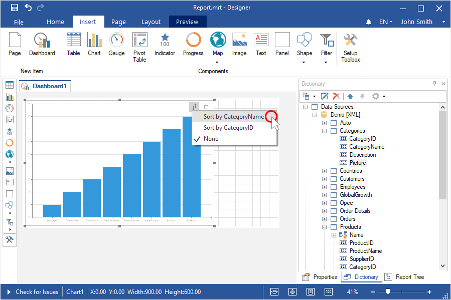

**Step 5**: Click the sort button and change the sort direction;

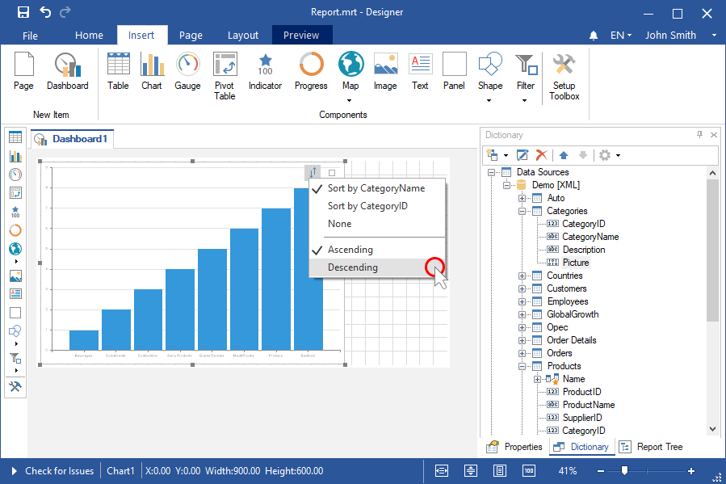

**Step 6**: Go to the Preview tab.

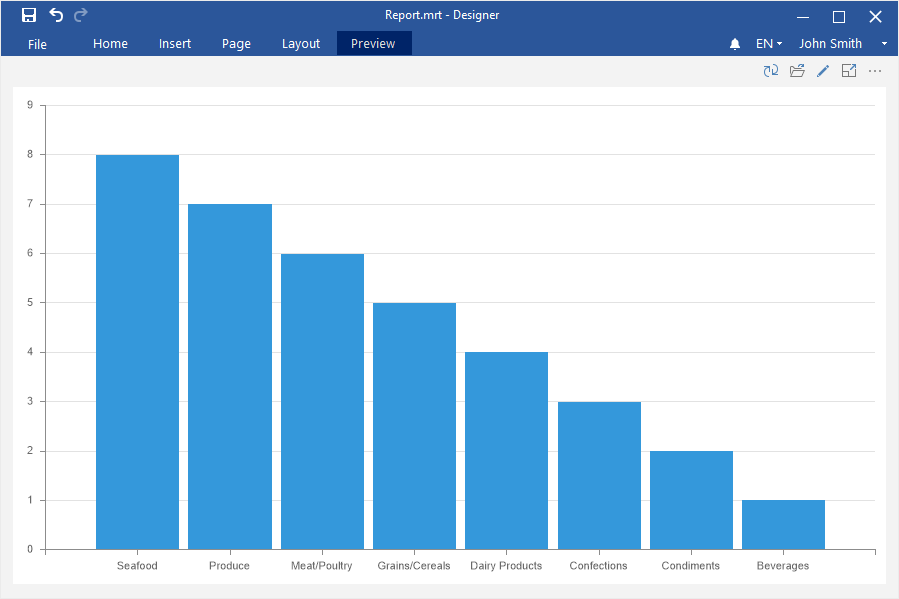

**Sorting element data when viewing**

To change sorting for a chart, gauge, indicator, progress when viewing a dashboard, you should make the following actions:

**Step 1**: Hover the cursor over this element and click the sort button;

**Step 2**: Select the data field where you need to sort values;

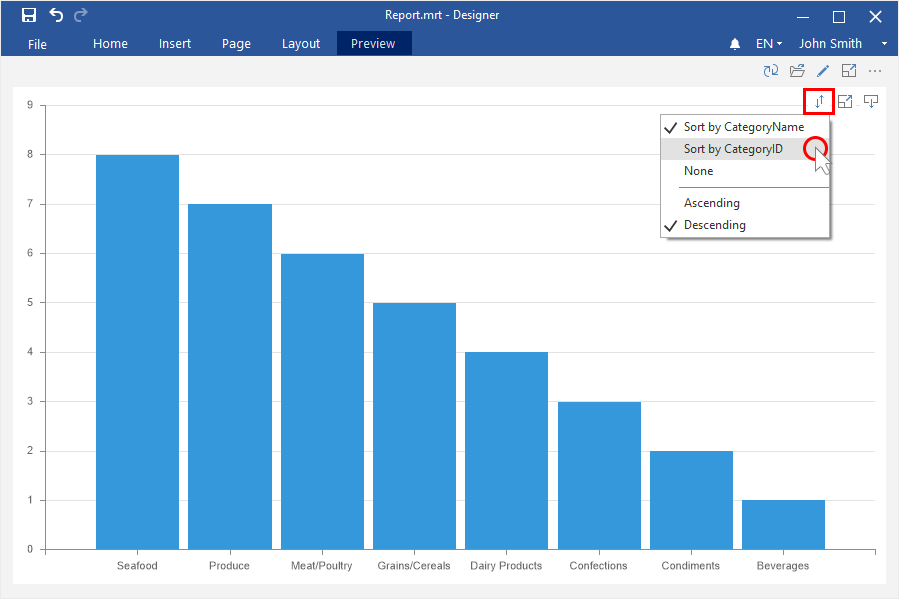

**Step 3**: Click the sort button and change the sort direction.

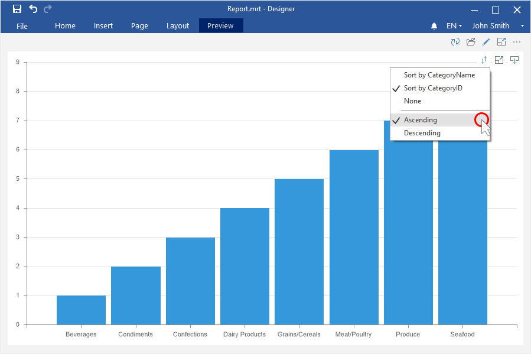

**Disable or enable the sort button in the viewer**

To disable or enable the element sort button when viewing a dashboard, you should make the following actions:

**Step 1**: Select an element in the report designer;

**Step 2**: Click the **Interaction** on the **Home** tab of the report designer;

**Step 3**: Uncheck the **Allow User Sorting** parameter if you need to disable the sort button for the current element, or set a checkbox next to this parameter if you want to enable the element sorting button;

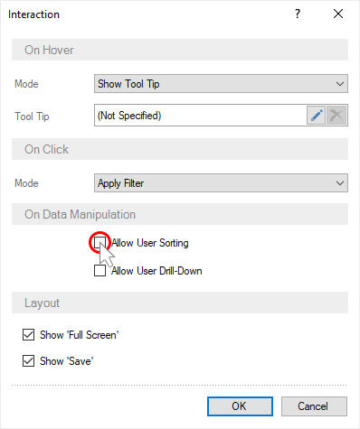

**Step 4**: Close the Interaction editor;

**Step 5**: Go to the Preview tab.

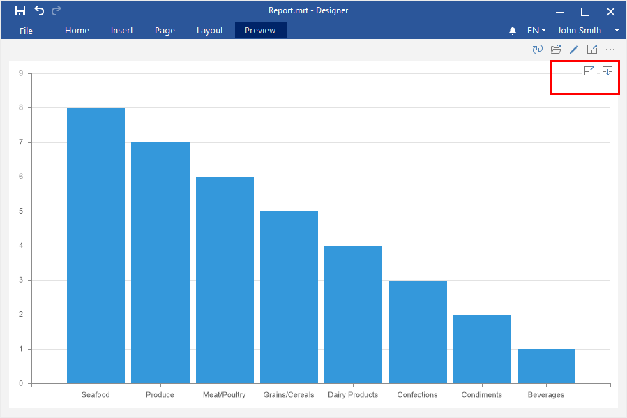

**Sorting data in the Table component**

Sorting in the Table is set at the same way both in the report designer and when viewing a dashboard.

**Step 1**: [Create or open a dashboard with the Table element;](Dashboard_wit_Table.md);

**Step 2**: Click on the column header by value of which the sorting will be carried out;

**Step 3**: Select the sort direction.

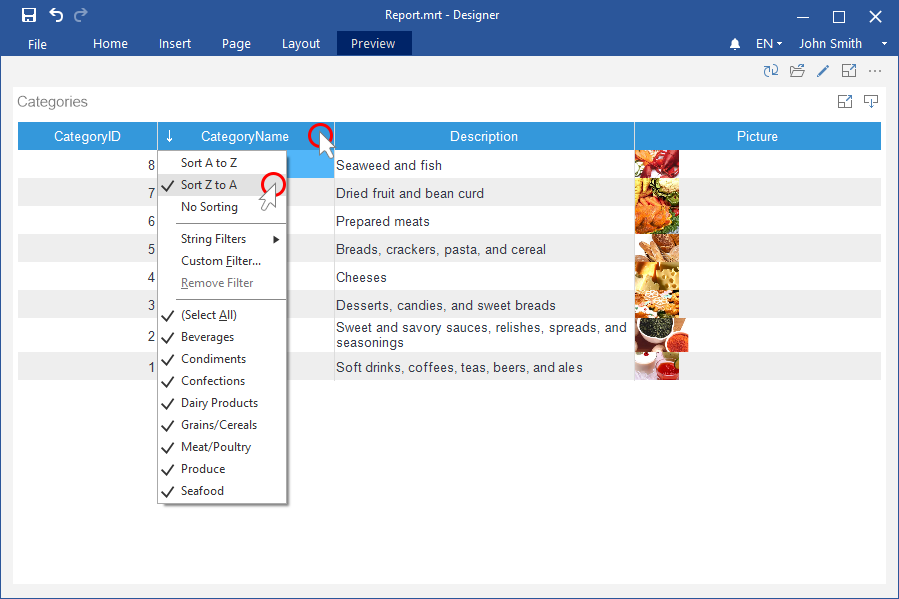

> **Information**
>
> You can specify sorting for several columns in the **Table** element. Firstly, the data will be sorted for the first column, then for the second, etc.

**Disable sorting in the Table**

**Step 1**: Select the Table element;

**Step 2**: Click the **Interaction** on the **Home** tab of the report designer;

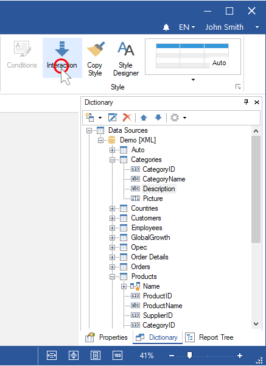

**Step 3**: Uncheck a box next to the **Allow User Sorting** parameter if you need to disable the sorting direction commands for the current element, or set a checkbox next to this parameter if you want to enable the element sorting commands;

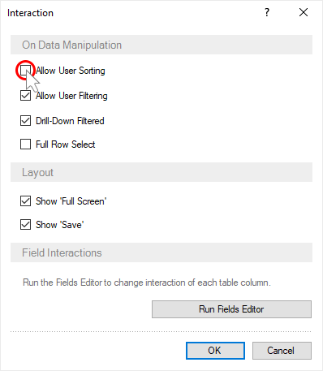
**Step 4**: Go to the Preview tab.

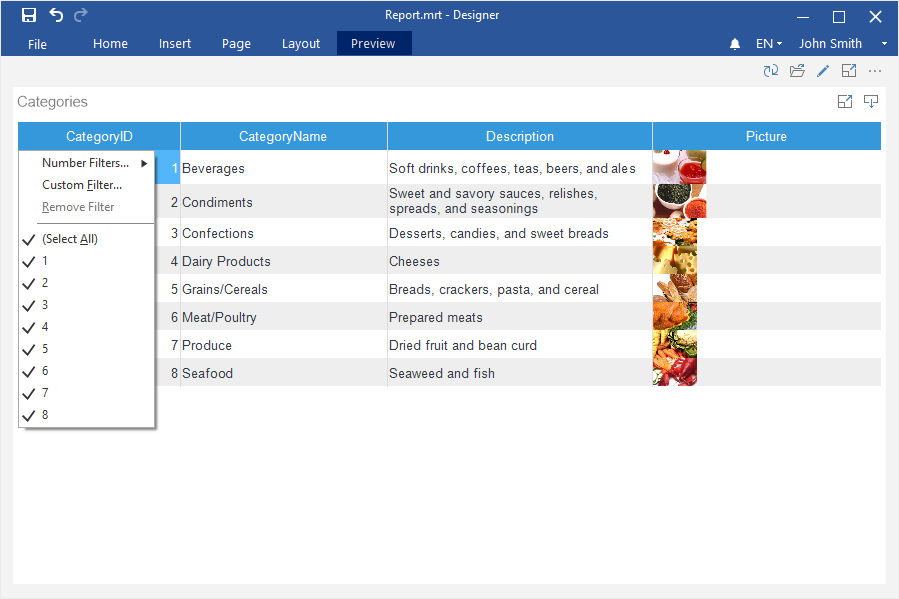
