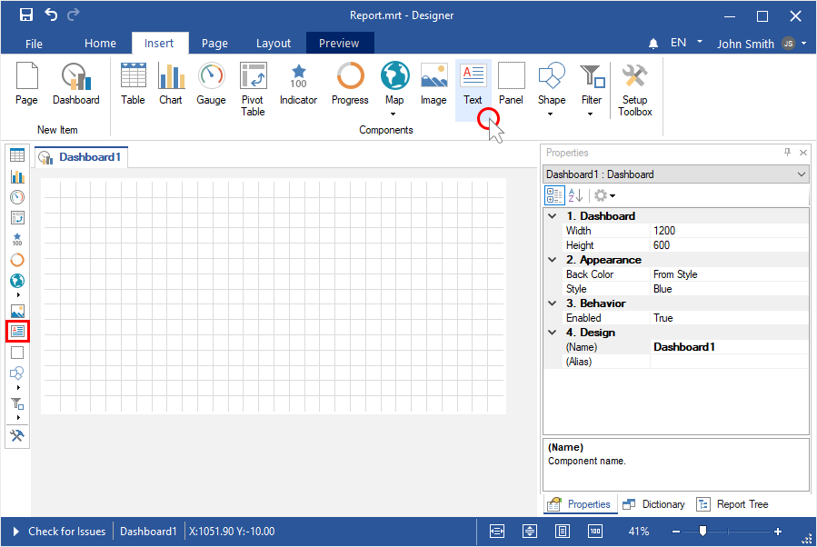
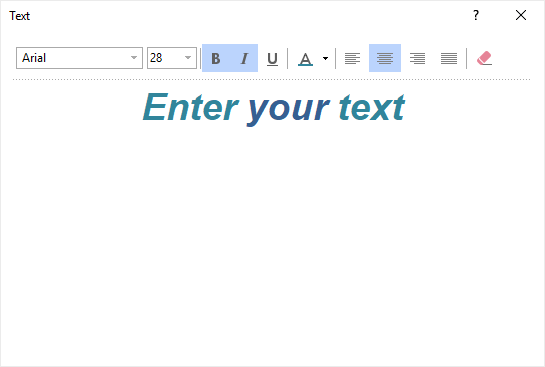
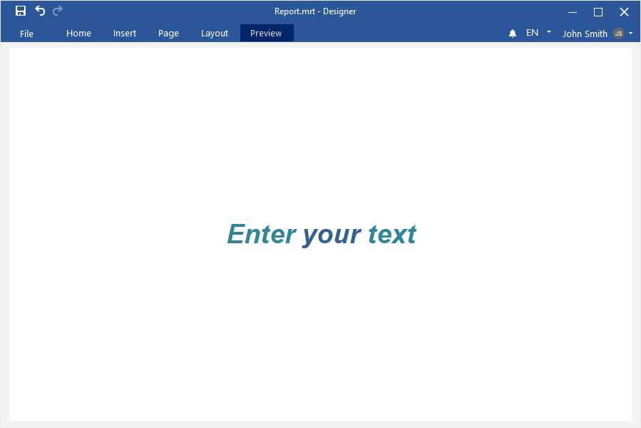

## Dashboard with Text

To create a dashboard with the [Text](../Dashboards/Text.md) element, you should do the following:

**Step 1**: [Run the report designer](Install_and_First_Run.md#rundesigner);

**Step 2**: [Create a dashboard](Creating_Dashboard.md) or [add it to a current report](Creating_Dashboard.md#addingadashboardtothecurrentreport);

**Step 3**: Select the **Text** element in the toolbox of the report designer or on the **Insert** tab;

**Step 4**: Put the item on the dashboard panel;

**Step 5**: If the item editor does not open, double-click on the text;

**Step 6**: Enter the text;

**Step 7**: Configure the text using the controls;

**Step 8**: Close the element editor;

**Step 9**: Go to the **Preview**.

