## Dashboard with Top N

When creating reports you can apply the **TopN** filter to the following elements: [Chart](../Dashboards/Chart.md), [Indicator](../Dashboards/Indicator.md), [Progress](../Dashboards/Progress.md), [Pivot table](../Dashboards/Pivot_Table.md).

The following questions will be considered in this chapter:

* [The TopN in the Chart](#Chart);

* [The TopN in the Indicator](#Indicator);

* [The TopN in the Progress](#Progress);

* [The TopN in the Pivot table](#Pivot).

**Chart**

**Step 1**: [Create a dashboard with the Chart element](Dashboard_with_Chart.md);

**Step 2**: Select the element;

**Step 3**: Click the **TopN** button of the current element;

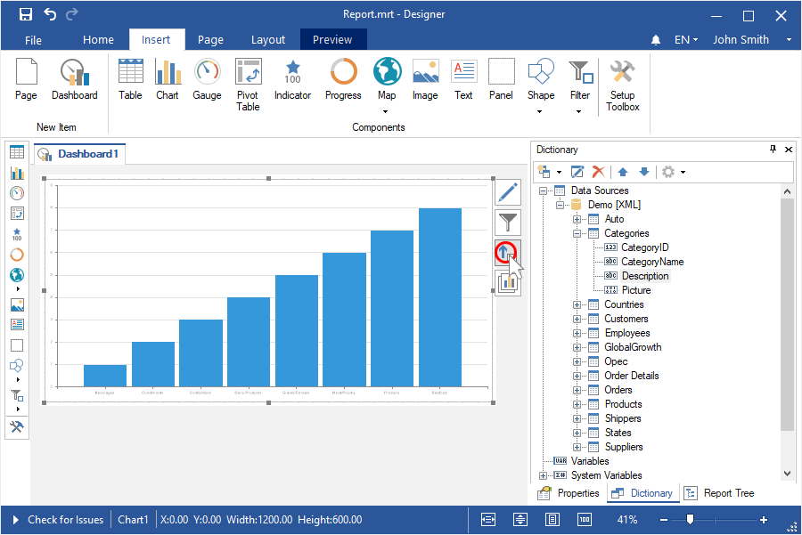

**Step 4**: Select **Top** or **Bottom** mode in the TopN editor;

**Step 5**: Set the number of the TopN with the help of the **Count** parameter;

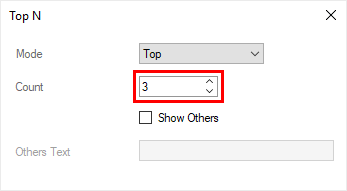

**Step 6**: Set a checkbox for the **Show Other** parameter, if you need to sum all values, which will not be included in the list of the TopN and display them as one value;

**Step 7**: Specify a header for other values in the **Other** text field, if it`s needed.

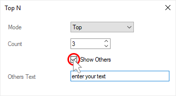

**Step 8**: Close the editor of the TopN;

**Step 9**: Go to the Preview.

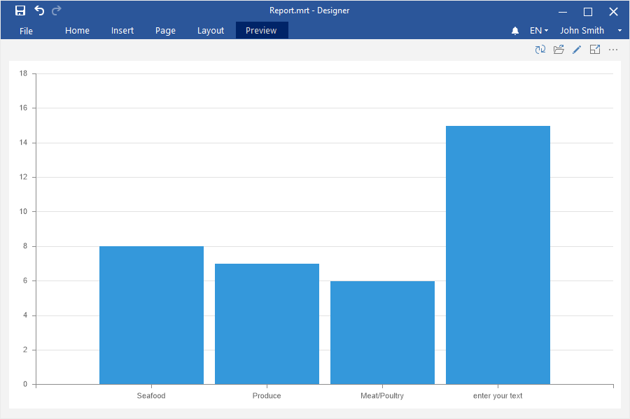

**Indicator**

**Step 1**: [Create a dashboard with the Indicator element and its rows](Dashboard_with_Indicator.md);

**Step 2**: Select the element;

**Step 3**: Click the **TopN** button of the current element;

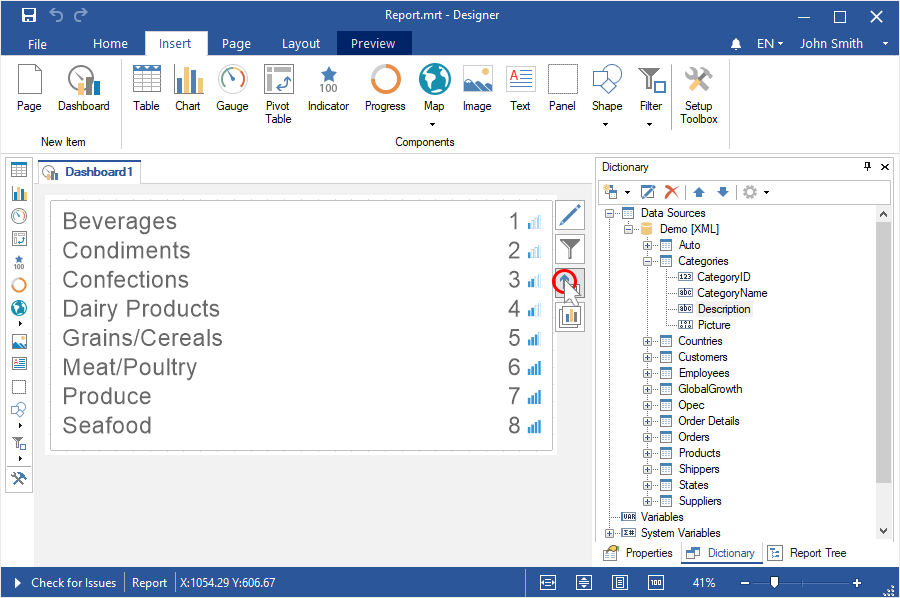

**Step 4**: Select **Top** or **Bottom** mode in the TopN editor;

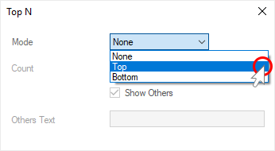

**Step 5**: Set the number of the TopN with the help of the **Count** parameter;

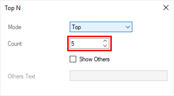

**Step 6**: Set a checkbox for the **Show Other** parameter if you need to sum all values, which will not be included in the list of the TopN and display them as one value;

**Step 7**: Specify a header for other values in the **Other text** field, if it`s needed. The Other header is applied to them by default.

**Step 8**: Close the TopN editor;

**Step 9**: Go to the Preview tab.

**Progress**

**Step 1**: [Create a dashboard with the Progress element and its rows](Dashboard_with_Progress.md);

**Step 2**: Select the element;

**Step 3**: Click the **TopN** button of the current element;

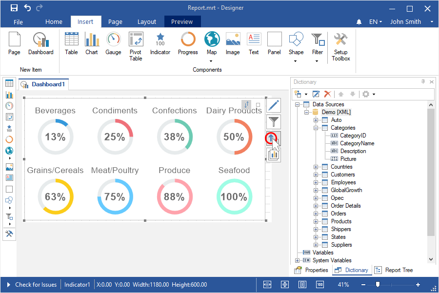

**Step 4**: Select **Top** and **Bottom** mode in the TopN editor;

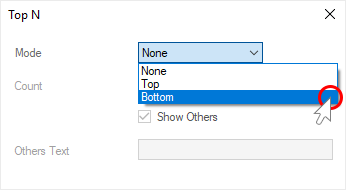

**Step 5**: Set the number of the TopN with the help of the **Count** parameter;

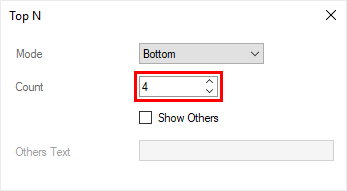

**Step 6**: Set a checkbox for the **Show Other** parameter if you need to sum all values, which will not be included in the list of the TopN and display them as one value;

**Step 7**: Specify a header for other values in the **Other** text field, if it`s needed. The Other header is applied for them, by default.

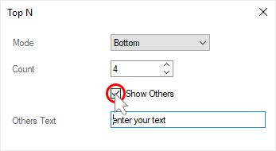

**Step 8**: Close the TopN editor;

**Step 9**: Go to the Preview tab.

**Pivot**

**Step 1**: [Create a dashboard with the Pivot table element](Dashboard_with_Indicator.md);

**Step 2**: If the editor element is not displayed, you should double click on the **Pivot** table;

**Step 3**: Select the data columns for which you need to display the TopN in the **Rows** or **Columns** field;

**Step 4**: Click the **TopN** of the current element;

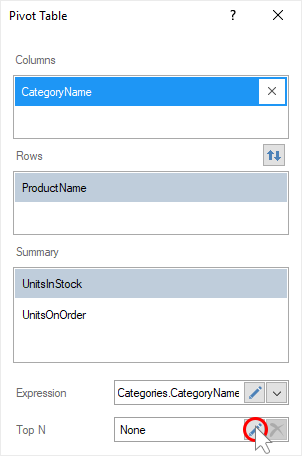

**Step 5**: Select **Top** or **Bottom** mode in the TopN editor;

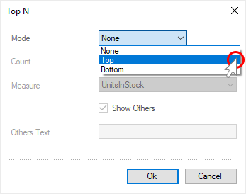

**Step 6**: Set the number of the TopN with the help of the **Count** parameter;

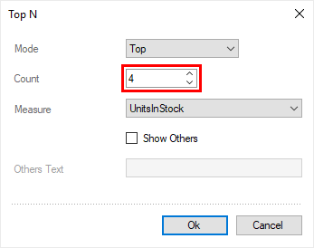

**Step 7**: Select the summary field, which values will be analyzed in the field of the **Measure** parameter;

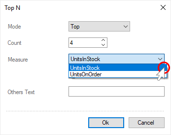

**Step 8**: Set a checkbox for the **Show Other** parameter, if you need to sum all values, which will not be in the list of the TopN and display them as one value;

**Step 9**: Specify a header for other values in the **Other** text field, if it`s needed. The **Other** header is applied for them, by default.

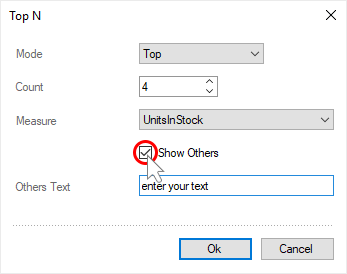

**Step 10**: Close the TopN editor.

**Step 11**: Close the Pivot table editor;

**Step 12**: Go to the Preview tab.

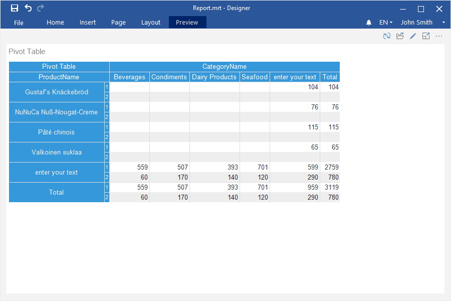
