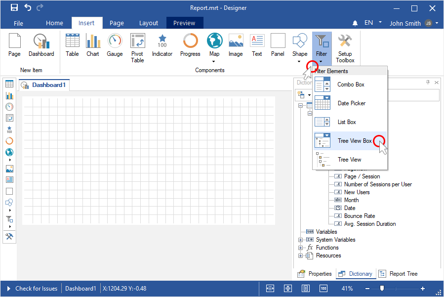
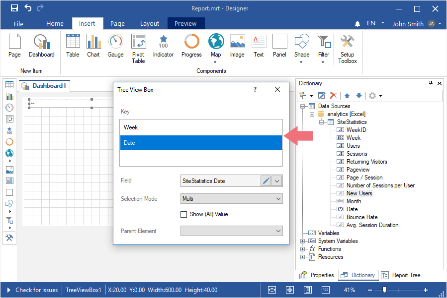
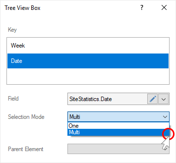
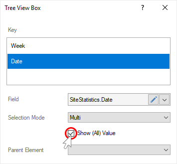
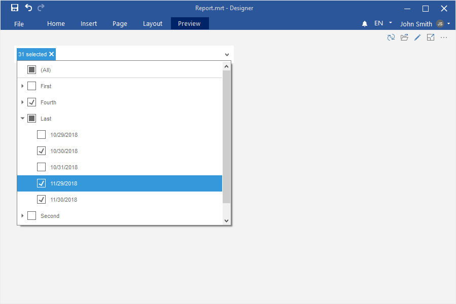

## Dashboards with Tree View Box

To create a dashboard with the [Tree View Box element](../Dashboards/Data_Filtering/Tree_View_Box.md), you should make the following actions:

**Step 1**: [Launch the report designer](Install_and_First_Run.md);

**Step 2**: [Create a dashboard or open it](Creating_Dashboard.md);

**Step 3**: [Connect data](Connecting_Data.md);

**Step 4**: Click on the **Filters** category in the **Toolbox** of the report designer or on the **Insert** tab;

**Step 5**: Select the **Tree View** **Box** element;

**Step 6**: Place the element on the dashboard;
**Step 7**: If the element editor is not displayed, you should double click on the element;
**Step 8**: Drag data columns from data dictionary into the **Key** field. The values from these data columns will form the hierarchy of the current element. The values from the upper column will be the values of the upper hierarchy level, the values from the second data column upper will be the values of the second level.

> **Information**
>
> The hierarchy of data values depends on the location of data columns in the **Key** field. The values of the data column, which is located in the current field upper than the others will be parent (initial) values in the hierarchical list of the values of the current element.
>
>
> The values of the bottom data column in the **Key** field will be nested in relation to the values of each upper data column.

**Step 9**: If you need to permit to select only one value of the current element, you should set the **One** element for the **Selection Mode** parameter. If you need to permit to select several values of the current element, you should set the **Multi** element for the **Selection Mode** parameter.

**Step 10**: If you need the list of values contain the **All** value, you should set a checkbox next to the **Show (All) Value** parameter.

**Step 11**: If you need the list of values of the current element to be depended on the selected value of the **Parent Element**, you should select another filtration element as the value of the Parent Element parameter.

**Step 12**: Close the element editor;
**Step 13**: Go to the **Preview** tab.

