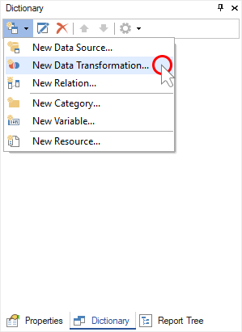
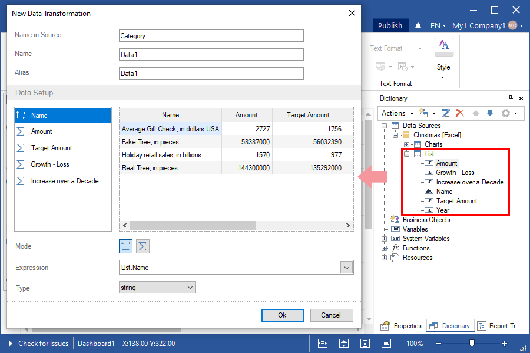
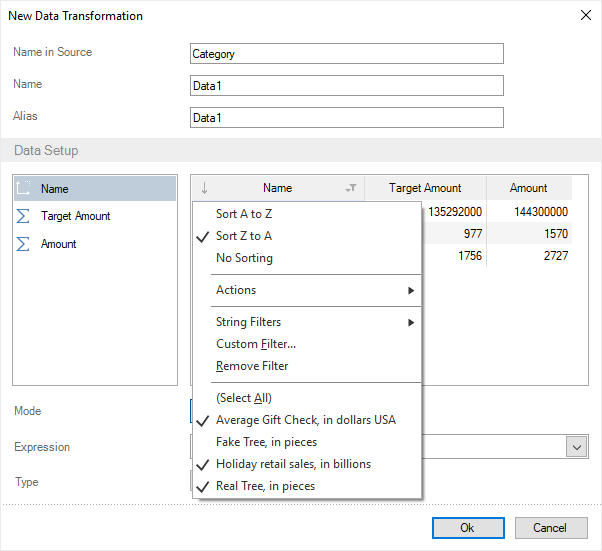
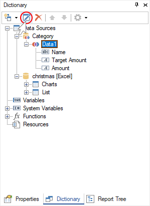

## Data transformation

After creating data sources in the report dictionary, you can convert these sources: join tables, group data, apply to function values, filter, sort data, replace values, calculate a running total, display a percentage of the value, skip and set row limits.

This chapter will cover issues such as:

* [Create a new data transformation](#creatinganewdatatransformation);

* [Edit data transformation](#editingdatatransformation).

**Creating a new data transformation**

**Step 1**: [Run the report designer](Install_and_First_Run.md#rundesigner);

**Step 2**: [Go to the data dictionary](Install_and_First_Run.md#reportdesigneroverview);

**Step 3**: [Connect data](Connecting_Data.md);

**Step 4**: Click the **New Item** button and select the **New Data Transformation** command;

**Step 5**: Drag the data columns from the sources to the data transformation editor.

> **Information**
>
> When adding data columns from various sources for data relation, a [relationship must be set between these sources](Creating_Relation.md).

**Step 6**: Set up data columns - change the type of values, group the data, apply functions to the values, filter, sort the data, replace the values, calculate the running total, display the percentage of the value, skip and set the row limit.

**Step 7**: Click **OK** in the **New Data Transformation** window.

Now, based on this data transformation, you can create reports or dashboards.

**Editing Data Transformation**

Also, you can edit the created data transformation.

**Step 1**: Select the existing data transformation in the report dictionary;

**Step 2**: Click the **Edit** button on the toolbar of the data dictionary;

**Step 3**: Edit data transformation;

**Step 4**: Click OK in the **Edit Data Transformation** window.
