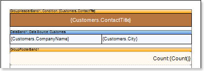
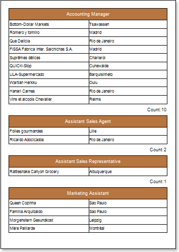
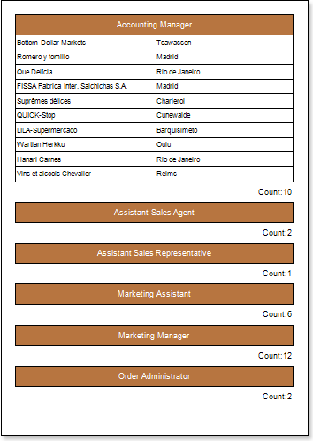
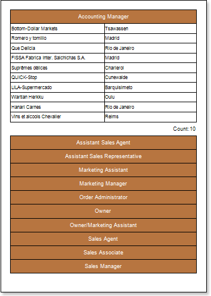
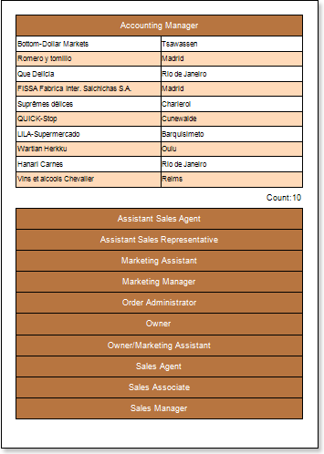

## Drill-Down Report

A Drill-Down report is an interactive report in what blocks can collapse/expand its content by clicking on the block title. Follow the steps below to create a report with dynamic folding in the preview window:

1. Run the designer;

2. Connect the data:

2.1. Create a New Connection;

2.2. Create a New Data Source;

3. Design a report or load already created one. For example, take a group report, which was reviewed in the "Report with Grouping". The picture below shows a report template with groups:

4. Click the Preview button or invoke the Viewer, clicking the Preview menu item. After rendering a report all references to data fields will be changed on data from specified fields.

5. Go back to the report template.

6. Select the GroupHeaderBand.

7. Set the Interaction.Collapsing Enabled property to true.

8. Change the value of the Interaction.Collapsed property. In our case, set the Interaction.Collapsed property to {GroupLine! = 1}. So, when rendering a report all the groups except the first one will be collapsed.

9. Click the Preview button or invoke the Viewer, clicking the Preview menu item. After rendering a report all references to data fields will be changed on data from specified fields.

To expand or collapse a group you should click on the GroupHeaderBand in the rendered report. If it is necessary for the group be collapsed together with the group summary, the Interaction.CollapseGroupFooter property should be set to true. The picture below shows the report page rendered with the collapsed report:

**Adding Styles**

1. Go back to the report template;
2. Select DataBand;
3. Change values of Even style and Odd style properties. If values of these properties are not set, then select the Edit Styles in the list of values of these properties and, using Style Designer, create a new style. The picture below shows the Style Designer:

Click the Add Style button to start creating a style. Select Component from the drop down list. Set the Brush.Color property to change the background color of a row. The picture below shows a sample of the Style Designer with the list of values of the Brush.Color property:

Click Close. Then a new value in the list of Even style and Odd style properties (a style of a list of odd and even rows) will appear.

4. To render the report, click the Preview button or invoke the Viewer, clicking the Preview menu item.

