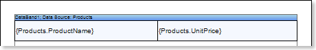
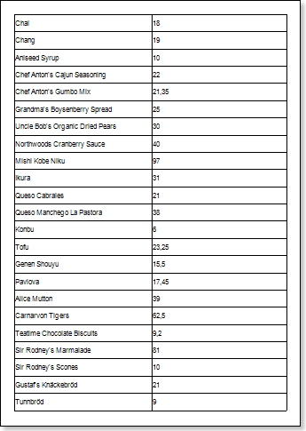
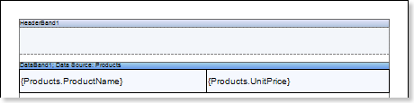
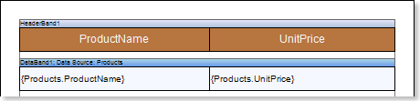
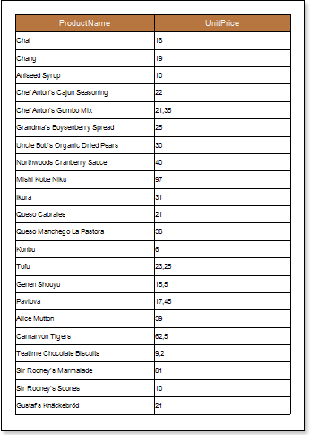
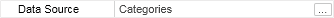
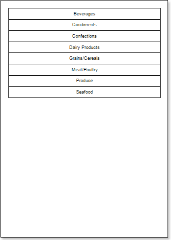
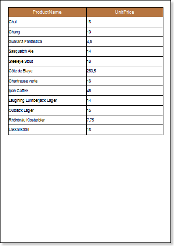
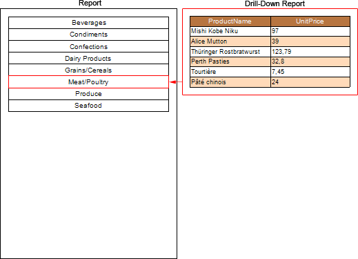

## Drill-Down Report Using External Report

Drill-Down report using external report is an interactive report in what detailed data are placed in an external report and the relationship between master and detailed data in reports is organized using the **Interaction.Drill-Down Report** property. Follow the steps below to design the report:

**Creating a report with detailed data**

1. Run the designer;

2. Connect the data:

2.1. Create a **New Connection**;

2.2. Create a **New Data Source**;

3. Put the **DataBand** on a report page:

4. Edit the **DataBand**:

4.1. Align the **DataBand**;

4.2. Change the values of properties;

4.3. Set the background color of the **DataBand**;

4.4. Set **Borders**, if required;

4.5. Set the border color.

5. Specify the data source in **DataBand** using the **Data Source** property:

6. Put text components with expressions in the **DataBand**. Where the expression is a reference to the data field. For example: put two text components with the **{Products.ProductName}** and **{Products.UnitePrice}** expressions in the **DataBand**;

7. Edit text and text components located in the **DataBand**:

7.1. Drag the text component to the required place in the **DataBand**;

7.2. Align the text in a text component;

7.3. Change the value of the required properties. For example to set the **Word Wrap** property to **true**, if you want the text be wrapped;

7.4. Set **Borders** of a text component, if required;

7.5. Change the border color.

8. Click the **Preview** button or invoke the **Viewer**, clicking the **Preview** menu item. After rendering all references to data fields will be changed on data form specified fields. Data will be output in consecutive order from the database that was defined for this report. The amount of copies of the **DataBand** in the rendered report will be the same as the amount of data rows in the database. The picture below shows a sample of a report:

9. Go back to the report template;

10. Add other bands to a report template, for example, add the **HeaderBand** to the report page;

11. Edit the band:

11.1. Align it by height;

11.2. Change values of properties, if required;

11.3. Change the background of the band;

11.4. Enable **Borders**, if required;

11.5. Set the border color.

12. Put a text component with an expression in this band. The expression in the text component is a header in the **HeaderBand**.

13.  Edit text and text components:

13.1. Drag and drop the text component in the band;

13.2. Change font options: size, type, color;

13.3. Align text component by height and width;

13.4. Change the background of the text component;

13.5. Align text in the text component;

13.6. Change values of text component properties, if required;

13.7. Enable **Borders** of the text component, if required;

13.8. Set the border color.

14. Click the **Preview** button or invoke the **Viewer**, clicking the **Preview** menu item. After rendering all references to data fields will be changed on data form specified fields. Data will be output in consecutive order from the database that was defined for this report. The amount of copies of the **DataBand** in the rendered report will be the same as the amount of data rows in the database. The picture below shows a sample of a report:

15. Go back to the report template;;

16. Set filtering in the **DataBand**. For example, set the following expression: **CategoryID == Products.CategoryID**;

17. Save the report. For example, save the report with detailed data on a local disk in the root directory D:\\, with the **Drill-Down Report** name, full path to the file will be **D:\\ Drill-Down Report.mrt**.

**Creating a report with master data**

1. Run the designer;

2. Connect the data:

2.1. Create a **New Connection**;

2.2. Create a **New Data Source**;

3. Put the **DataBand** on a report page:

4. Edit the **DataBand**:

4.1. Align the **DataBand**;

4.2. Change the values of properties;

4.3. Set the background color of the **DataBand**;

4.4. Set **Borders**, if required;

4.5. Set the border color.

5. Specify the data source in **DataBand** using the **Data Source** property:

6. Put a text component with expressions in the **DataBand**. Where the expression is a reference to the data field. For example: put the text component with the **{Categories.CategoryName}** expression in the **DataBand**;

7. Edit text and text components located in the **DataBand**:

7.1. Drag the text component to the required place in the **DataBand**;

7.2. Align the text in a text component;

7.3. Change the value of the required properties. For example to set the **Word Wrap** property to **true**, if you want the text be wrapped;

7.4. Set **Borders** of a text component, if required;

7.5. Change the border color.

8. Click the **Preview** button or invoke the **Viewer**, clicking the **Preview** menu item. After rendering all references to data fields will be changed on data form specified fields. Data will be output in consecutive order from the database that was defined for this report. The amount of copies of the **DataBand** in the rendered report will be the same as the amount of data rows in the database. The picture below shows a sample of a report:

**Creating an interactive report**

1. Go back to the report template with the master data;

2. Select a text component in the **DataBand**;

3. Set the **Interaction.Drill-Down Enabled** property to **true**;

4. Set the **Interaction.Drill-Down Report** property. Where the value of this property is the full path to the report with detailed data. In our tutorial, the **Interaction.Drill-Down Report** property will be set to **D:\\Drill-Down Report.mrt**;

5. Edit **Drill-Down Parameter 1**:

5.1. The **Name** property should be set to **CategoryID**;

5.2. The **Expression** property should be set to **Categories.CategoryID**;

6. Click the **Preview** button or invoke the **Viewer**, clicking the **Preview** menu item. After rendering all references to data fields will be changed on data form specified fields. Data will be output in consecutive order from the database that was defined for this report. The amount of copies of the **DataBand** in the rendered report will be the same as the amount of data rows in the database. The picture below shows a sample of a report:

When you click the **Beverages**, the user will see the detailed data that correspond to filtering conditions and parameters of detailing. The picture below shows a page of a rendered report with detailed data of the **Beverages** entry:

**Adding styles**

1. Go back to the report template;
2. Select the **DataBand**;
3. Change values of **Even style** and **Odd style** properties. If values of these properties are not set, then select the **Edit Styles** in the list of values of these properties and, using **Style Designer**, create a new style. The picture below shows the **Style Designer**.

Click the **Add Style** button to start creating a style. Select **Component** from the drop down list. Set the **Brush.Color** property to change the background color of a row. The picture below shows a sample of the **Style Designer** with the list of values of the **Brush.Color** property:

Click **Close**. Then a new value in the list of **Even style** and **Odd style** properties (a style of a list of odd and even rows) will appear.

1. Save changes in the detailed report by clicking the **Save** button;
2. Open the report with master data in the designer;
3. Click the **Preview** button or invoke the **Viewer**, clicking the **Preview** menu item. The picture below shows the structure of the report, shows the ratio of the detailed data to the **Meat/Poultry** master entries with different styles of even/odd rows of the **DataBand** in the detailing report:

