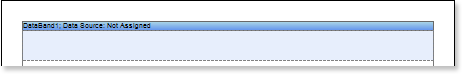
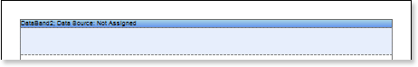
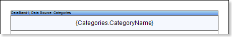
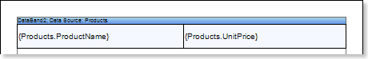
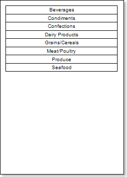
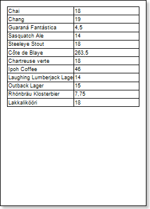
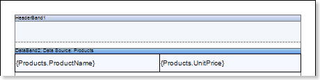
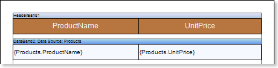
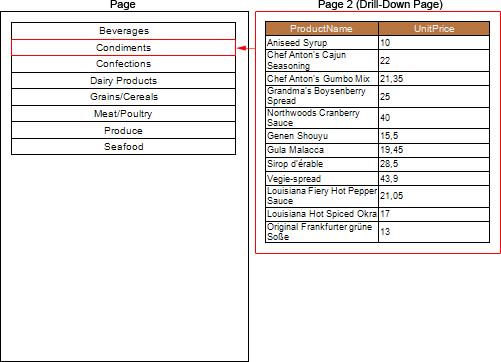
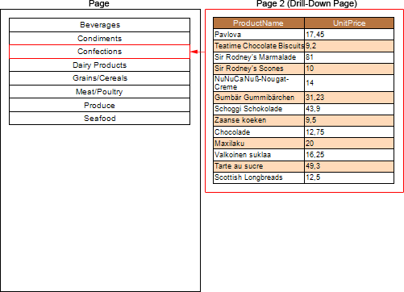

## Drill-Down Report Using Page in Report

The **Drill-Down** report using the pages in the report is an interactive report in what detailed data are placed on the page of a report and the relation between master and detailed data in the report is organized with the help of the **Interaction.Drill-Down Page** property. This type of report must contain at least two pages: a one with master data, and a second with detailed ones. Follow the steps below to design the report:

1. Run the designer;

2. Connect the data:

2.1. Create a **New Connection**;

2.2. Create a **New Data Source**;

3. Put the **DataBand1** on the **Page1** and **DataBand2** on **Page2** of a report. In this case, the master data will be located on the first page, and detailed - on the second page.

4. Edit **DataBand1** and **DataBand2**:

4.1. Align the **DataBands** vertically;

4.2. Change the value of the required properties;

4.3. Change the background color of the **DataBand**;

4.4. If necessary, set **Borders** of the **DataBand**;

5. Define a data source for **DataBands** using the **Data Source** property:

6. Put the text components with expressions. Where the expression is a reference to the data field. For example: put the text component with the **{Categories.CategoryName}** expression in the **DataBand1**, and put two text components with the **{Products.ProductName}** and **{Products.UnitePrice}** expressions in the **DataBand2**;

7. Edit text and text components located in the **DataBands**:

7.1. Drag the text component to the required place in the **DataBands**;

7.2. Align the text in a text component;

7.3. Change the value of the required properties. For example to set the **Word Wrap** property to **true**, if you want the text be wrapped;

7.4. Set **Borders** of a text component, if required.

7.5. Change the border color.

8. Select a text component in the **DataBand1**;

9. Set the **Interaction.Drill-Down Enabled** to **true**;

10. Set the Interaction.Drill-Down Page to **Page2**;

11. Edit **Drill-Down Parameter 1** for the text component of the **DataBand 1**:

11.1. The **Name** property should be set to **CategoryID**;

11.2. The **Expression** property should be set to **Categories.CategoryID**;

12. Set filter in the **DataBand2**, in this case, we specify the **(int) this ["CategoryID"] == Products.CategoryID** expression;

13. Click the **Preview** button or invoke the **Viewer**, clicking the **Preview** menu item. After rendering all references to data fields will be changed on data form specified fields. Data will be output in consecutive order from the database that was defined for this report. The amount of copies of the **DataBand** in the rendered report will be the same as the amount of data rows in the database. The picture below shows a sample of a report:

When you click the **Beverages**, the user will see the detailed data that correspond to filtering conditions and parameters of detailing. The picture below shows a page of a rendered report with detailed data of the **Beverages** entry:

14. Go back to the report template;

15. Add other bands to a report template, for example, add the **HeaderBand** to the **Page2** of a report;

16. Edit the band:

16.1. Align it by height;

16.2. Change values of properties, if required;

16.3. Change the background of the band;

16.4. Enable **Borders**, if required;

16.5. Set the border color.

17. Put a text component with an expression in this band. The expression in the text component is a header in the **HeaderBand**.

18.  Edit text and text components:

18.1. Drag and drop the text component in the band;

18.2. Change font options: size, type, color;

18.3. Align text component by height and width;

18.4. Change the background of the text component;

18.5. Align text in the text component;

18.6. Change values of text component properties, if required;

18.7. Enable **Borders** of the text component, if required;

18.8. Set the border color.

19. Click the **Preview** button or invoke the **Viewer**, clicking the **Preview** menu item. After rendering all references to data fields will be changed on data form specified fields. Data will be output in consecutive order from the database that was defined for this report. The amount of copies of the **DataBand** in the rendered report will be the same as the amount of data rows in the database. The picture below shows the structure of a report, shows the ratio of detailed data to the master **Condiments** entry:

**Adding styles**

1. Go back to the report template;
2. Select the **DataBand**;
3. Change values of **Even style** and **Odd style** properties. If values of these properties are not set, then select the **Edit Styles** in the list of values of these properties and, using **Style Designer**, create a new style. The picture below shows the **Style Designer**.

Click the **Add Style** button to start creating a style. Select **Component** from the drop down list. Set the **Brush.Color** property to change the background color of a row. The picture below shows a sample of the **Style Designer** with the list of values of the **Brush.Color** property:

Click **Close**. Then a new value in the list of **Even style** and **Odd style** properties (a style of a list of odd and even rows) will appear.

5. The picture below shows the structure of a report, shows the ratio of detailed data to the **Confections** master entry with different styles even/odd rows of the **DataBand**:

