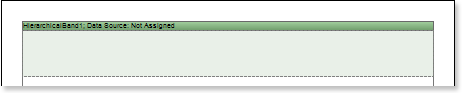
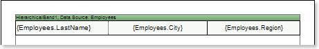
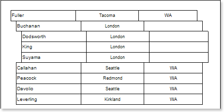
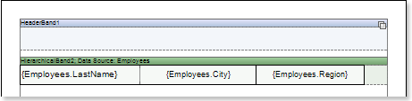
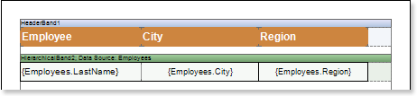
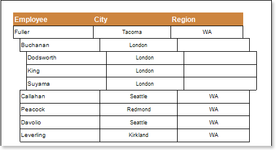
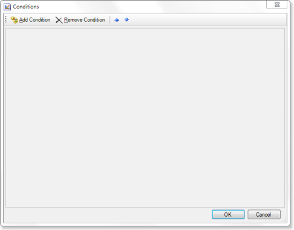
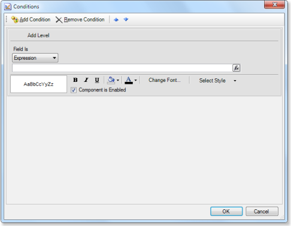
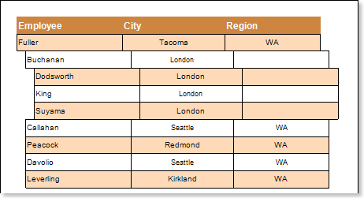

## Hierarchical Report

Do the following steps to create a hierarchical report:

1. Run the designer;
2. Connect data:

2.1. Create **New Connection**;

2.2. Create **New Data Source**;

3. Put the **HierarchicalBand** on a page of the report template**.**

4. Edit the **HierarchicalBand**:

4.1. Align the **HierarchicalBand** by height;

4.2. Set the properties of the **HierarchicalBand**. For example, set the **Can Break** property to **true**, if it is necessary for the **HierarchicalBand** to be broken;

4.3. Set the background of the **HierarchicalBand**;

4.4. Set the **Borders** of the **HierarchicalBand**;

4.5. Set the border color.

5. Set the data source of the **HierarchicalBand** using the **Data Source** property:

6. Put text components with expressions in the **HierarchicalBand**. Where the expression is a reference to the data field. For example, put three text component with expressions: **{Employees.LastName}, {Employees.City}**, and **{Employees.Region}**;

7. Edit text (**Text**) and text components (**TextBox**):

7.1. Drag the text component to the required place in the **HierarchicalBand**;

7.2. Set the font of the text: the size, style, color;

7.3. Align the text component vertically and horizontally;

7.4. Set the background color of the text component;

7.5. Align text in the text component;

7.6. Set values of the properties of a text component. For example, set the **Word Wrap** property to **true**, if you want the text to be wrapped;

7.7. Set **Borders** of a text component.

7.8. Set the border color.

8. Set the **KeyDataColum** property, select a data column on which an identification number of the data row will be assigned. In this case, select the **EmployeeID** data column:

9. Set the **MasterKeyDataColum** property, select a data column on which the reference to the table's primary key of the parent entry will be specified. In this case, select the **ReportsTo** data column:

10. Set the **Indent**  property, set an offset of the detail entry in relation to the parent one. In this example, the **Indent** property will be 20 units in the report (centimeters, inches, hundredths of inches, pixels);

11. Set the **ParentValue** property, indicate the entry, which will be a parent for all rows. If this property is not specified, the default value is used. By default, the **Parent Value** property is set to **null**. In this case, the value of the **ParentValue** property is not specified, so the default value is used:

12. Click the **Preview** button or call **Viewer**, using the **Preview** menu item. After rendering a report, all references to data sources will be replaced with data from these sources. Data will be taken sequentially from the data source, which has been specified for this band. Number of copies of the **DataBand** in the report is equal to the number of rows in the data source.

13. Go back to the report template;

14. If necessary, add other bands into the report template, for example, **HeaderBand**;

15. Edit this band:

15.1. Align the **HeaderBand** vertically;

15.2. Set properties of the **HeaderBand**, if necessary;

15.3. Set the background color of the **HeaderBand**;

15.4. If necessary, set the **Borders**;

15.5. Change the border color.

16. Put text components with the expressions. Where expressions in text components in the **HeaderBand** will be the data headers;

17. Edit text and text components:

17.1. Drag the text component to the required place in the band;

17.2. Set the font settings: size, style, color;

17.3. Align the text component vertically and horizontally;

17.4. Set the background color of the text component;

17.5. Align the text in a text component;

17.6. Set the value of properties of a text component, if necessary;

17.7. If necessary, set **Borders** of a text component;

17.8. Set the border color.

18. Click the **Preview** button or call **Viewer**, using the **Preview** menu item. After rendering a report, all references to data sources will be replaced with data from these sources:

**Adding styles**

1. Go back to the report template;

1. Select component. In our case this is the text component;
2. Invoke the **Conditions** dialog box. For example, click the **Conditions** button on the control panel.

1. To get started, you must click the **Add Condition** button and in the **Conditions** dialog box the condition and formatting options will be displayed. The condition can be of two types: **Value** and **Expression**. In this case, consider an example of a condition, such as **Expression**. The picture below shows an example of **Conditions** dialog box with options and conditions of formatting:

1. Specify the options of conditional formatting. In this case, to specify the condition means to specify the expression. For example, **Line% 2 == 1**, and set the formatting means to change the background, for example, by pressing the **Back Color** button and selecting the drop-down list of values of the background color.
2. Click **OK**. It should also be noted that to odd and even rows have different styles, it is necessary to make a conditional formatting of each text component;
3. Render a report by clicking on the **Preview** tab or call the **Viewer** clicking the **Preview** menu item.

