## Installation and first run

| Important |
| --- |
| Scripts can be a security risk, so they are disabled in the [Interpretation mode](../Reports_Designer/Template/Calculation_Mode.md). However, if you are confident in the safety of your scripts, you can use them in the [Compilation mode](../Reports_Designer/Template/Calculation_Mode.md). |

To start creating reports and dashboards, you need to install the Stimulsoft report designer:

* [Installing the report designer from our website](#installingfromstimulsoftwebsite);

* [Register a new account](#signupfromdesigner);

* [Log In with Google](#loginwithgoogle);

* [Sign Up with Google](#signupwithgoogle);

* [Downloading packages for developers from our website](#loadingdeveloperpackagesfromstimulsoft);

* [Skill Level](#chooseyourskilllevel);

* [Overview of the report designer](#reportdesigneroverview);

* [Installing other applications and packages from the report designer](#downloadotherapplicationsandpackagesfromreportdesigner).

* [Account registration and activation](../Introduction/Activation.md).

Installing from Stimulsoft website
Step 1: Go to the download page at [https://www.stimulsoft.com/en/downloads](<%LINK_CAPTION%>);

Step 2: Click the Download for Windows button on the site page;

> **Information**
>
> When you go to the download page from a device running macOS, you will be asked to download the report designer for macOS. If you logged in from a device running Windows, and you need to download the version for macOS, then click the More Apps button under the Download for Windows button.
>
>
> Also, in this submenu you can download other applications:
>
> * Stimulsoft Designer.JS is a universal application for working with reports and dashboards. The designer is designed using NW.js, HTML5, and JavaScript technologies. The main feature is the use of the JS core in design. The documents created with it will have the same look and functionality on any operating system.
>
> * Stimulsoft Demo is a demo application for exploring the main features and benefits of a report writer and dashboards. The application contains lots of predesigned reports and dashboards, grouped by functionality.

Step 3: Run the installer.
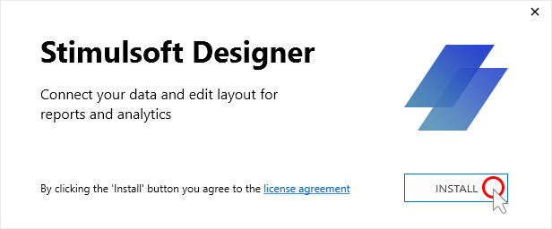

Step 4: Click the Install button after you read and accept the terms of the license agreement.

> **Information**
>
> Installing a report designer, like any other product, means that you have read and accepted the terms of the license agreement.

Step 5: The installation process of the report designer will be completed. At the end of the installation, a window will be displayed.
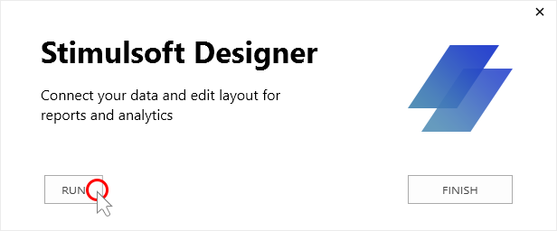

Step 7: Click the Run button to start the report designer, or the Finish button to close the installer window if you wish to run the designer later.

Step 8: You must log in to the user account after the first run of the report designer. Enter Email in the User Name field, the password for the account in the Password field, and click the Log In button in the login window. You must [register a new account](#signupfromdesigner), if the account is missing. Also, you can [log in](#loginwithgoogle) or [sign up](#signupwithgoogle) with your Google account.

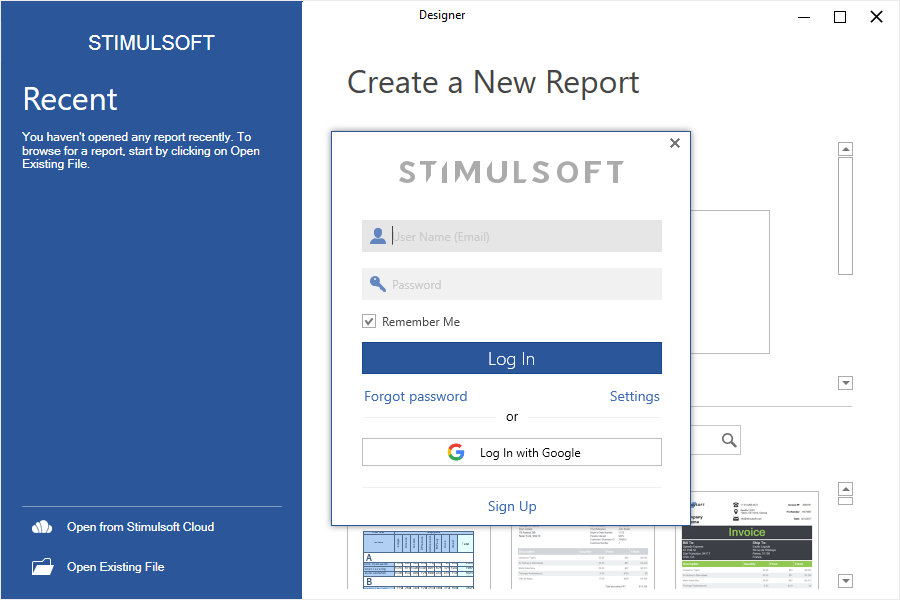

After installation:

* The report designer will be installed by the following path: c:\Program Files (x86)\Stimulsoft Designer% version%\. To run the report designer, you need to open this local storage and double-click on the Designer.exe file.

* All installed data adapters are located in the following path: c:\Users\% username%\AppData\Local\Stimulsoft\DataAdapters\

Sign Up from designer
**Step 1**: Click the Sign Up button in the Log In window of the report designer;
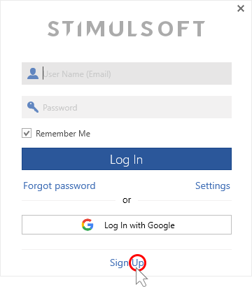

**Step 2**: Fill in the required fields - First Name, Last Name, User Name (Email) and Password;
**Step 3**: Acquainted with [Privacy Policy](https://www.stimulsoft.com/en/privacy-policy) and [Terms of Use](https://www.stimulsoft.com/en/terms-of-use);
**Step 4**: By clicking the **Sign UP** button, you agree to the [Privacy Policy](https://www.stimulsoft.com/en/privacy-policy) and [Terms of Use](https://www.stimulsoft.com/en/terms-of-use).

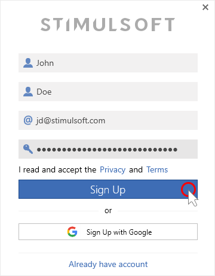

After successful registration of the user account, you will be log into the report designer.

**Log In with Google**
For authorization in the report design, you can use a Google account.

**Step 1**: Click the **Log In with Google** button in Log In window of the report designer;
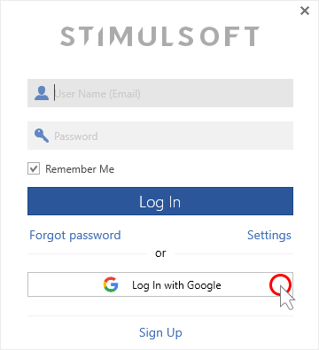

**Step 2**: After that, the default browser will be called up with the Google page of authorization.

**Step 3**: You should choose the account that will be used for authorization in the report designer if you accept the [privacy policy](https://www.stimulsoft.com/en/privacy-policy) and [terms of use](https://www.stimulsoft.com/en/terms-of-use). You will need to sign in to your Google Account if you are not signed in to Google Accounts.

**Step 4**: You must return to the report designer, after successfully logging in to your Google account. The authorization will happen automatically in the report designer.

**Sign Up with Google**
**Step 1**: Click the Sign Up button in Log In window of the report designer;

**Step 2**: Click the **Sign Up with Google** button in the Sign Up window of the report designer;

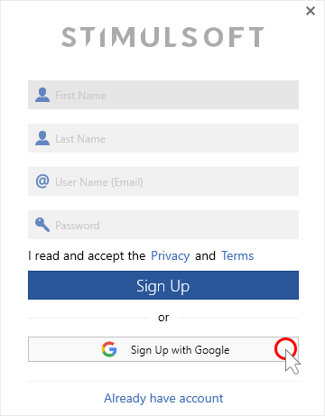

**Step 3**: After that, the default browser will be called up with the Google page of authorization.

**Step 4**: You should choose the account that will be used for authorization in the report designer if you accept the [privacy policy](https://www.stimulsoft.com/en/privacy-policy) and [terms of use](https://www.stimulsoft.com/en/terms-of-use). You will need to sign in to your Google Account if you are not signed in to Google Accounts.

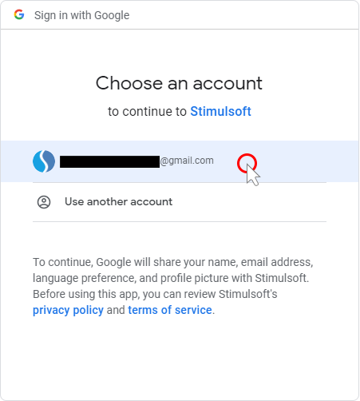

**Step 5**: You must return to the report designer, after successfully logging in to your Google account. The authorization will happen automatically in the report designer.

Skill Level

After logging into the report designer, you will be prompted to select the report designer's skill level. Depending on the chosen level, the number of properties, options, and settings of elements and tools in the report designer, may vary. Full functionality of options, settings, and tools is available when you choose the Professional level. However, we recommend starting with the Basic level when you run the designer for the first time.

> **Information**
>
> [Please see with list of report designer tools, components and their properties that are available depending on the selected skill level.](../Stimulsoft_Reports_Features_Stimulsoft_Reports_Product_Line/Designers/Skill_Level.md)

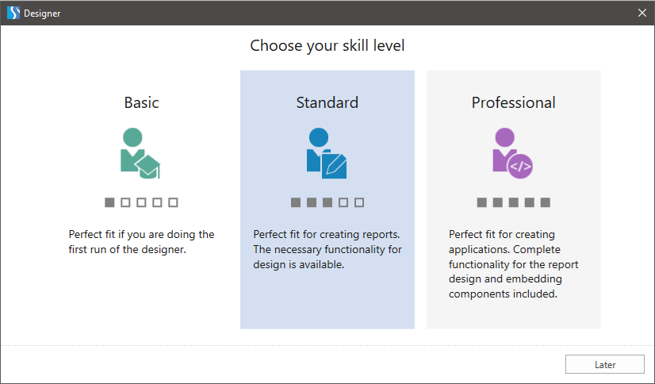

While creating reports in the report designer, you may change the skill level. To do this, you should:

Step 1: Run the report designer and log in;

Step 2: Switch from the welcome window to the report or dashboard editing mode;

Step 3: Open the account menu in the upper right corner by left click on the account name;

Step 4: Select Profile;

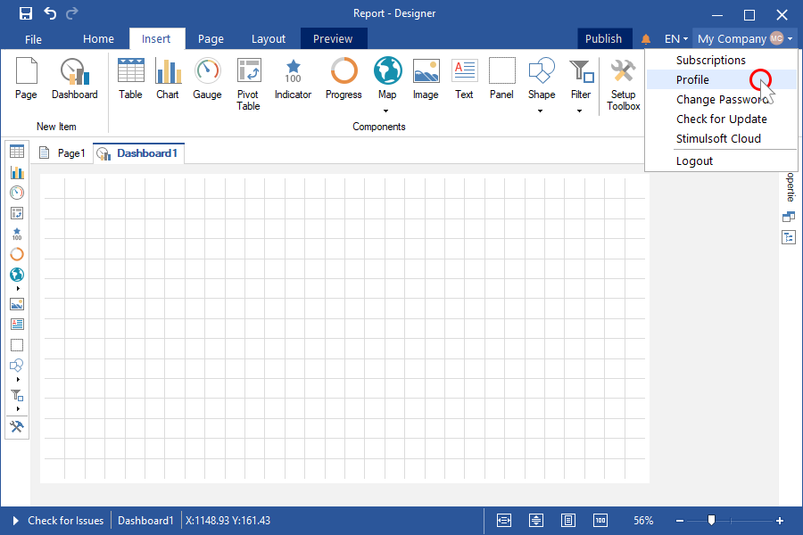

Step 5: In the profile menu, click on the value of the Skill Level parameter;

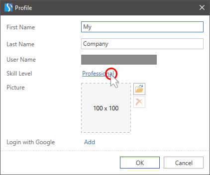

Step 6: Select the appropriate value.

You can also change the skill level in the properties panel settings or select it from the context menu of this panel.

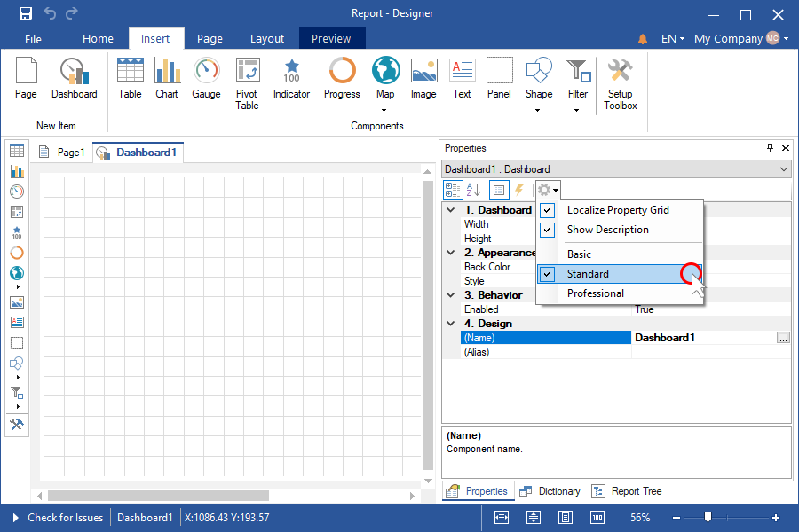

Report Designer Overview

The report designer is a tool for creating and editing reports and dashboards.

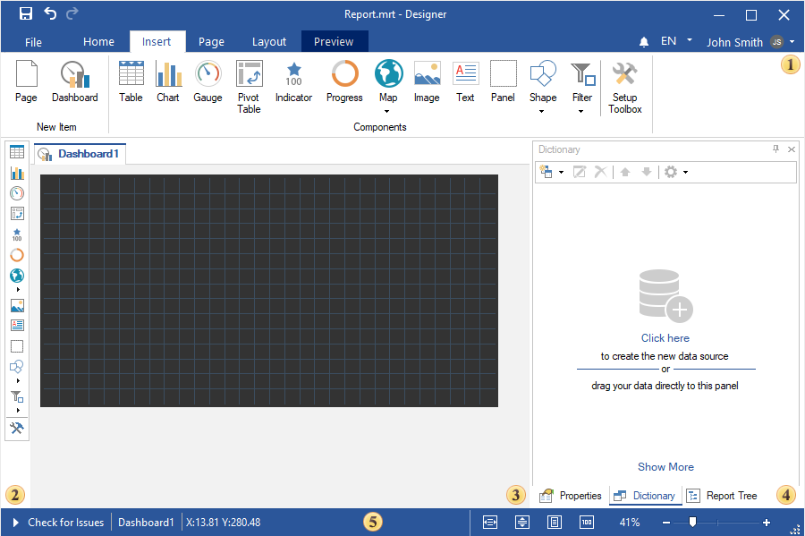

 The Ribbon panel consists of several tabs on which you can find commands for creating report elements and dashboards, File, notification, localizations and account menus.

 The toolbox contains commands for creating report elements and is similar to the Insert tab in the Ribbon panel.

 The workspace of the report designer - the [report template](../Reports_Designer/Template/index.md). In this area, reports and dashboards are being designed.

 The Bookmarks bar in the report designer contains the Property Panel, Data Dictionary, and Report Tree tabs.

 The Status bar of the report designer contains the zoom controls, the report verification commands, and additional information while designing reports and dashboards.

Loading developer packages from Stimulsoft

Step 1: Go to the download page at [https://www.stimulsoft.com/en/downloads](<%LINK_CAPTION%>);

Step 2: Scroll down until you reach the section Packages for developers;

Step 3: Select the required package;

Step 4: Click the Download button. After that, the zip archive with libraries and Stimulsoft scripts will be downloaded.

Step 5: Unzip the zip archive. Use Stimulsoft libraries and scripts to develop your application.

> **Information**
>
> When developing applications, developer packages can also be installed from [NuGet](https://www.nuget.org/profiles/Stimulsoft), [npm](https://www.npmjs.com/package/stimulsoft-reports-js), [Maven](https://search.maven.org/search?q=g:com.stimulsoft).

Download other applications and packages from Report Designer

When starting the report designer, the Get Started window will be displayed. From this window you can:

* Install the demo application and the js report designer;

* Download developer packages;

* Go to help resources or contact technical support.

Depending on the required action, click the Show more button under the corresponding item.

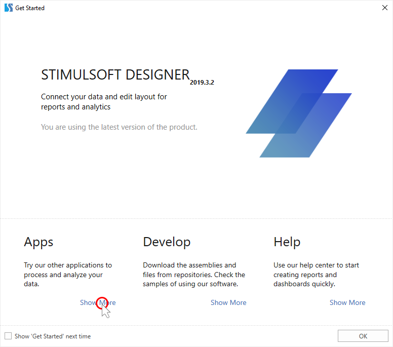

> **Information**
>
> If, when you start the report designer, the Get started window does not appear, then you have disabled the Show 'Get Started' next time option. To call this window from the report designer, you should:
>
>
> Step 1: Click the File menu button in the report designer;
>
>
> Step 2: Select Get Started.
