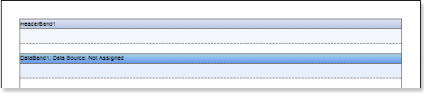
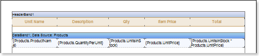
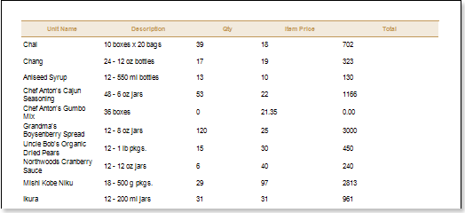
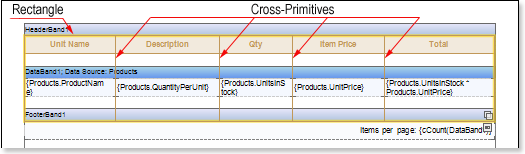
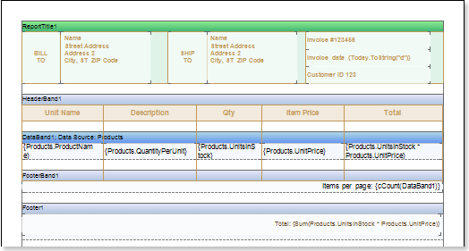
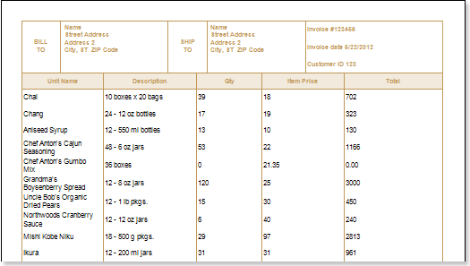
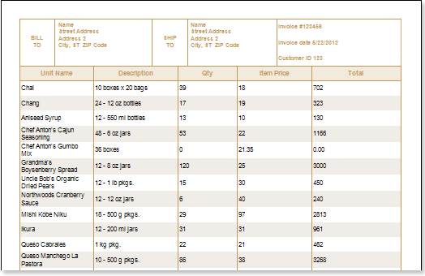
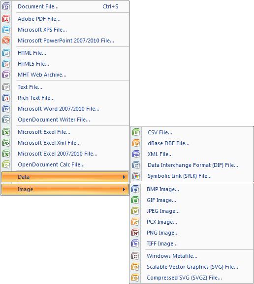

## Invoice Report

The invoice is most often used in accounting for the tax (customs) control or in the international supply of goods. This document usually includes the cost of transportation, shipping operations, insurance, payment of export duties, as well as various taxes (fees), and more. If your activity requires constant creation of invoices, for optimization, time and cost savings, it is logical to assume that it is easier to create a document template. Using it, you change only the data, saving yourself from routine work to create the structure of the invoice and its design.

You can create templates and tools in many ways, but I want to help you save time in finding these resources. In this tutorial you will learn how to quickly create an invoice template, decorate it and get the finished document. This will take you some time. I will try as much as possible to describe in detail the process of creating such a report.

The product which is used in this tutorial is Stimulsoft Reports.NET which trial can be downloaded at http://www.stimulsoft.com/Downloads/StimulsoftReports.Net_2012.1_Trial.zip .

The database to this tutorial is delivered with the product installation. I also attached the video file which shows how to create a report.

The ready invoice.mrt file is also attached to this article.

To create an invoice, you should do the following steps:

1. Run the designer;

2. Connect the data:

2.1. Create **New Connection**;

2.2. Create **New Data Source**;

3. Put the **DataBand** on the page of the report template;

4. Put the **HeaderBand** above the **DataBand**. The picture below shows an example of the report template with the bands on the page:

Edit the bands **DataBand** and **HeaderBand**:

5.1. Align them by height;

5.2. Set the properties of the **DataBand**. For example, set the **Can Break** property to **true**, if you want the band be broken;

5.3. Set the background color for the bands;

5.4. If necessary, set **Borders**;

5.5. Set the border color.

6. Specify the data source for the **DataBand** using the **Data Source** property from the object inspector:

7. Put text components in the **HeaderBand** with texts **Unit Name**, **Description**, **Qty**, **Item Price**, **Total**;

8. Put text components in the **DataBand** with expressions. Where the expression is a reference to the data field. Put text components with the expressions: **{Products.ProductName}**, **{Products.QuantityPerUnit}**, **{Products.UnitsInStock}**, **{Products.UnitPrice}**, and **{Products.UnitsInStock * Products.UnitPrice}**;

9. Edit **Text** and **TextBox**:

9.1. Drag the text components on the **DataBand** and **HeaderBand** to the appropriate places;

9.2. Set the font parameters: size, style and color;

9.3. Align text components by height and width;

9.4. Set the background of text components;

9.5. Align text in text components;

9.6. Set the properties of text components. For example to set the **Word Wrap** property to **true**;

9.7. If necessary, include **Borders** of text components;

9.8. Set the border color.

The picture below shows the report template:

10. Click on the **Preview** button or invoke the report viewer, using the **Preview** item. After rendering a report, all references to the data fields will be replaced with data from the specified fields. That data will be taken sequentially from the data source that was specified for the given band. The number of copies of the **DataBand** in the rendered report will be equal to the number of rows in the data source. The picture below shows the rendered report:

11. Go back to the report template;

12. Add the **FooterBand** on the report page and edit it;

13. Put text components in the band with the expression **Items per page: {cCount (DataBand1)}** and edit this text component;

14. Add **Rectangle**, so that the upper points are located on the **HeaderBand**, and the lower ones on the **FooterBand**;

15. Add cross-primitives, which start points are located at the top of the **HeaderBand**, and the end ones - on **FooterBand**. The picture below shows the report template with the **FooterBand**, rectangle and primitives:

16. Add the **ReportTitleBand** to the report template and **FooterBand** and edit them;

17. Put a text component in the **FooterBand** with the expression **Total: {Sum (Products.UnitsInStock * Products.UnitPrice)}**;

18. Put a text components in the **ReportTitleBand** with expressions:

18.1. The first text component has the text **BILL TO**;

18.2. The second one indicates **Name Street Address Address 2 City, ST ZIP Code**;

18.3. The third component with the text **SHIP TO**;

18.4. In the fourth component the text is the same as in the second one **Name Street Address Address 2 City, ST ZIP Code**;

18.5. Put the text **Invoice # 123456** in the next component;

18.6. Put the expression **Invoice date {Today.ToString ("d")}** in the sixth component in this band;

18.7. And in the last component put **Customer ID 123**;

The picture below shows a report template:

19. Click on the **Preview** button or invoke the report viewer, using the **Preview** item. After rendering a report, all references to the data fields will be replaced with data from the specified fields. That data will be taken sequentially from the data source that was specified for the given band. The number of copies of the **DataBand** in the rendered report will be equal to the number of rows in the data source. The picture shows a report with the report header and footer:

**Adding styles**

1. Go back to the report template;

2. Call the **Style Designer**;

The picture below shows the dialog **Styles Designer**:

Click the **Add Style** button to start creating a style. Select **Component** from the drop down list. Set the **Brush.Color** property to change the background color of a row. The picture below shows a sample of the **Style Designer** with the list of values of the **Brush.Color** property

Press the **Close** button when the property is set. After that, in the list of values of properties ​​**Even style** and **Odd style** the new values will appear, the new style of even/odd lines, respectively.

4. Render a report by clicking on the **Preview** tab or call the report **Viewer** using the **Preview** menu item. The picture below shows the rendered report with the invoice:

5. Go back to the report template;

6. Save the report template, for example, as **Invoice.mrt**.

The invoice, can be printed, saved to any of the available file formats, or sent via Email. The picture below shows a list of file formats available for saving or sending reports via Email:

