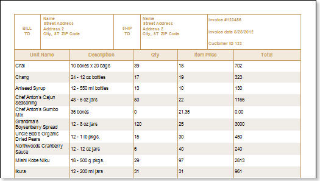
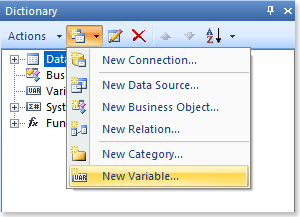
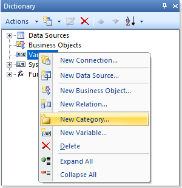
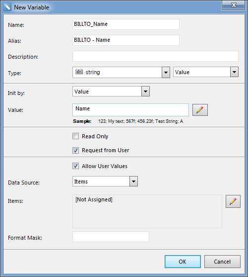
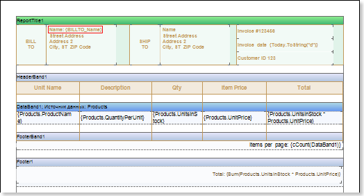
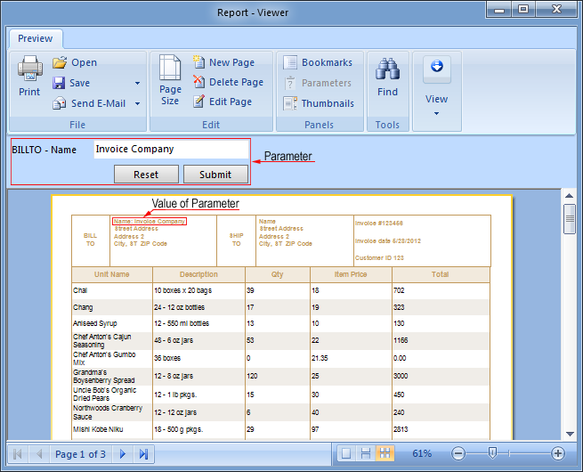
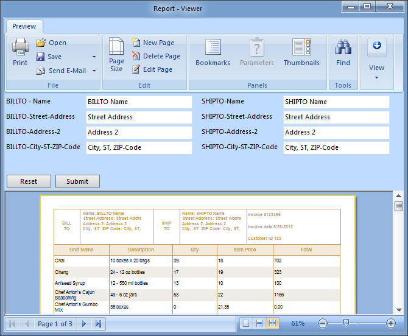

## Invoice Report With Parameters

Do the following steps to create an invoice with parameters:

1. Run the report designer;

2. Open the saved report template and render a report. The picture below shows the rendered report with the invoice:

Pay attention to the report header. As can be seen from the picture above, information about payments and delivery are not specified. How to make it so you can easily specify these details? The constant editing of text components in the report template is not an option, but using the parameters in the report is quick and easy. Especially if there are more recipients of your invoices. So, to add parameters to the report, follow these steps:

3. Go back to the report template;

4. Add parameters to the report template. The parameters in the report are implemented using variables (a variable may have different values​). To add a variable, in the tab Dictionary -> the menu item New Item -> select New Variable.... The picture below shows the New Item:

Details BILL TO and SHIP TO, by definition of fields (name, street, city, zipcode) are the same, so when you create variables, there could be confusion. To avoid this, the variables can be created in different subcategories. So, to avoid this, create a sub-category of variables, which are called BILL TO and SHIP TO. For this purpose, in the context menu of the category Variables, click New Category...:

Then, in the box of the New Category you should specify a name for the category (BILL TO and SHIP TO). After that, we will create the variables in the category BILL TO. In principle, there is no difference where to create a variable, because it is always possible to move it to the appropriate subcategory. Yet, to save time, get used immediately to create the correct location. So, select a subcategory created by BILL TO command and call the new variable (New Variable) from the context menu or menu item New (New Item). The picture below presents a window to create a new variable:

Define the parameters created by the variable:

5.1. Change the name (Name) and Nick (Alias) variable, specify the description (Description), if necessary;

5.2. Choose the type of stored value (in this case string) and the type of the variable (we will approach the variable type value (Value)). Here is a very important step, which we have determined that our variable will store a single value (rather than a list of values ​​or Range), and this value will be stored in a string type.

5.3. Set the default value. In our example, set the value of Name;

5.4. Get the answer options are installing from a user (Request from User), and use user values ​​(Allow User Values). In this step, we allow the user to participate, as well as change the value stored in variable;

5.5. Press Ok.

To use this variable in the report, you must provide a link to it - {variable name}. In this case, we indicate in the text component {BILLTO_Name}. The picture below predstalen invoice template with a variable:

Render a report to check how works the newly created key in the final report. Click on the Preview button or bring up the Viewer, using the shortcut key F5 or the menu Preview. After building a report, all references to data sources will be replaced with data from these fields. With that data will be taken sequentially from a data source that was specified for a given band. The number of copies of the band Data in the rendered report will be equal to the number of rows in the data source. The picture below before your report with a parameter:

As can be seen from the picture, the report shows the specified field values ​​of the parameter (in this case, Name). Note that in the first set of values ​​stored in the variable value by default. Now change the value and click the Apply button (Submit). In the picture below a report with the modified parameter value:

Add options for other fields. To do this:

Back to the template;

Create a similar variables in the sub-BILLTO named BILLTO_Street_Address, BILLTO_Address_2, BILLTO_City-ST-ZIP_Code;

In a similar sub-SHIPTO variables, with the names of SHIPTO_Name, SHIPTO_Street_Address, SHIPTO_Address_2, SHIPTO_City-ST-ZIP_Code;

Use these variables to the report, ie They point to the links in the template;

We construct a report to check how the newly created key in the final report. Click on the Preview button or bring up the Viewer, using the shortcut key F5 or the menu Preview. After building a report, all references to data sources will be replaced with data from these fields. With that data will be taken sequentially from a data source that was specified for a given band. The number of copies of band Data in the constructed report will be equal to the number of rows in the data source. The picture below before the report prepared with the following parameters:

Now, to prepare an invoice with the required details and BILLTO SHIPTO, no need to alter permanently a template. Enough to simply specify the details and click the Apply button (Submit). Reset Button (Reset) resets the values ​​stored in a variable and sets the value stored by default. In these two articles, I showed you how to use report generator Stimulsoft can facilitate their work in creating invoices. And also learned how to use this tool in a few steps and get a hard-structured, well-designed, dynamic report. I would like to add that this is only a small part of the potential reporting tool Stimulsoft. Stimulsoft Start learning today and you'll wonder how you can quickly and easily create reports. And I'll be sure to write articles to help you solve your questions.
