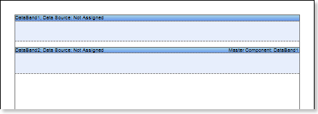
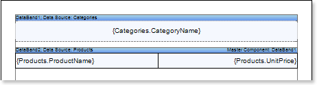
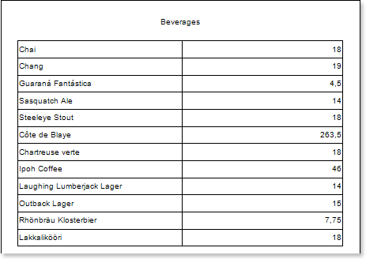
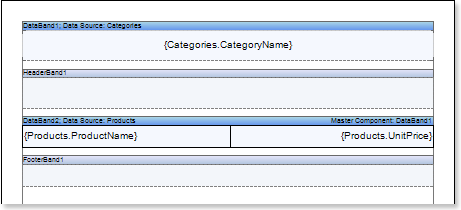
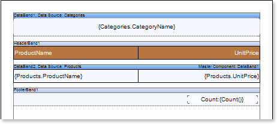
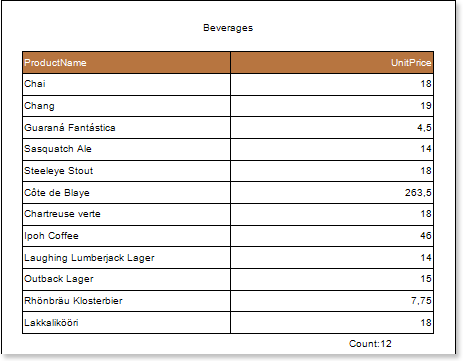
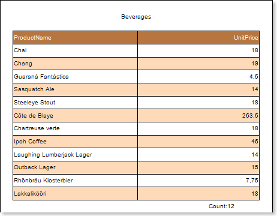

## Master-Detail Report

Do the following steps to create a master-detail report:

1. Run the designer;
2. Connect data:

2.1. Create New Connection;

2.2. Create New Data Source;

1. Create Relation between data sources. If the relation will not be created and/or the Relation property of the Detail data source will not be filled, then, for Master entry, all Detail entries will be output;
2. Put two DataBands on a page of a report template.

1. Edit DataBand1 and DataBand2:

5.1. Align them by height;

5.2. Change values of required properties. For example, if to set the PrintIfDetailEmpty property of the DataBand1 that is the Master component in the Master-Detail report to true, if it is necessary all Master entries be printed in any case, even if Detail entries not present. And set the CanShrink property of the DataBand2 that is the Detail component in the Master-Detail report to true, if it is necessary to shrink this band;

5.3. Change the background color of the DataBand;

5.4. Enable Borders of the band, if required;

1. Define data sources for DataBands, a define the Master component. In our tutorial, the Master component is the DataBand1. This means that in the Data Setup window of the lower DataBand2, the DataBand1 will be specified as the Master component in the Master Component tab;
2. Fill the Data Relation property of the DataBand, that is the Detail components. In our case this DataBand2:

1. Put text components with expressions on DataBands. Where expression is a reference to the data field. For example, put a text component with the expression {Customers.CompanyName} on the DataBand1. Put a text component with {Products.ProductName} and {Products.UnitPrice} expressions in the DataBand2;

9. Edit Text  and TextBox component:

9.1. Drag and drop the text component in DataBands;

9.2. Change parameters of the text font: size, type, color;

9.3. Align the text component by width and height;

9.4. Change the background of the text component;

9.5. Align text in the text component;

9.6. Change the value of properties of the text component. For example, set the Word Wrap property to true, if you need a text to be wrapped;

9.7. Enable Borders for the text component, if required.

9.8. Change the border color.

The picture below shows the master-detail report template.

10.  Click the Preview button or invoke the Viewer, clicking the Preview menu item. After rendering all references to data fields will be changed on data form specified fields. Data will be output in consecutive order from the database that was defined for this report. The amount of copies of the DataBand in the rendered report will be the same as the amount of data rows in the database. The picture below shows a sample of the master-detail report:

11. Go back to the report template;

12. If needed, add other bands to the report template, for example, HeaderBand and FooterBand;

13.  Edit these bands:

13.1. Align them by height;

13.2. Change values of properties, if required;

13.3. Change the background of bands;

13.4. Enable Borders, if required;

13.5. Set the border color.

The picture below shows a simple list report template with HeaderBand and FooterBand:

14. Put text components with expressions in the these bands. The expression in the text component is a header in the HeaderBand, and a footer in the FooterBand.

15.  Edit text and text components:

15.1. Drag and drop the text component in the band;

15.2. Change font options: size, type, color;

15.3. Align text component by height and width;

15.4. Change the background of the text component;

15.5. Align text in the text component;

15.6. Change values of text component properties, if required;

15.7. Enable Borders of the text component, if required;

15.8. Set the border color.

The picture below shows a sample of the master-detail report template:

16. Click the Preview button or invoke the Viewer, clicking the Preview menu item. After rendering all references to data fields will be changed on data form specified fields. Data will be output in consecutive order from the database that was defined for this report. The amount of copies of the DataBand in the rendered report will be the same as the amount of data rows in the database. The picture below shows a sample of the master-detail report with header and footer:

**Adding styles**

1. Go back to the report template;
2. Select DataBand;
3. Change values of Even style and Odd style properties. If values of these properties are not set, then select the Edit Styles in the list of values of these properties and, using Style Designer, create a new style. The picture below shows the Style Designer:

Click the Add Style button to start creating a style. Select Component from the drop down list. Set the Brush.Color property to change the background color of a row. The picture below shows a sample of the Style Designer with the list of values of the Brush.Color property:

Click Close. Then in the list of Even style and Odd style properties a new value (a style of a list of odd and even rows).

4. To render the report, click the Preview button or invoke the Viewer, clicking the Preview menu item. The picture below shows a sample of a rendered master-detail report with alternative color of rows:

If to select the DataBand1, that is the Master component in the Master-Detail report, then it is possible to change values of Even style

and Odd style properties. In such a case, alternative row color will be applied only for Master entries.
