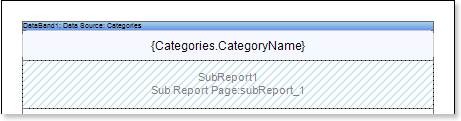
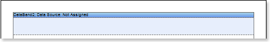
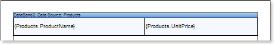
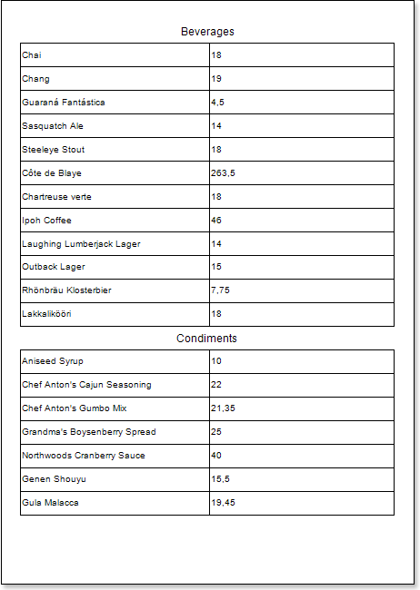
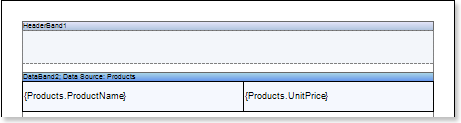
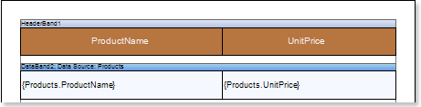
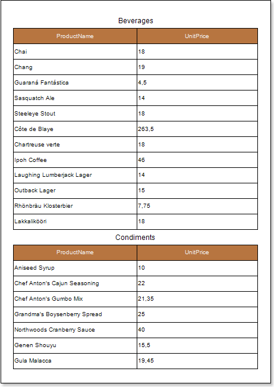
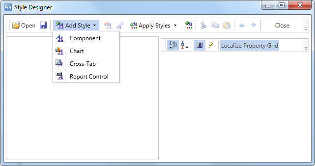
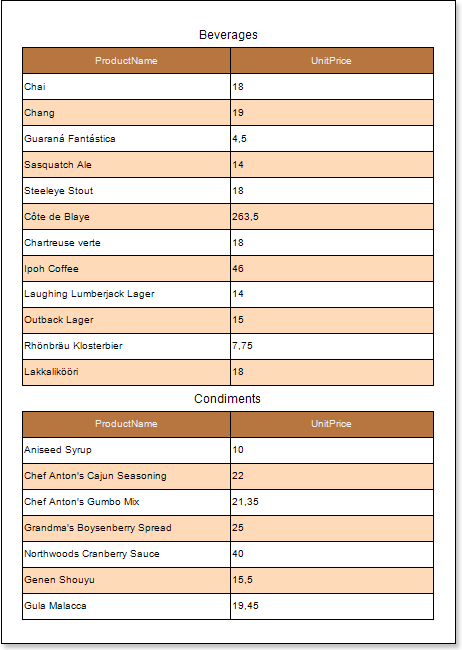

## Master-Detail Report and Sub-Reports

Do the following steps to create a **Master-Detail** report with sub-reports:

1. Run the designer;
2. Connect data:

2.1. Create **New Connection**;

2.2. Create **New Data Source**;

3. Create **Relation** between data sources. If the relation will not be created and/or the **Relation** property of the **Detail** data source will not be filled, then, for **Master** entry, all **Detail** entries will be output;

4. Put the **DataBand1** on a page of a report template:

5. Edit **DataBand1**:

5.1. Align the **DataBand1** by height;

5.2. Change values of band properties. For example, set the **Can Break** property to **true**, if you wish the data band to be broken;

5.3. Change the **DataBand1** background color;

5.4. Enable **Borders** for the **DataBand1**, if required;

5.5. Change the border color.

6. Define the data source for the **DataBand1** using the **Data Source** property. For example, define the **Categories** data source for the **DataBand2:**

7. Put text components with expressions in the **DataBand1**. Where an expression is a reference to a data field. For example, put the text component with the following expression in the **DataBand1** (**Master** component): **{Categories.CategoryName}**;

8. Edit **Text** and **TextBoxes**:

8.1. Drag the text component to the required place in the **DataBand1**;

8.2. Set the text font: size, style, color;

8.3. Align text component vertically and horizontally;

8.4. Set the background color of the text component;

8.5. Align text in the component;

8.6. Set values of the properties of text components. For example to set the **Word Wrap** property to **true**, if you want the text to be wrapped;

8.7. Set **Borders** of a text component.

8.8. Set the border color.

9. Put a **Sub-Report** component in the **DataBand1**;

10. Edit the **Sub-Report** components:

10.1. Stretch the **Sub-Report** components as seen on the picture below;

10.2. Change the value of properties of **Sub-Reports**. For example, set the **Keep Sub-Report Together** property to **true**, if you want the sub-report to be kept together;;

10.3. Change the background color of the components.

11. Go to the sub-report page;

12. Add to the **DataBand2** to the sub-report page.

13. Edit **DataBand2**:

13.1. Align the **DataBand2** by height;

13.2. Change values of band properties. For example, set the **Can Break** property to **true**, if you wish the data band to be broken;

13.3. Change the **DataBand2** background color;

13.4. Enable **Borders** for the **DataBand2**, if required;

13.5. Change the border color.

14. Define the data source for the **DataBand1** using the **Data Source** property. For example, define the **Products** data source for the **DataBand2**:

15. Define the **Master** component in a report. In our case set the **DataBand1** as a **Master** component for the **DataBand2**;

16. Fill the **Data Relation** property of the **DataBand**, that is the **Detail** component, in this case for the **DataBand2**;

17. Put text components with expressions in the **DataBand1**. Where an expression is a reference to a data field. For example, put the text component with the following expression in the **DataBand2**: **{Products.ProductName}** and **{Products.UnitPrice}**;

18. Edit **Text** and **TextBoxes**:

18.1. Drag the text component to the required place in the **DataBand2**;

18.2. Set the text font: size, style, color;

18.3. Align text component vertically and horizontally;

18.4. Set the background color of the text component;

18.5. Align text in the component;

18.6. Set values of the properties of text components. For example to set the **Word Wrap** property to **true**, if you want the text to be wrapped;

18.7. Set **Borders** of a text component.

18.8. Set the border color.

19. Click the **Preview** button or call **Viewer**, using the **Preview** menu item to see how the report will look like:

20. Go back to the report template;

21. If necessary, add some bands to the report template, for example, the **HeaderBand**;

22. Edit this band:

22.1. Align vertically this band;

22.2. Set values of the properties of the **HeaderBand**, if necessary;

22.3. Set the background color;

22.4. Set **Borders** of a text component.

22.5. Set the border color.

23. Put a text component with expression where the expression of the text component in the **HeaderBand** will be the page title.

24. Edit the text component:

24.1. Drag the text component to the required place in the band;

24.2. Set the text font: size, style, color;

24.3. Align text component vertically and horizontally;

24.4. Set the background color of the text component;

24.5. Align text in the component;

24.6. Set values of the properties of text components;

24.7. Set **Borders** of a text component.

24.8. Set the border color.

25. Click the **Preview** button or call **Viewer**, using an **F5** hot key or the **Preview** menu item to see how the report will look like:

**Adding styles**

1. Go back to the report template;
2. Select the sub-report;
3. Select the **DataBand**;
4. Change values of **Even style** and **Odd style** properties. If values of these properties are not set, then select the **Edit Styles** in the list of values of these properties and, using **Style Designer**, create a new style. The picture below shows the **Style Designer**.

Click the **Add Style** button to start creating a style. Select **Component** from the drop down list. Set the **Brush.Color** property to change the background color of a row. The picture below shows a sample of the **Style Designer** with the list of values of the **Brush.Color** property:

Click **Close**. Then a new value in the list of **Even style** and **Odd style** properties (a style of a list of odd and even rows) will appear.

5. To render the report, click the **Preview** button or invoke the **Viewer**, clicking the **Preview** menu item. The picture below shows a sample of a rendered "**master-detail report with sub-report**" with alternative color of rows:

