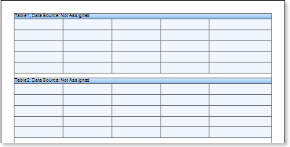
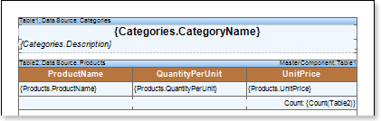
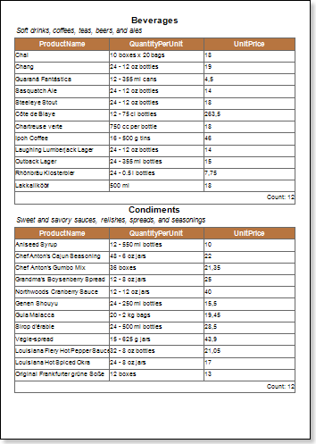
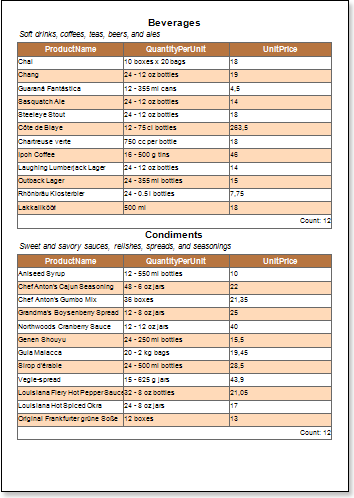

## Master-Detail Report with Table

Do the following steps to design a Master-Detail report with the Table component:

1. Run the designer;

2. Connect the data:

2.1. Create a New Connection;

2.2. Create a New Data Source;

3. Create Relation between data sources. If the relation will not be created and/or the Relation property of the Detail data source will not be filled, then, for Master entry, all Detail entries will be output.

4. Put two Table components on a page of a report template.

5. Edit Table components:

5.1. Change the number of rows and columns in the Table component. For example, using the RowCount and ColumnCount properties. Set the RowCount and ColumnCount properties of the Table1 component to 3 and 1 respectively. And for the Table2 component - values of 3 and 3;

5.2. Set the number of headers and footers in the table using, for example, the HeaderRowsCount and FooterRowsCount properties. Set the FooterRowsCount property of the Table1 to 1. Set the HeaderRowsCount and FooterRowsCount property of the Table2 to 1 and 1 respectively;

5.3. Align the Table component by height;

5.4. Set the height of rows in the table. To do this, select the Table component and, dragging the horizontal border line, edit the row height. In addition, if you want to change the row height, leaving the height of the Table component unchanged, it is necessary to hold down the Ctrl button before editing the row height;

5.5. Change columns width in the table. To do this, select the Table component, and change width by dragging the vertical border of a column;

5.6. Change values of properties. For example, set the Print if Detail Empty property of the Table component, which is the Master component in the Master-Detail report, to true, if you want the Master entries be printed in any case, even if the Detail entries are not available. Set the CanShrink property of the Table component, which is the Detail component in the Master-Detail report to true, if you want this component be shrunk;

5.7. Set color of table cells;

5.8. Set Borders of cells of the Table component, if necessary;

6. Specify data sources for the Table components, as well as set the Master component. In our case, the Master component is the Table1. This means that in the Data Setup window of the Table2 component on the tab of the Master Component, specify Table1 as the Master component;

7. Fill in the DataRelation property of the Table2 component, which is the Detail entry in this report:

8. Set expressions in table cells. Where an expression is a reference to a data source. For example: the Table1 component, which is the Master component, set the following expressions for the first and second rows: {Categories.CategoryName} and {Categories.Description}, respectively. The third row of the Table1 is a total row, and in this case, it is blank. The first row of the Table2 is the header row of data, so the expression in cells of the first row will be the data header. In the cells of the second row we specify references to data sources. The third row in the Table2 is the total row, so the expression in this line will be a total. Set the Count function for the third row;

9. Edit text boxes and cells:

9.1. Set the font options: size, style, color;

9.2. Set the background color of cells;

9.3. Align the text in cells;

9.4. Set the value of properties of cells. For example, set the Word Wrap property to true, if you want the text be wrapped;

10. Click the Preview button or invoke the Viewer, clicking the Preview menu item. After rendering all references to data fields will be changed on data form specified fields.

Adding Styles

1. Go back to the report template;
2. Select the Table component. In this case the Table2 component;
3. Change values of Even style and Odd style properties. If values of these properties are not set, then select the Edit Styles in the list of values of these properties and, using Style Designer, create a new style. The picture below shows the Style Designer:

Click the Add Style button to start creating a style. Select Component from the drop down list. Set the Brush.Color property to change the background color of a row. The picture below shows a sample of the Style Designer with the list of values of the Brush.Color property:

Click Close. Then a new value in the list of Even style and Odd style properties (a style of a list of odd and even rows) will appear.

4. To render the report, click the Preview button or invoke the Viewer, clicking the Preview menu item.

