## Report with Chart in Data Band

Suppose a **Chart** component is placed on the page of the report, then, for a report, this component will be rendered as a page item. If the **Chart** component is placed in the **DataBand**, then, when rendering a report, this component will be rendered as part of the **DataBand**. Since the **Chart** component placed in the **DataBand**, is rendered as a part of the **DataBand**, and will be printed as many times as the **DataBand** will be output. An example of designing a report with a chart in the **DataBand** will be described below. In this example, the chart will graphically display the detailed data of the data source in the **DataBand**. Follow the steps below to render a report with the **Chart** in the  **DataBand**:

1. Run the designer;
2. Connect data:

2.1. Create **New Connection**;

2.2. Create **New Data Source**;

3. Create a **Relation** between data sources. In this case, the **Parent Data Source** is the **Categories** data source, and the **Child Data Source** is the **Products** data source;

4. Put the **DataBand** on a report template page:

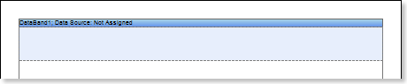

5. Edit **DataBand**:

5.1. Align the **DataBand** by height;

5.2. Change values of band properties. For example, set the **Can Break** property to **true**, if you wish the data band to be broken;

5.3. Change the **DataBand** background;

5.4. Enable **Borders** for the **DataBand**, if required;

5.5. Change the border color.

6. Define the data source for the **DataBand** using the **Data Source** property:

7. Put the **Chart** component in the **DataBand** as seen on a picture below:

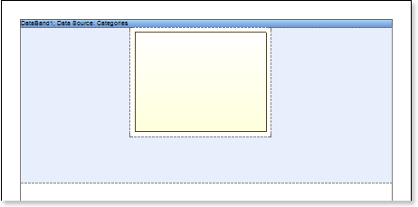

8. Edit the **Chart** component:

8.1. Align it by width;

8.2. Change properties of the **Chart** component. For example, set the **GrowToHeight** property to **true**, if it is required the Chart component be grown by height;

8.3. Set **Borders**, if required, for the **Chart** component;

8.4. Change the border color.

8.5. Edit the chart area. For example, change the **Area.Brush.Color** property, if it is required to change the color of a chart area.

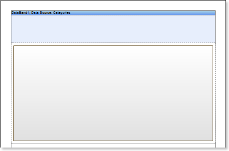

9. Change the type of a chart using the **Chart Type** property. For example, set it to **Clustered Column**:

10. Define the data source for the **Chart** component using the **Data Source** property

11. Define the relation between data sources, using the **DataRelation** property of the **Chart** component:

12. Add series. Invoke the **Series Editor**, for example, by double-clicking the **Chart**:

13. Setup chart series:

13.1. Get the data for **Value** and for the **Argument** of series. There are three ways to get data for the series: set the column data from the dictionary, or specify an expression, or manually specify values for the series as a list, through the ',' separator. For example, create a series and specify columns from the dictionary: define the **Products.ProductName** for the **Argument** and **Products.UnitPrice** for the **Value**;

13.2. Change the values of the series properties. For example, set the **Show Zeros** property to **false**, if it is necessary to hide zero values;

13.3. Enable or disable **Series Labels**;

13.4. Edit headers of rows: align, change the style, font, type of value, etc.;

13.5. Change the design of series, by setting values of the following properties: **Border Color**, **Brush**, **Show Shadow**.

The picture below shows an example of a report template with the chart:

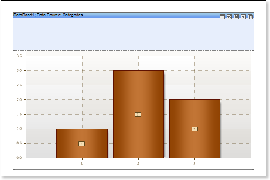

14. Edit **Legend**:

14.1. Enable or disable the visibility of **Legends**. You can do it by setting the value of the **Legend.Visible** property to **true** or **false**, respectively;

14.2. Align the legend horizontally and vertically;

14.3. Change the legends design, etc.

The picture below shows an example of a report template with the chart displaying the legend:

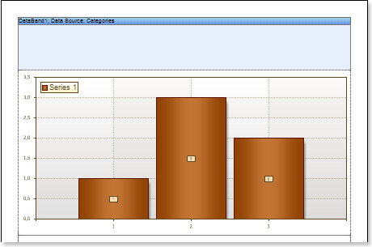

15. Change the style of the chart, completely change the appearance of the chart:

15.1. Change the **Style** property. Where the value of the property is a chart style;

15.2. Set the **AllowApplyStyle** to the **true**. If the **AllowApplyStyle** property is set to **false**, then the report generator, when rendering, will take into account the values of the appearance of the series.

The picture below shows an example of a report template of the chart with a changed style:

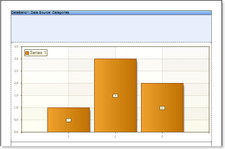

16. Put text components with an expression in the **DataBand**. Where the expression is a reference to the data field. For example, put a text component with the expression: **{Categories.CategoryName}**;

17. Edit **Text**  and **TextBox** component:

17.1. Drag and drop the text component in the **DataBand**;

17.2. Change parameters of the text font: size, type, color;

17.3. Align the text component by width and height;

17.4. Change the background of the text component;

17.5. Align text in the text component;

17.6. Change the value of properties of the text component. For example, set the **Word Wrap** property to **true**, if you need a text to be wrapped;

17.7. Enable **Borders** for the text component, if required.

17.8. Change the border color.

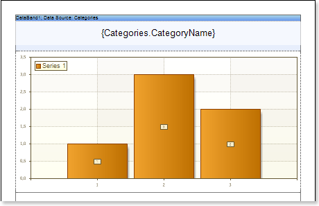

18. Click the **Preview** button or invoke the **Viewer**, clicking the **Preview** menu item. The picture below shows a sample of the report with the chart in the **DataBand**:

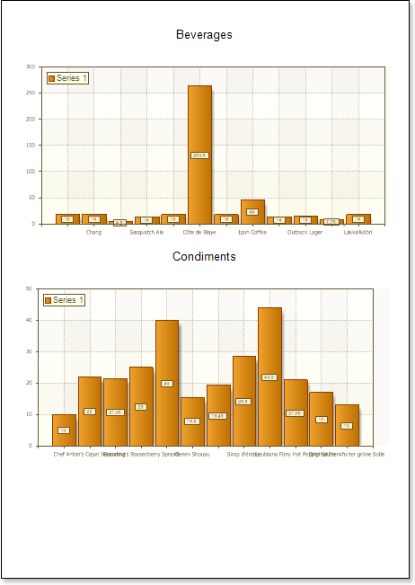

**Adding styles**

1. Go back to the report template;
2. Call the **Style Designer**;

The picture below shows the **Style Designer**:

Click the **Add Style** button to start creating a style. Select **Chart** from the drop down list. Set the style using **Basic Color Style**, **Brush Type** and **Style Colors** group of properties.

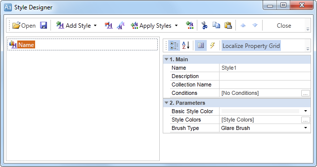

Click **Close**. In the list of values of the **Style** property of the chart component a custom style will be displayed. In our case, the value is **Style for Chart**. Select this value;

3. Click the **Preview** button or invoke the **Viewer**, clicking the **Preview** menu item. The picture below shows samples of reports with the chart with a style applied:

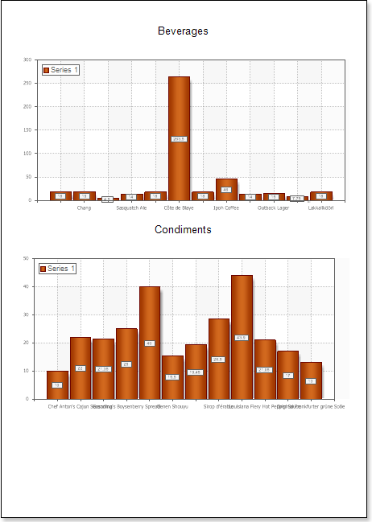

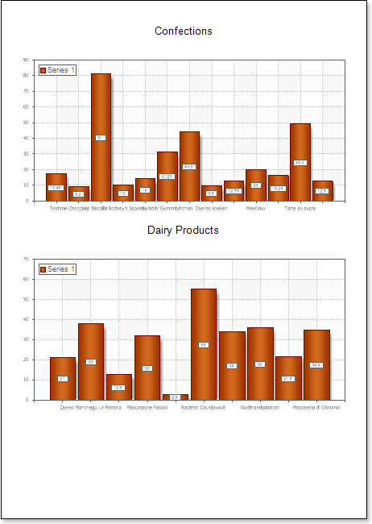
