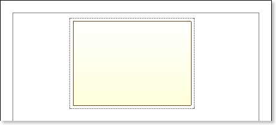
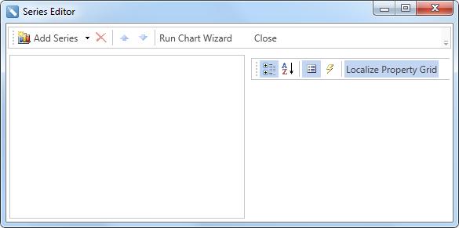
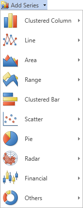
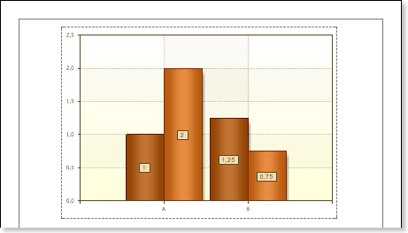
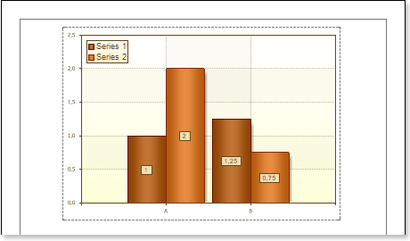
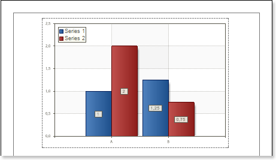
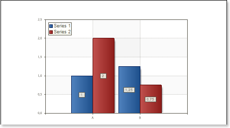
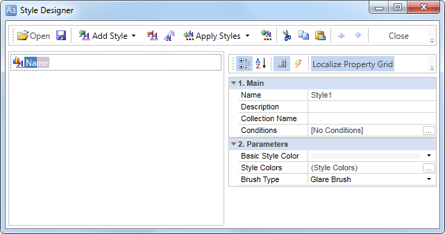
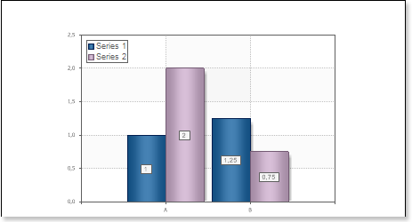

## Report with Chart on Page

Do the following steps to create a report with charts:

1. Run the designer;
2. Connect data:

2.1. Create New Connection;

2.2. Create New Data Source;

3. Put the Chart component on a page as seen on a picture below.

4. Edit the Chart component:

4.1. Align it by width;

4.2. Change properties of the Chart component. For example, set the GrowToHeight property to true, if it is required the Chart component be grown by height;

4.3. Set Borders, if required, for the Chart component;

4.4. Change the border color.

4.5. Edit the chart area. For example, change the Area.Brush.Color property, if it is required to change the color of a chart area.

5. Change the type of a chart using the Chart Type property. For example, set it to Clustered Column:

6. Add series. Invoke the Series Editor, for example, by double-clicking the Chart.

Click the Add Series button to add a series and select the type of series in the menu. The picture below shows the menu of the Add Series button:

It should be noted that the type of number should match the type of chart; if the Clustered Column chart type, then the series must be of the Clustered Column type.

7. Setup chart series:

7.1. Get the data for Value and for the Argument of series. There are three ways to get data for the series: set the column data from the dictionary, or specify an expression, or manually specify values for the series as a list, through the ',' separator. For example, create two rows, and manually define the values for these series as a list, with the ";" delimiter: arguments for Series 1 - A; B, the values - 1; 1.25; for arguments Series 2 - A; B, the value - 2, 0.75.

7.2. Change the values of the series properties. For example, set the Show Zeros property to false, if it is necessary to hide zero values;

7.3. Enable or disable Series Labels;

7.4. Edit headers of rows: align, change the style, font, type of value, etc.;

7.5. Change the design of series, by setting values of the following properties: Border Color, Brush, Show Shadow.

The picture below shows an example of a report template with the chart:

8. Edit Legend:

8.1. Enable or disable the visibility of Legends. You can do it by setting the value of the Legend.Visible property to true or false, respectively;

8.2. Align the legend horizontally and vertically;

8.3. Change the legends design, etc.

The picture below shows an example of a report template with the chart displaying the legend:

9. Change the style of the chart, completely change the appearance of the chart:

9.1. Change the Style property. Where the value of the property is a chart style;

9.2. Set the AllowApplyStyle to the true. If the AllowApplyStyle property is set to false, then the report generator, when rendering, will take into account the values of the appearance of the series.

The picture below shows an example of a report template of the chart with a changed style:

10. Click the Preview button or invoke the Viewer, clicking the Preview menu item. The picture below shows samples of reports with the chart:

**Adding styles**

1. Go back to the report template;
2. Call the Style Designer;

The picture below shows the Style Designer:

Click the Add Style button to start creating a style. Select Chart from the drop down list. Set the style using Basic Color Style, Brush Type and Style Colors group of properties.

Click Close. In the list of values of the Style property of the chart component a custom style will be displayed. In our case, the value is Style for Chart. Select this value;

1. Click the Preview button or invoke the Viewer, clicking the Preview menu item. The picture below shows samples of reports with the chart with a style applied:

