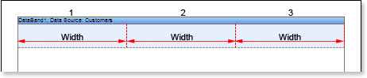
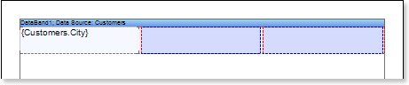
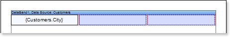
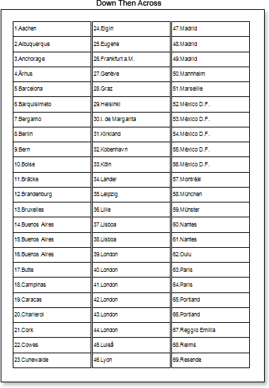
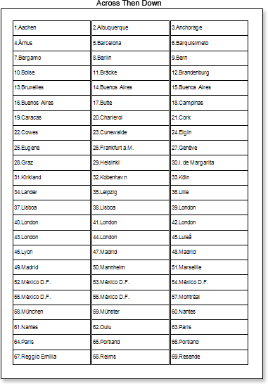
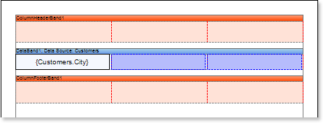
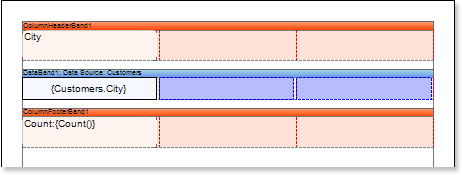
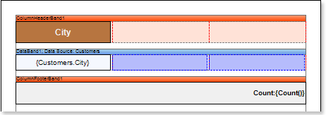
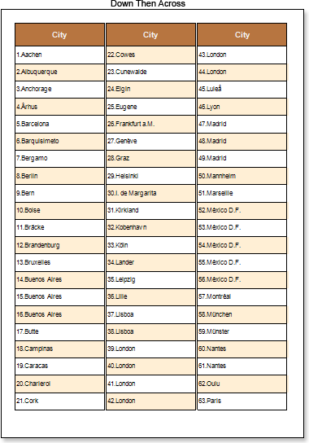
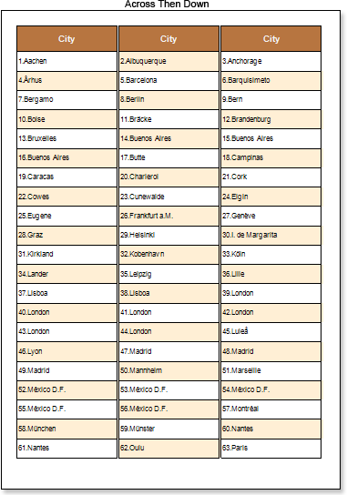

## Report with Columns in Data Band

Do the following steps to create a report with columns in DataBand:

1. Run the designer;
2. Connect data:

2.1. Create **New Connection**;

2.2. Create **New Data Source**;

1. Put a **DataBand** on a page of a report template.

1. Define the data source for the **DataBand** using, for example, the **Data Source** property**:**

1. Set column options: the number of columns, column width, and column gap. For example, set the number of columns equal to **3**, with the gap equal to **0**. The column width is created automatically. The picture below shows a sample of the report template with two columns, placed in the **DataBand**:

1. Put a text component with expressions on the **DataBand**. Where expression is a reference to the data field. For example, put one text component with the **{Customers.City}** expression.

1. Edit expressions and text components:

7.1.  Drag and drop the text component in **DataBand**;

7.2. Change parameters of the text font: size, type, color;

7.3. Align the text component by width and height;

7.4. Change the background of the text component;

7.5. Align text in the text component;

7.6. Change the value of properties of the text component. For example, set the **Word Wrap** property to **true**, if you need a text to be wrapped;

7.7. Enable **Borders** for the text component, if required.

7.8. Change the border color.

1. Set the columns direction of data output using the **Column Direction** property. Read about this property in section Report Internals -&gt; Columns.
2. Click the **Preview** button or invoke the **Viewer**, clicking the **Preview** menu item. After rendering all references to data fields will be changed on data form specified fields. Data will be output in consecutive order from the database that was defined for this report. The amount of copies of the **DataBand** in the rendered report will be the same as the amount of data rows in the database. The picture below shows samples of reports with columns rendered using different values of the **Column Direction** property.

1. Go back to the report template;

11. If needed, add other bands to the report template, for example, **ColumnHeaderBand** and **ColumnFooterBand**.

12. Edit these bands:

12.1. Align them by height;

12.2. Change values of properties, if required;

12.3. Change the background of bands;

12.4. Enable **Borders**, if required;

12.5. Set the border color.

13. Put text components with expressions in the these bands. Where expression of the text component in the **ColumnHeaderBand** is the column name and the expression of the text component in the **ColumnFooterBand** is the data footer.

14. Edit **Text** and **TextBox** component:

14.1. Drag and drop the text component in **ColumnHeaderBand** and **ColumnFooterBand**;

14.2. Change parameters of the text font: size, type, color;

14.3. Align the text component by width and height;

14.4. Change the background of the text component;

14.5. Align text in the text component;

14.6. Change the value of properties of the text component. For example, set the **Word Wrap** property to **true**, if you need a text to be wrapped;

14.7. Enable **Borders** for the text component, if required.

14.8. Change the border color.

15. Click the **Preview** button or invoke the **Viewer**, clicking the **Preview** menu item. After rendering all references to data fields will be changed on data form specified fields. Data will be output in consecutive order from the database that was defined for this report. The amount of copies of the **DataBand** in the rendered report will be the same as the amount of data rows in the database. The picture below shows samples of reports with column headers.

**Adding styles**

1. Go back to the report template;
2. Select **DataBand**;
3. Change values of **Even style** and **Odd style** properties. If values of these properties are not set, then select the **Edit Styles** in the list of values of these properties and, using **Style Designer**, create a new style. The picture below shows the **Style Designer**:

Click the **Add Style** button to start creating a style. Select **Component** from the drop down list. Set the **Brush.Color** property to change the background color of a row. The picture below shows a sample of the **Style Designer** with the list of values of the **Brush.Color** property:

Click **Close**. Then in the list of **Even style** and **Odd style** properties a new value (a style of a list of odd and even rows).

4. To render the report, click the **Preview** button or invoke the **Viewer**, clicking the **Preview** menu item. The picture below shows a sample of a rendered report with columns on a page and alternative color of rows:

