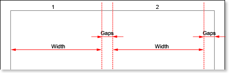
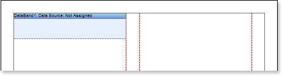
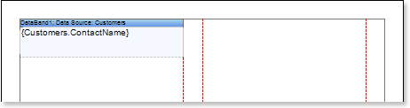
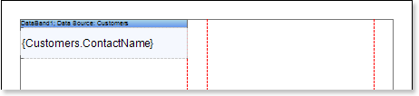
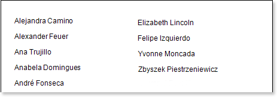
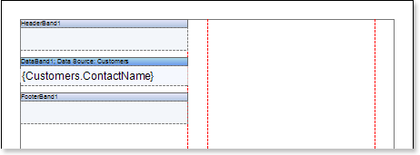
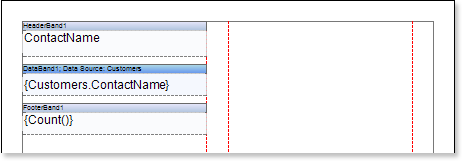
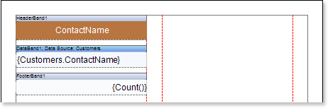
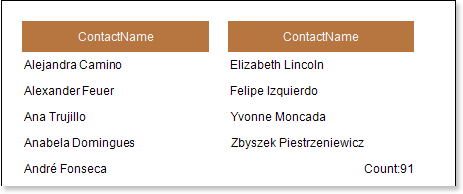
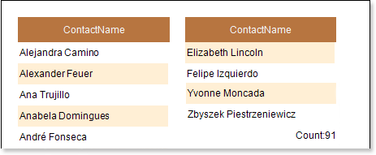

## Report with Columns on Page

Do the following steps to create a report with columns on a page:

1. Run the designer;
2. Connect data:

2.1. Create New Connection;

2.2. Create New Data Source;

1. Set column options: the number of columns, column width, and column gap. For example, set the number of columns equal to 2, with the gap equal to 1. The column width is created automatically. The picture below shows a sample of the report template with two columns:

1. Put DataBand on a page.

5. Edit DataBand:

5.1. Align the DataBand by height;

5.2. Change values of band properties. For example, set the Can Break property to true, if you wish the data band to be broken;

5.3. Change the DataBand background;

5.4. Enable Borders for the DataBand, if required;

5.5. Change the border color.

6. Define the data source for the DataBand using the Data Source property:

7. Put text components with expressions on the DataBand. Where expression is a reference to the data field. For example, put two text components with expressions: {Customers.ContactName}.

8. Edit expressions and text components:

8.1.  Drag and drop the text component in DataBand;

8.2. Change parameters of the text font: size, type, color;

8.3. Align the text component by width and height;

8.4. Change the background of the text component;

8.5. Align text in the text component;

8.6. Change the value of properties of the text component. For example, set the Word Wrap property to true, if you need a text to be wrapped;

8.7. Enable Borders for the text component, if required.

8.8. Change the border color.

The picture below shows a report template with edited text component:

9. Click the Preview button or invoke the Viewer, clicking the Preview menu item. After rendering all references to data fields will be changed on data form specified fields. Data will be output in consecutive order from the database that was defined for this report. The amount of copies of the DataBand in the rendered report will be the same as the amount of data rows in the database. The picture below shows a sample of the report with two columns on a page:

Step 3 and 4 can be changed in sequence of doing. So you may put DataBand first and then set the column options on page.

10. Go back to the report template;

11. If needed, add other bands to the report template, for example, HeaderBand and FooterBand;

12.  Edit these bands:

12.1. Align them by height;

12.2. Change values of properties, if required;

12.3. Change the background of bands;

12.4. Enable Borders, if required;

12.5. Set the border color.

13. Put text components with expressions in the these bands. The expression in the text component is a header in the HeaderBand, and a footer in the FooterBand.

14. Edit text and text components:

14.1. Drag and drop the text component in the band;

14.2. Change font options: size, type, color;

14.3. Align text component by height and width;

14.4. Change the background of the text component;

14.5. Align text in the text component;

14.6. Change values of text component properties, if required;

14.7. Enable Borders of the text component, if required;

14.8. Set the border color.

The picture below shows a sample of the report with two columns on a page:

15. Click the Preview button or invoke the Viewer, clicking the Preview menu item. After rendering all references to data fields will be changed on data form specified fields. Data will be output in consecutive order from the database that was defined for this report. The amount of copies of the DataBand in the rendered report will be the same as the amount of data rows in the database. The picture below shows a sample of the report with a header and a footer:

**Adding styles**

1. Go back to the report template;
2. Select DataBand;
3. Change values of Even style and Odd style properties. If values of these properties are not set, then select the Edit Styles in the list of values of these properties and, using Style Designer, create a new style. The picture below shows the Style Designer:

Click the Add Style button to start creating a style. Select Component from the drop down list. Set the Brush.Color property to change the background color of a row. The picture below shows a sample of the Style Designer with the list of values of the Brush.Color property:

Click Close. Then in the list of Even style and Odd style properties a new value (a style of a list of odd and even rows).

1. To render the report, click the Preview button or invoke the Viewer, clicking the Preview menu item. The picture below shows a sample of a rendered report with columns on a page and alternative color of rows:

