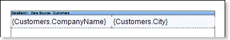
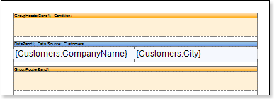
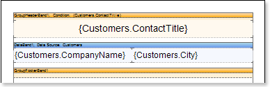
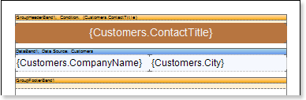
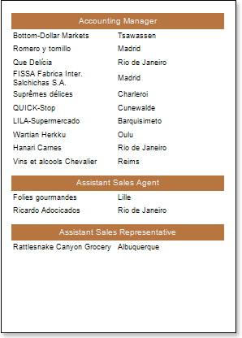
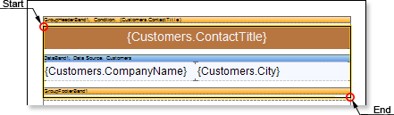
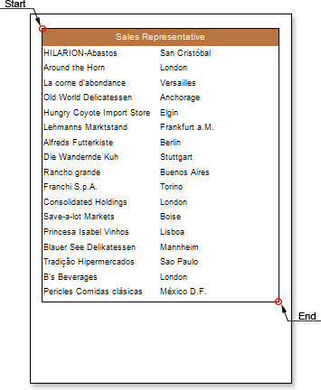
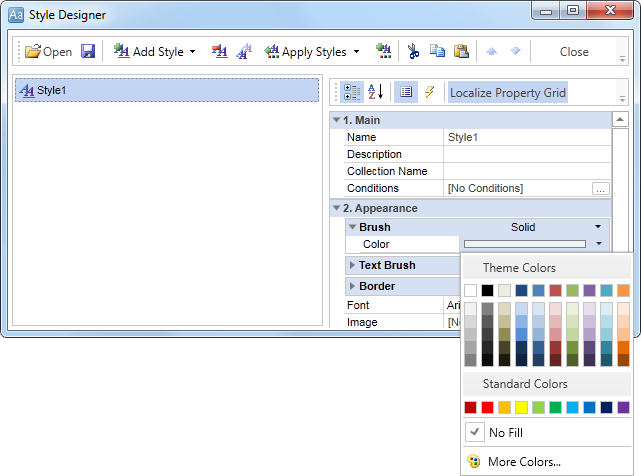
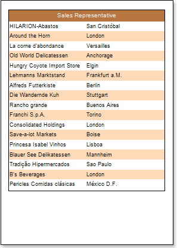

## Report with Cross-Primitives

Cross-primitives include: **Vertical Line**, **Rectangle** and **Rounded Rectangle**. The start and end points of cross-primitives can be placed on different components of a report. To design a report with cross-primitives, follow the steps below:

1. Run the designer;

2. Connect the data:

2.1. Create a **New Connection**;

2.2. Create a **New Data Source**;

3. Create a report or load previously saved one. For our example we take a Simple List Report report, described in **Simple List Report** article.

4. Add **GroupHeaderBand** and **GroupFooterBand** to a report template. The **GroupHeaderBand** should be placed above the **DataBand** to which it applies. The **GroupFooterBand** should be placed below the **DataBand**. And it is meant exactly the **DataBand**, that is associated with the **GroupHeaderBand**. Each **GroupFooterBand**, refers to a certain **GroupHeaderBand**. The **GroupFooterBand** will not be output without the **GroupHeaderBand**.

5. Edit the **GroupHeaderBand** and the **GroupFooterBand**:

5.1. Align them by height;

5.2. Change the values of the required properties. For example, set the **KeepGroupHeaderTogether** property for the **GroupHeaderBand** to **true**, if you want the **GroupHeaderBand** be kept with the group. And set the **KeepGroupFooterTogether** property for the **GroupFooterBand** to **true**, if you want this band be kept with the group;

5.3. Set the background color for the **GroupHeaderBand**;

5.4.  If necessary, set the **Borders** for the **DataBand**;

6. Set the condition of data grouping in the report using the **Condition** property of the **GroupHeaderBand**. Condition for the grouping can be set by specifying an expression or by selecting a column from a data source. In this example, we specify the **{Customers.ContactTitle}** expression of the grouping condition, so, when rendering the report, a list of companies will be grouped by the **ContactTitle** column data.

7. Put a text component in the **GroupHeaderBand** with the following expression: **{Customers.ContactTitle}**. So when rendering the report, as a group header, the entries from the **ContactTitle** data column will be output. Put a text component in the **GroupFooterBand** with the following expression: **{Count ()}**. The **{Count ()}** function will count the number of entries in each group.

8. Edit expressions, and text components:

8.1. Drag and drop text components in the **GroupHeaderBand** and **GroupFooterBand**;

8.2. Set the font settings: size, style, color;

8.3. Align text components by height and width;

8.4. Set background color of text components;

8.5. Set the expression in the text components;

8.6. Set the value of the required properties;

8.7. Set **Borders** of text components, if required;

8.8. Set the border color.

9. Click the **Preview** button or invoke the **Viewer**, clicking the **Preview** menu item. After rendering a report all references to data fields will be changed on data from specified fields.

10. Go back to the report template;

11. Add the **Rectangle** cross-primitive to the report template. Starting points of the rectangle will lie in the **GroupHeaderBand**, and the end point will lie in the **GroupFooterBand**.

12. Click the **Preview** button or invoke the **Viewer**, clicking the **Preview** menu item. After rendering a report all references to data fields will be changed on data from specified fields. The picture below shows a rendered report page with grouping and the rendered **Rectangle** cross-primitive:

**Adding Styles**

1. Go back to the report template;
2. Select **DataBand**;
3. Change values of **Even style** and **Odd style** properties. If values of these properties are not set, then select the **Edit Styles** in the list of values of these properties and, using **Style Designer**, create a new style. The picture below shows the **Style Designer**:

Click the **Add Style** button to start creating a style. Select **Component** from the drop down list. Set the **Brush.Color** property to change the background color of a row. The picture below shows a sample of the **Style Designer** with the list of values of the **Brush.Color** property:

Click **Close**. Then a new value in the list of **Even style** and **Odd style** properties (a style of a list of odd and even rows) will appear.

4. To render the report, click the **Preview** button or invoke the **Viewer**, clicking the **Preview** menu item.

