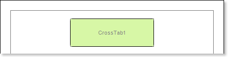
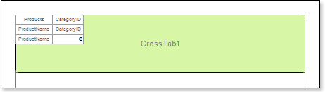
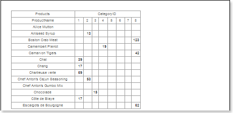
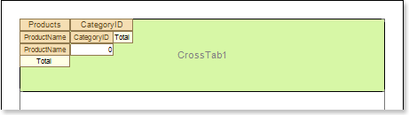
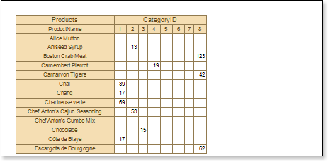
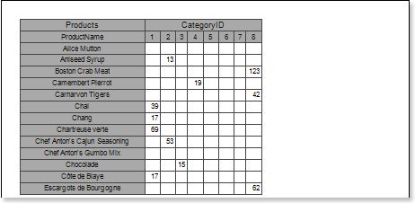

## Report with Cross-Tab on Page

Do the following steps to create a report with the cross table:

1. Run the designer;
2. Connect data:

2.1. Create **New Connection**;

2.2. Create **New Data Source**;

3. Put the **Cross-Tab** component on a page of the report template.

4. Edit the **Cross-Tab** component:

4.1. For example, set the **GrowToHeight** property to **true**, to allow the **Cross-Tab** component to grow by height;

5. Define the data source for the **Cross-Tab** component of the band, for example, using the **Data Source** property:

6. Invoke the **Cross-Tab Designer**, for example, clicking the **Design...** item of the context menu of the cross table component. The picture below shows the **Cross-Tab Designer** window:

 The **DataSource** field shows the data columns of the selected data source;

 The **Columns** field shows a list of columns of the data source by what the columns in the cross table will be created;

 The **Rows** field shows a list of rows of the data source by what the rows in the cross table will be created;

 The **Summary** field shows a list of columns of the data source by what the summary in the cross table will be created;

 The **Properties** field shows the properties of the selected item of the cross table;

 The **Cross-Tab Cells** field shows cells of the cross table;

 The **Select Style** button. When clicking the drop down list of styles for the cross table appear.

7. Do the following steps in the **Cross-Tab Designer**:

7.1. Add the data column from the 

 **DataSource** to the 

 **Columns** field of the cross-tab. For example, add the **CategoryID** data column to the **Columns** field of the cross-tab. Hence one entry from this data column will correspond to one column in the rendered cross-table, the number of entries in this data column will be equal to the number of columns in the cross-table;

7.2. Add a column of the data source from 

 the **DataSource** field to  the **Rows** of the cross-table. For example, add the **ProductName** data column to the **Rows** field of the cross-table, and then one entry from this data column will correspond to one row in the rendered cross-table, the number of entries in this  data column will be equal to the number of rows in the cross-table;

7.3. Add a data column from 

 the **DataSource** field to the  **Summary** field of the cross-table. For example, add the **UnitInStock** data column to the **Summary** field of the cross-table, all entries in this data column will be summary entries in the cross-table;

8. Press the **OK** button to save your changes and go back to the report template with cross-table.

9. Click the **Preview** button or invoke the **Viewer**, clicking the **Preview** menu item. The picture below shows a rendered cross-tab report:

10. Go back to the report template;

11. Edit cells in the report template:

11.1. Set the font settings: type, style, size;

11.2. Set the background of cells;

11.3. Set the **Word Wrap** property to **true** if it is necessary to wrap text;

11.4. Switch on/off **Borders**;

11.5. Set the border color;

11.6. Set the background of cells etc.

12. Click the **Preview** button or invoke the **Viewer**, clicking the **Preview** menu item. The picture below shows a report of the rendered report with the cross table after editing report template cells:

**Adding styles**

1. Go back to the report template;
2. Call the **Style Designer**;

The picture below shows the **Style Designer**:

Click the **Add Style** button to start creating a style. Select **Cross-Tab** from the drop down list. To create the custom style, set the **Color** property. The picture below shows a sample of the **Style Designer** with created custom style**:**

Click **Close**. In the list of values of the **Select Style** button in the cross-table editor, a custom style will be displayed. In our case, the name is **Style for Cross-Tab**. Select this value;

3. Click the **Preview** button or invoke the **Viewer**, clicking the **Preview** menu item. The picture below shows a sample of the rendered cross-table report using the custom style:

