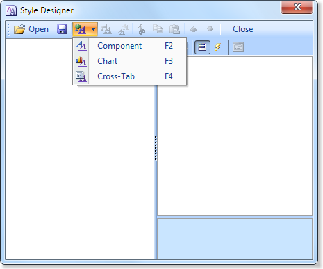
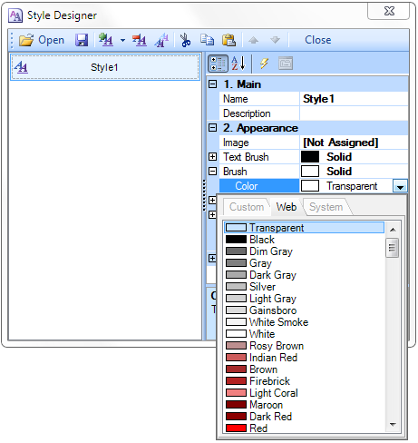

## Report With Dynamic Collapsing in Preview

The report with dynamic collapsing is an interactive report in what items can collapse/expand its contents by clicking the title of the block. To create a report with dynamic folding in the preview window, you should do the following:

Run the designer;

Connect the data:

2.1. Create a **New Connection**;

2.2. Create a **New Data Source**;

3. Create a report or open a previously designed one. For example, open a report with grouping, which was reviewed in the chapter "Report from the groups." The picture below shows a report template with groups:

4. Render your report. Click on the **Preview** tab or invoke the report viewer clicking the Preview in the menu. After rendering a report, all references to the data field will be replaced with data from these fields. The picture below shows a report page with the grouping:

5. Go back to the report template;

6. Select the GroupHeaderBand;

7. Set the **Interaction.Collapsing Enabled** property to **true**:

8. Change the value of the **Interaction.Collapsed**. In this case, set this property to **{GroupLine!=1}**, all the groups except the first one will be collapsed:

9. Render the report. Click on the **Preview** tab or invoke the report viewer clicking the Preview in the menu. After rendering a report, all references to the data field will be replaced with data from these fields. The picture below shows the rendered page of the report:

To expand or collapse the group, select the **GroupHeaderBand** in the rendered report. If you want to collapse the group together with the the group footer you should set the **Interaction.Collapse Group Footer** property set to **true**. The picture below shows a rendered report page with the collapsed items:

**Adding Styles**

1. Go back to the report template;
2. Select DataBand;
3. Change values of Even style and Odd style properties. If values of these properties are not set, then select the Edit Styles in the list of values of these properties and, using Style Designer, create a new style. The picture below shows the Style Designer:

Click the Add Style button to start creating a style. Select Component from the drop down list. Set the Brush.Color property to change the background color of a row. The picture below shows a sample of the Style Designer with the list of values of the Brush.Color property:

Click Close. Then a new value in the list of Even style and Odd style properties (a style of a list of odd and even rows) will appear.

4. To render the report, click the Preview button or invoke the Viewer, clicking the Preview menu item.

