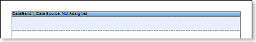
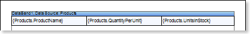
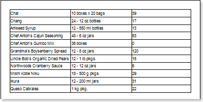
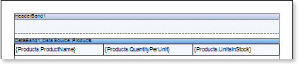
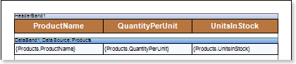
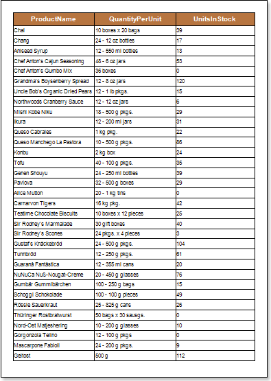
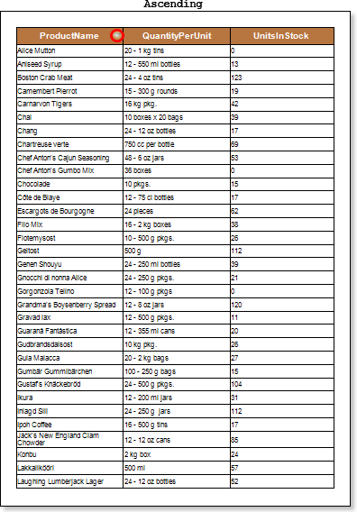
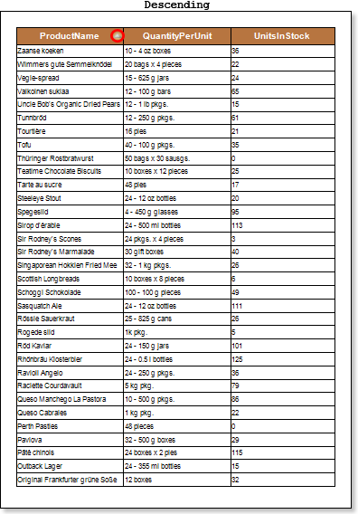
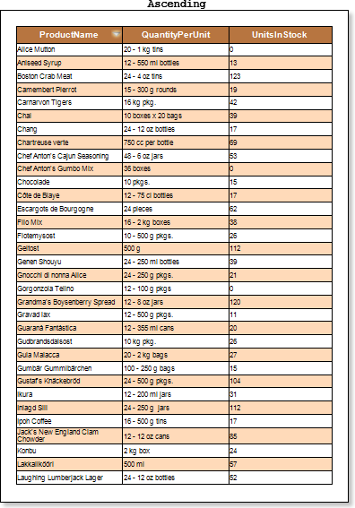
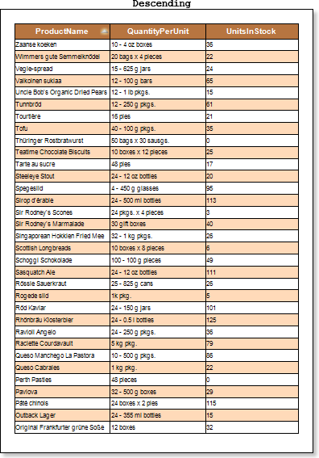

## Report with Dynamic Data Sorting in Preview

When designing a report, data used in a report are not always sorted in the order that is needed. In this case, the sorting can be done by means of the report generator. One way to sort the data is dynamic sorting. A report with dynamic data sorting in the preview window is an interactive report in which changing of dynamic data sorting is done by clicking the component, which dynamic sorting is enabled. Follow the steps below to render a report with dynamic data sorting in the preview window:

1. Run the designer;

2. Connect the data:

2.1. Create a New Connection;

2.2. Create a New Data Source;

3. Put a DataBand on a page of a report template.

4. Edit DataBand:

4.1. Align the DataBand by height;

4.2. Change values of band properties. For example, set the Can Break property to true, if you wish the data band to be broken;

4.3. Change the DataBand background;

4.4. Enable Borders for the DataBand, if required;

4.5. Change the border color.

5. Set the data source for the DataBand using the Data Source property:

6. Put text components with expressions in the DataBand. Where expression is a reference to the data field. For example, put three text components with expressions: {Products.ProductName}, {Products.QuantityPerUnit}, and {Products.UnitsInStock};

7. Edit Text  and TextBox component:

7.1. Drag and drop the text component in the DataBand;

7.2. Change parameters of the text font: size, type, color;

7.3. Align the text component by width and height;

7.4. Change the background of the text component;

7.5. Align text in the text component;

7.6. Change the value of properties of the text component. For example, set the Word Wrap property to true, if you need a text to be wrapped;

7.7. Enable Borders for the text component, if required.

7.8. Change the border color.

8. Click the Preview button or invoke the Viewer, clicking the Preview menu item. After rendering all references to data fields will be changed on data form specified fields. Data will be output in consecutive order from the database that was defined for this report. The amount of copies of the DataBand in the rendered report will be the same as the amount of data rows in the database.

9.Go back to the report template;

10. If needed, add other bands to the report template, for example, ReportTitleBand and ReportSummaryBand;

11. Edit these bands:

11.1. Align them by height;

11.2. Change values of properties, if required;

11.3. Change the background of bands;

11.4. Enable Borders, if required;

11.5. Set the border color.

12. Put text components with expressions in the these bands. The expression in the text component is a title in the ReportTitleBand, and a summary in the ReportSummaryBand.

13. Edit text and text components:

13.1. Drag and drop the text component in the band;

13.2. Change font options: size, type, color;

13.3. Align text component by height and width;

13.4. Change the background of the text component;

13.5. Align text in the text component;

13.6. Change values of text component properties, if required;

13.7. Enable Borders of the text component, if required;

13.8. Set the border color.

14. Click the Preview button or invoke the Viewer, clicking the Preview menu item. After rendering all references to data fields will be changed on data form specified fields. Data will be output in consecutive order from the database that was defined for this report. The amount of copies of the DataBand in the rendered report will be the same as the amount of data rows in the database.

15. Go back to the report template;

16. Select a text component or any other component, on what one clicks and in the rendered report sorting will be done. In this case, select the TextBox4 component in the HeaderBand with the ProductName text;

17. Change the value of the Interaction.Sorting Column property. The value of this property will be a column of the data source by what sorting will be done. Set the Interaction.Sorting Column property to DataBand1.ProductName;

18. Click the Preview button or invoke the Viewer, clicking the Preview menu item. After rendering all references to data fields will be changed on data form specified fields. Data will be output in consecutive order from the database that was defined for this report. The amount of copies of the DataBand in the rendered report will be the same as the amount of data rows in the database.

19. To enable sorting of data by the specified data column, you should click a report component which the Interaction.Sorting Column property was set earlier. In our example, you should click the TextBox4. After clicking the text component, data will be sorted in Ascending direction. To change the sorting direction from Ascending to Descending, you need to click the text component again, each time after clicking the text component sorting direction will be changed. The picture below shows the first page of the report rendered with different sorting directions:

Sorting direction displays the "arrow" icon.

**Adding Styles**

1. Go back to the report template;
2. Select DataBand;
3. Change values of Even style and Odd style properties. If values of these properties are not set, then select the Edit Styles in the list of values of these properties and, using Style Designer, create a new style. The picture below shows the Style Designer:

Click the Add Style button to start creating a style. Select Component from the drop down list. Set the Brush.Color property to change the background color of a row. The picture below shows a sample of the Style Designer with the list of values of the Brush.Color property:

Click Close. Then a new value in the list of Even style and Odd style properties (a style of a list of odd and even rows) will appear.

4. To render the report, click the Preview button or invoke the Viewer, clicking the Preview menu item.

