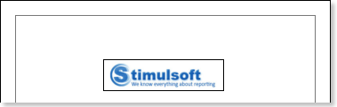
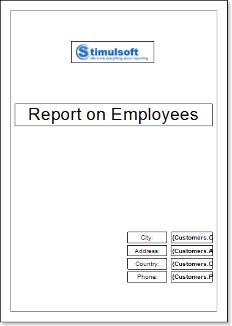
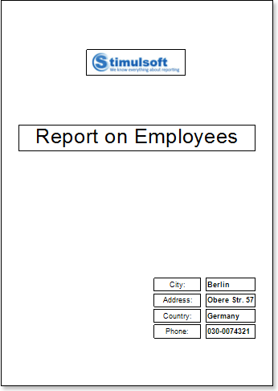
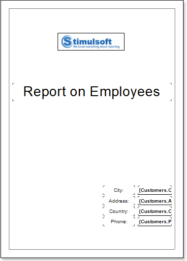
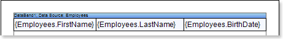
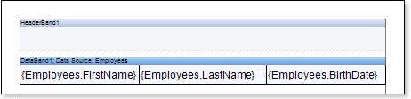
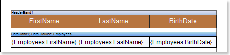
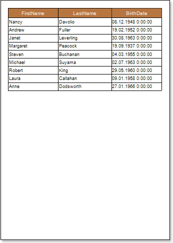
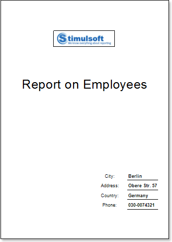
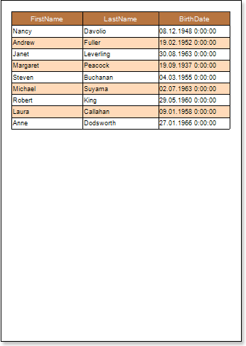

## Report with Multiple Pages in Template

If you want to design a report, for example, with the cover page, the report template will consist of minimum two pages: the cover page and page with data. Creating a report with several pages in the template includes the following steps:

**Creating a cover page**

1. Run the designer;

2. Connect the data:

2.1. Create a New Connection;

2.2. Create a New Data Source;

3. Put an Image component on a report page;

4. Edit the Image component:

4.1. Drag the Image component to the desired location on the report page;

4.2. Align the Image component by height and width;

4.3. Set the background color of the component;

4.4. Align the image in the Image component;

4.5. Set properties of the Image component. For example, set the Print property to true, if you want this component be printed;

4.6. Set Borders of the component, if required;

4.7. Set the border color.

5. On the report page Text components should be placed. We put 9 text components on this page. TextBox1 will contain the Report on Employees text, which is the title of the report. TextBoxes 2-5 will contain names in the address box, and TextBoxes 6-9 will contain references to the source data;

6. Edit text and text components:

6.1. Drag and drop the text component in the band;

6.2. Change font options: size, type, color;

6.3. Align text component by height and width;

6.4. Change the background of the text component;

6.5. Align text in the text component;

6.6. Change values of text component properties, if required;

6.7. Enable Borders of the text component, if required;

6.8. Set the border color.

7. Click the Preview button or invoke the Viewer, clicking the Preview menu item:

8. Go back to the report template;

9. Disable Borders for all components. Enable only the bottom borders in TextBoxes 6-9. The figure below submitted revised report template:

10. Create a second page in a report template and start editing it;

**Creating a page with data**

1. Put the DataBand page on the report template.

2. Edit DataBand:

2.1. Align the DataBand by height;

2.2. Change values of band properties. For example, set the Can Break property to true, if you wish the data band to be broken;

2.3. Change the DataBand background;

2.4. Enable Borders for the DataBand, if required;

2.5. Change the border color.

3. Specify the data source in the DataBand using the Data Source property:

4. Put text components with expressions on DataBands. Where expression is a reference to the data field. For example, put two text components with the following expressions:{Employees.FirstName}, {Employees.LastName} and {Employees.BirthDate};

5. Edit Text  and TextBox component:

5.1. Drag and drop the text component in DataBands;

5.2. Change parameters of the text font: size, type, color;

5.3. Align the text component by width and height;

5.4. Change the background of the text component;

5.5. Align text in the text component;

5.6. Change the value of properties of the text component. For example, set the Word Wrap property to true, if you need a text to be wrapped;

5.7. Enable Borders for the text component, if required.

5.8. Change the border color.

6. Add other bands to the report template, for example, the HeaderBand;

7. Edit this bands:

7.1. Align it by height;

7.2. Change values of properties, if required;

7.3. Change the background of bands;

7.4. Enable Borders, if required;

7.5. Set the border color.

8. Put text components with expressions in the band. The expression in the text component is a header in the HeaderBand.

9.  Edit text and text component:

9.1. Drag and drop the text component in the band;

9.2. Change font options: size, type, color;

9.3. Align text component by height and width;

9.4. Change the background of the text component;

9.5. Align text in the text component;

9.6. Change values of text component properties, if required;

9.7. Enable Borders of the text component, if required;

9.8. Set the border color.

9. Click the Preview button or invoke the Viewer, clicking the Preview menu item. After rendering all references to data fields will be changed on data form specified fields. Data will be output in consecutive order from the database that was defined for this report. The amount of copies of the DataBand in the rendered report will be the same as the amount of data rows in the database.

**Adding Styles**

1. Go back to the report template;
2. Select DataBand;
3. Change values of Even style and Odd style properties. If values of these properties are not set, then select the Edit Styles in the list of values of these properties and, using Style Designer, create a new style. The picture below shows the Style Designer:

Click the Add Style button to start creating a style. Select Component from the drop down list. Set the Brush.Color property to change the background color of a row. The picture below shows a sample of the Style Designer with the list of values of the Brush.Color property:

Click Close. Then a new value in the list of Even style and Odd style properties (a style of a list of odd and even rows) will appear.

4. To render the report, click the Preview button or invoke the Viewer, clicking the Preview menu item.

