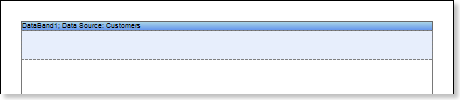
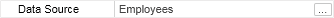
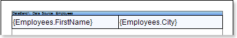
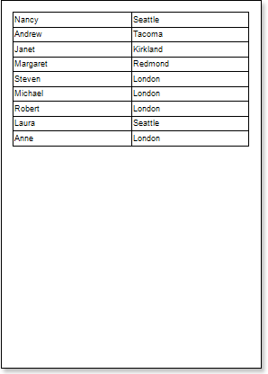
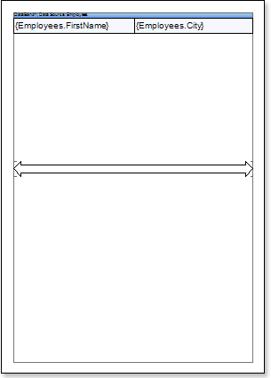
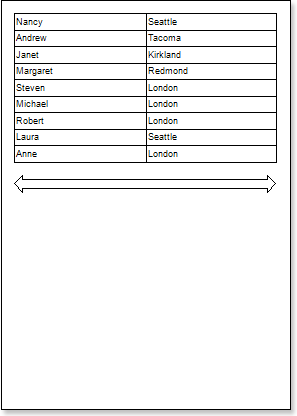
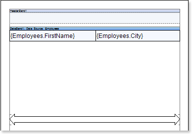
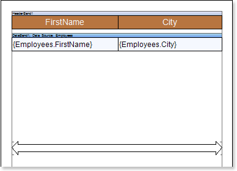
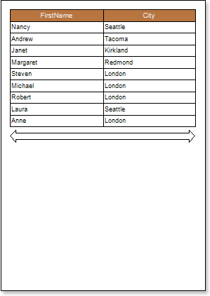

## Report with Primitives on Page

Primitives are: **Horizontal Line**, **Vertical Line**, **Rectangle** and **Rounded Rectangle**. Besides, you may use the **Shape** component. When placing a primitive on a page, the primitive will be rendered as a page item. To design a report with primitives on a page, follow the steps below:

1. Run the designer;

2. Connect the data:

2.1. Create a **New Connection**;

2.2. Create a **New Data Source**;

3. Put the **DataBand** on a page of a report template.

4. Edit **DataBand**:

4.1. Align the **DataBand** by height;

4.2. Change values of band properties. For example, set the **Can Shrink** property to **true**, if you wish the data band to be broken;

4.3. Change the **DataBand** background;

4.4. Enable **Borders** for the **DataBand**, if required;

4.5. Change the border color.

5. Define the data source for the **DataBand** using the **Data Source** property:

6. Put text components with expressions on the **DataBand**. Where expression is a reference to the data field. For example, put two text components with expressions: **{Employees.FirstName}** and **{Employees.City}**;

7. Edit **Text**  and **TextBox** component:

7.1. Drag and drop the text component in the **DataBand**;

7.2. Change parameters of the text font: size, type, color;

7.3. Align the text component by width and height;

7.4. Change the background of the text component;

7.5. Align text in the text component;

7.6. Change the value of properties of the text component. For example, set the **Word Wrap** property to **true**, if you need a text to be wrapped;

7.7. Enable **Borders** for the text component, if required.

7.8. Change the border color.

8. Click the **Preview** button or invoke the **Viewer**, clicking the **Preview** menu item.

9. Go back to the report template.

10. Add the **Shape** component to a report template and edit it:

10.1. Drag and drop the **Shape** component on the page;

10.2. Change the type of a shape using the **Shape Type** property. Set the **Shape Type** property to **Complex Arrow**;

10.3. Stretch the **Shape** component horizontally and vertically;

10.4. Change the value of other properties. For example, set the **Grow to Height** property to **true**.

The picture below shows a report template with the **Shape** component placed on the report page:

11. Click the **Preview** button or invoke the **Viewer**, clicking the **Preview** menu item.

12. Go back to the report template.

13. If needed, add other bands to the report template, for example, **HeaderBand**;

14.  Edit this bands:

14.1. Align it by height;

14.2. Change values of properties, if required;

14.3. Change the background color of the band;

14.4. Enable **Borders**, if required;

14.5. Set the border color.

The picture below shows a report template with a **HeaderBand**:

15. Put text components with expressions in the this band. The expression in the text component is a header in the **HeaderBand**.

16.  Edit text and text components:

16.1. Drag and drop the text component in the band;

16.2. Change font options: size, type, color;

16.3. Align text component by height and width;

16.4. Change the background of the text component;

16.5. Align text in the text component;

16.6. Change values of text component properties, if required;

16.7. Enable **Borders** of the text component, if required;

16.8. Set the border color.

17. Click the **Preview** button or invoke the **Viewer**, clicking the **Preview** menu item. After rendering all references to data fields will be changed on data form specified fields. Data will be output in consecutive order from the database that was defined for this report. The amount of copies of the **DataBand** in the rendered report will be the same as the amount of data rows in the database.

