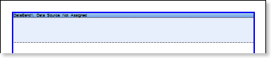
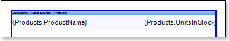
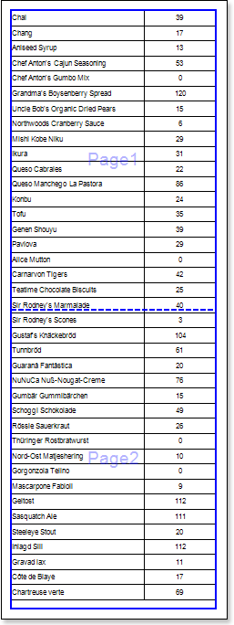
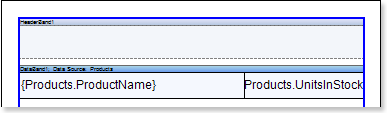
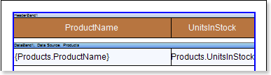
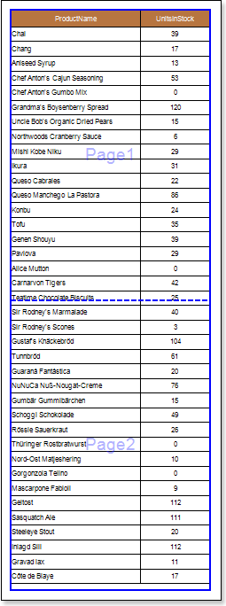
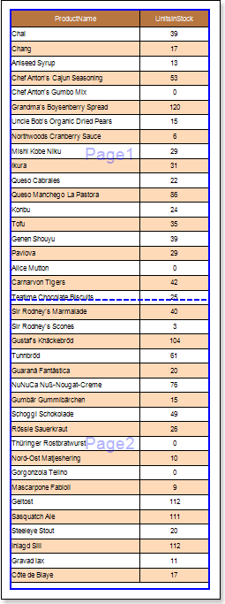

## Report with Segmented Pages

If data in a report should be placed on a single page by width or height, and a page size is small, you can add the required number of segments by width and/or height. In this case, one segment is a whole page and summary page consists of several segments across by width or height. To design a report with segmented pages, follow the steps below:

1. Run the designer;

2. Connect the data:

2.1. Create a **New Connection**;

2.2. Create a **New Data Source**;

3. Define the number of segments by height and/or width. For example, set the **Segment per Height** property to **2**, i.e. the number of segments by height is **2**.

4. Put the **DataBand** on a segment of the report template.

5. Edit **DataBand**:

5.1. Align the **DataBand** by height;

5.2. Change values of band properties. For example, set the **Can Break** property to **true**, if you wish the data band to be broken;

5.3. Change the **DataBand** background;

5.4. Enable **Borders** for the **DataBand**, if required;

5.5. Change the border color.

6. Specify the data source in the **DataBand** using the **Data Source** property:

7. Put text components with expressions on **DataBands**. Where expression is a reference to the data field. For example, put two text components with the following expressions: **{Products.ProductName}** and **{Products.UnitslnStock}**;

8. Edit **Text**  and **TextBox** component:

8.1. Drag and drop the text component in **DataBands**;

8.2. Change parameters of the text font: size, type, color;

8.3. Align the text component by width and height;

8.4. Change the background of the text component;

8.5. Align text in the text component;

8.6. Change the value of properties of the text component. For example, set the **Word Wrap** property to **true**, if you need a text to be wrapped;

8.7. Enable **Borders** for the text component, if required.

8.8. Change the border color.

9. Click the **Preview** button or invoke the **Viewer**, pressing **F5** or clicking the **Preview** menu item. After rendering all references to data fields will be changed on data form specified fields. Data will be output in consecutive order from the database that was defined for this report. The amount of copies of the **DataBand** in the rendered report will be the same as the amount of data rows in the database.

10. Add other bands to the report template, for example, the **HeaderBand**;

11. Edit this bands:

11.1. Align it by height;

11.2. Change values of properties, if required;

11.3. Change the background of bands;

11.4. Enable **Borders**, if required;

11.5. Set the border color.

12. Put text components with expressions in the band. The expression in the text component is a header in the **HeaderBand**.

13.  Edit text and text component:

13.1. Drag and drop the text component in the band;

13.2. Change font options: size, type, color;

13.3. Align text component by height and width;

13.4. Change the background of the text component;

13.5. Align text in the text component;

13.6. Change values of text component properties, if required;

13.7. Enable **Borders** of the text component, if required;

13.8. Set the border color.

14. Click the **Preview** button or invoke the **Viewer**, clicking the **Preview** menu item.

**Adding Styles**

1. Go back to the report template;
2. Select **DataBand**;
3. Change values of **Even style** and **Odd style** properties. If values of these properties are not set, then select the **Edit Styles** in the list of values of these properties and, using **Style Designer**, create a new style. The picture below shows the **Style Designer**:

Click the **Add Style** button to start creating a style. Select **Component** from the drop down list. Set the **Brush.Color** property to change the background color of a row. The picture below shows a sample of the **Style Designer** with the list of values of the **Brush.Color** property:

Click **Close**. Then a new value in the list of **Even style** and **Odd style** properties (a style of a list of odd and even rows) will appear.

4. To render the report, click the **Preview** button or invoke the **Viewer**, clicking the **Preview** menu item.

