## Report with Sub-Reports in Data Band

Do the following steps to create a simple list report:

1. Run the designer;
2. Connect data:

2.1. Create **New Connection**;

2.2. Create **New Data Source**;

3. Put the **DataBand** on a page of a report template.

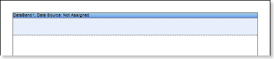

4. Edit **DataBand**:

4.1. Align the **DataBand** by height;

4.2. Change values of band properties. For example, set the **Can Break** property to **true**, if you wish the data band to be broken;

4.3. Change the **DataBand** background color;

4.4. Enable **Borders** for the **DataBand**, if required;

4.5. Change the border color.

5. Define the data source for the **DataBand** using the **Data Source** property. For example, define the **Categories** data source for the **DataBand**:

6. Put **Sub-Report** components in the **DataBand**;

7. Edit the **Sub-Report** components:

7.1. Stretch the **Sub-Report** components as seen on the picture below;

7.2. Change the value of properties of **Sub-Reports**. For example, set the **Keep Sub-Report Together** property to **true**, if you want the sub-report to be kept together;;

7.3. Change the background color of the components.

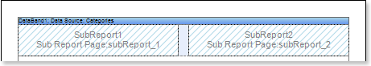

8. Go to the sub-report page;

9. Add two **DataBands** to the sub-report page. Add **DataBand1** to the **Sub Report1** and **DataBand2** to the **Sub Report2**;

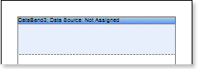

10. Edit the **DataBands**:

10.1. Align the **DataBands** vertically;

10.2. Change values of properties of the **DataBands**.

10.3. Change background color of the band;

10.4. Set **Borders**, if necessary;

10.5. Change the border color.

11. Specify the data source for the **DataBand** using the **Data Source** property. For example, set the **Customers** data source for the **DataBand1**, and the **Products** data source for the **DataBand2**:

   

12. Put text components with expressions in the **DataBands**. Where an expression is a reference to a data field. For example, put the following expressions to the **DataBand1**: **{Customers.CompanyName}** and **{Customers.City}**. put the following expressions to the **DataBand2**: **{Products.ProductName}** and **{Products.UnitPrice}**;

13. Edit **Text** and **TextBoxes**:

13.1. Drag the text component to the required place in the **DataBand**;

13.2. Set the text font: size, style, color;

13.3. Align text component vertically and horizontally;

13.4. Set the background color of the text component;

13.5. Align text in the component;

13.6. Set values of the properties of text components. For example to set the **Word Wrap** property to **true**, if you want the text to be wrapped;

13.7. Set **Borders** of a text component.

13.8. Set the border color.

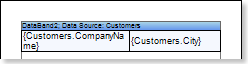

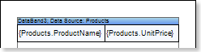

14. Click the **Preview** button or call **Viewer**, using the **Preview** menu item to see how the report will look like:

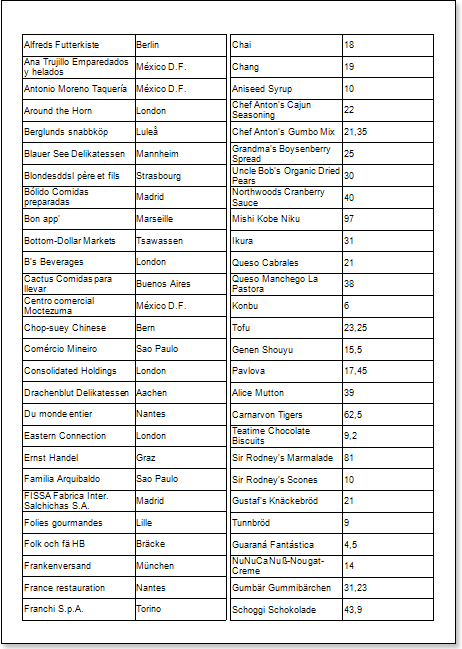

15. Go back to the report template;

16. If necessary, add some bands to the report template, for example, the **HeaderBand**;

17. Edit this band:

17.1. Align vertically this band;

17.2. Set values of the properties of the **HeaderBand**, if necessary;

17.3. Set the background color;

17.4. Set **Borders** of a text component.

17.5. Set the border color.

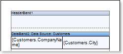

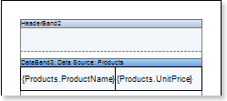

18. Put a text component with expression where the expression of the text component in the **HeaderBand** will be the page title.

19. Edit the text component:

19.1. Drag the text component to the required place in the band;

19.2. Set the text font: size, style, color;

19.3. Align text component vertically and horizontally;

19.4. Set the background color of the text component;

19.5. Align text in the component;

19.6. Set values of the properties of text components;

19.7. Set **Borders** of a text component.

19.8. Set the border color.

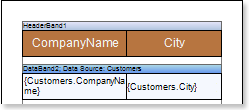

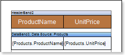

20. Click the **Preview** button or call **Viewer**, using the **Preview** menu item to see how the report will look like:

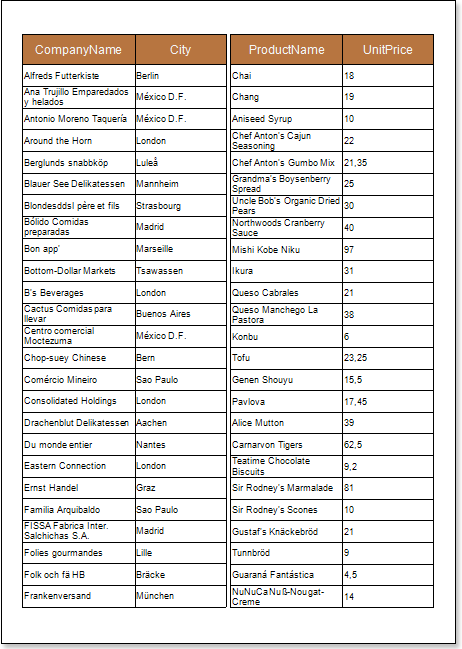

**Adding styles**

1. Go back to the report template;
2. Select the sub-report;
3. Select the **DataBand**;
4. Change values of **Even style** and **Odd style** properties. If values of these properties are not set, then select the **Edit Styles** in the list of values of these properties and, using **Style Designer**, create a new style. The picture below shows the **Style Designer**.

Click the **Add Style** button to start creating a style. Select **Component** from the drop down list. Set the **Brush.Color** property to change the background color of a row. The picture below shows a sample of the **Style Designer** with the list of values of the **Brush.Color** property:

Click **Close**. Then a new value in the list of **Even style** and **Odd style** properties (a style of a list of odd and even rows) will appear.

5. To render the report, click the **Preview** button or invoke the **Viewer**, clicking the **Preview** menu item. The picture below shows a sample of a rendered report with sub-report and alternative color of rows:

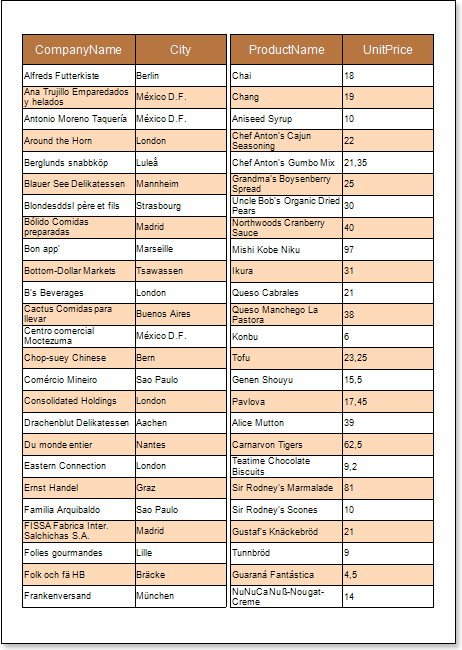
