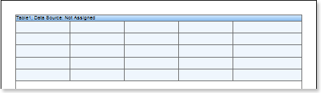
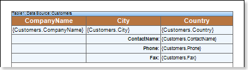
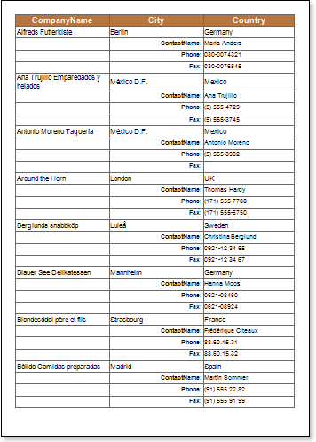
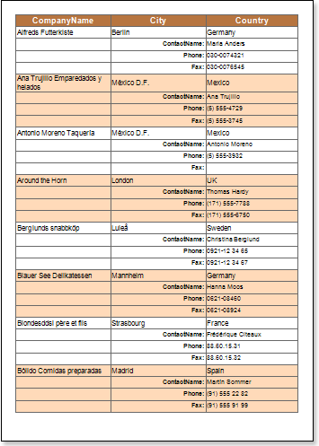

## Report with Table Component

Do the following steps to design a report with the **Table** component:

1. Run the designer;

2. Connect the data:

2.1. Create a **New Connection**;

2.2. Create a **New Data Source**;

3. Put a **Table** component on a page of a report template.

4. Edit the **Table** component:

4.1. Set the amount of columns and rows using, for example, the **RowCount** and **ColumnCount** properties. Set these properties to 5 and 3 respectively;

4.2. Set the number of headers and footers in the table using, for example, the **HeaderRowsCount** and **FooterRowsCount** properties. Set the **HeaderRowsCount** property to **1**;

4.3. Align the **Table** component by height;

4.4. Change values of the component. for example, set the **CanBreak** property to **true**, if it is required for the **Table** component be broken;

5. Set the data source of the **Table** component using the **Data Source** property:

6. Put some text and expressions in the table cells. For example, cells of the first and third rows will contain only text, that will be a data header. Cells of the second and fourth rows will contain expressions, references to data source;

7. Edit text and cells:

7.1. Set font parameters of text: size, style, color;

7.2. Set color of table cells;

7.3. Align text in cells;

7.4. Change values of cells. For example, set the **WordWrap** property to **true**, if it is necessary for the text to be wrapped.

8. Click the **Preview** button or invoke the **Viewer**, clicking the **Preview** menu item. After rendering all references to data fields will be changed on data form specified fields. Data will be output in consecutive order from the database that was defined for this report. The amount of copies of the **Table** in the rendered report will be the same as the amount of data rows in the database.

**Adding Styles**

1. Go back to the report template;
2. Select the **Table** component;
3. Change values of **Even style** and **Odd style** properties. If values of these properties are not set, then select the **Edit Styles** in the list of values of these properties and, using **Style Designer**, create a new style. The picture below shows the **Style Designer**:

Click the **Add Style** button to start creating a style. Select **Component** from the drop down list. Set the **Brush.Color** property to change the background color of a row. The picture below shows a sample of the **Style Designer** with the list of values of the **Brush.Color** property:

Click **Close**. Then a new value in the list of **Even style** and **Odd style** properties (a style of a list of odd and even rows) will appear.

4. To render the report, click the **Preview** button or invoke the **Viewer**, clicking the **Preview** menu item.

