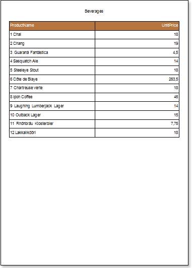
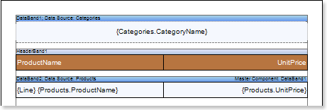
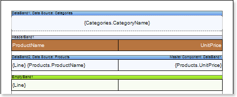
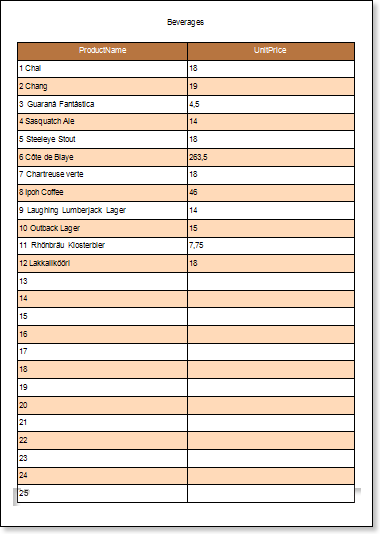

## Report with Empty Band

The **EmptyBand** is used to fill free space at the bottom of a page. This tutorial describes how to create a report with the **EmptyBand**:

1. Run the designer;

2. Connect the data:

2.1. Create a **New Connection**;

2.2. Create a **New Data Source**;

3. Design a report or load a previously saved one. Consider creating a report with the **EmptyBand** on the base of the **Master-Detail** report. Suppose there is a **Master-Detail** report in which data is printed on half of a page, then to fill the empty space you can use the **EmptyBand**. The picture below shows the rendered **Master-Detail** report:

4. Go back to the **Master-Detail** report template.

5. Add the **EmptyBand** in the report template;

6. Edit the **EmptyBand**:

6.1. Align it by height;

6.2. Change the value of required properties. For example, set the **CanGrow** property to **true**, if you want the band be grown;

6.3. Set the background color of the **EmptyBand**;

6.4. If necessary, set **Borders** of the EmptyBand);

7. Put text components with an expression in the **EmptyBand**. Where the expression is a reference to the data field. For example, put a text component with the expression: **{Line}**;

8. Edit **Text**  and **TextBox** component:

8.1. Drag and drop the text component in the **EmptyBand**;

8.2. Change parameters of the text font: size, type, color;

8.3. Align the text component by width and height;

8.4. Change the background of the text component;

8.5. Align text in the text component;

8.6. Change the value of properties of the text component. For example, set the **WordWrap** property to **true**, if you need a text to be wrapped;

8.7. Enable **Borders** for the text component, if required.

8.8. Change the border color.

9. Click the **Preview** button or invoke the **Viewer**, pressing the **Preview** menu item. The picture below shows a sample of the report:

As can be seen in the picture above blank lines will be numbered and output in the report.

**Adding styles**

1. Go back to the report template;
2. Select the **DataBand**;
3. Change values of **Even style** and **Odd style** properties. If values of these properties are not set, then select the **Edit Styles** in the list of values of these properties and, using **Style Designer**, create a new style. The picture below shows the **Style Designer**.

Click the **Add Style** button to start creating a style. Select **Component** from the drop down list. Set the **Brush.Color** property to change the background color of a row. The picture below shows a sample of the **Style Designer** with the list of values of the **Brush.Color** property:

Click **Close**. Then a new value in the list of **Even style** and **Odd style** properties (a style of a list of odd and even rows) will appear.

5. To render the report, click the **Preview** button or invoke the **Viewer**, clicking the **Preview** menu item. The picture below shows a sample of a rendered report:

