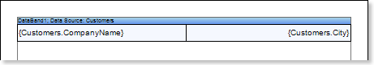
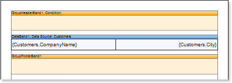
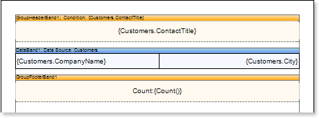
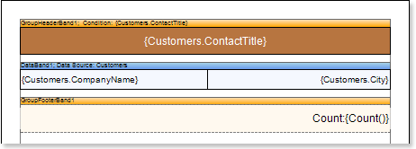
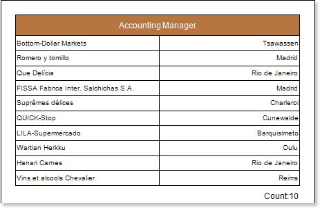
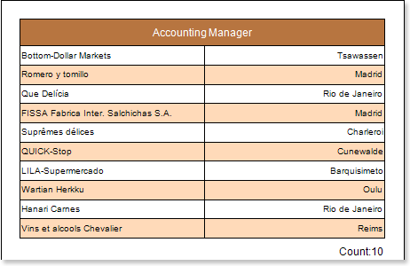

## Report with Groups

Do the following steps to create a report with grouping:

1. Run the designer;
2. Connect data:

2.1. Create New Connection;

2.2. Create New Data Source;

1. Create a report or open already created one. For example, we can take a simple list report created in the chapter "Simple List Report".

1. Add GroupHeaderBand and GroupFooterBand to the report template. The GroupHeaderBand should be placed higher than the DataBand to what it is related to. The GroupFooterBand is placed under the Data to what GroupHeader is related. Each GroupFooter corresponds to a specified GroupHeader. The GroupFooter band will not output without GroupHeader. The picture below shows a report template with added GroupHeaderBand and GroupFooterBand.

1. Edit GroupHeaderBand and GroupFooterBand:

5.1. Align them be height;

5.2. Change values of properties according to requirements. For example, set the KeepGroupHeaderTogether property for the  GroupHeaderBand to true, it is necessary to keep the group header with the group. And for the GroupFooterBand set the KeepFooterTogether to true, if it is required to keep the footer with the group;

5.3. Set the background of the GroupHeaderBand;

5.4. Enable Borders of the DataBand, if required;

1. Set the condition data grouping in the report using the Condition property of the GroupHeader band. Condition of grouping can be set by setting the expression or by selecting the data column from the data source. In our tutorial, define the {Customers.ContactTitle} expression in the condition of grouping.
2. Put a text component in the GroupHeaderBand and put the expression {Customers.ContactTitle} into this text component. Put a text component in the GroupFooterBand and put the expression {Count()} into this text component. The {Count()} function will count summary by the amount of entries in each group. The picture below shows a report template with the condition of grouping set, and text components placed in GroupHeaderBand and GroupFooterBand:

1. Edit expressions and text components:

8.1.  Drag and drop the text component in GroupHeaderBand and GroupFooterBand;

8.2. Change parameters of the text font: size, type, color;

8.3.. Align the text component by width and height;

8.4. Change the background of the text component;

8.5. Align text in the text component;

8.6. Change the value of properties of the text component. For example, set the Word Wrap property to true, if you need a text to be wrapped;

8.7. Enable Borders for the text component, if required.

8.8. Change the border color.

The picture below shows a sample of the edited report template with grouping:

1. Click the Preview button or invoke the Viewer, clicking the Preview menu item. After rendering all references to data fields will be changed on data form specified fields. Data will be output in consecutive order from the database that was defined for this report. The amount of copies of the DataBand in the rendered report will be the same as the amount of data rows in the database. The picture below shows a sample of the report with grouping:

**Adding styles**

1. Go back to the report template;
2. Select DataBand;
3. Change values of Even style and Odd style properties. If values of these properties are not set, then select the Edit Styles in the list of values of these properties and, using Style Designer, create a new style. The picture below shows the Style Designer:

Click the Add Style button to start creating a style. Select Component from the drop down list. Set the Brush.Color property to change the background color of a row. The picture below shows a sample of the Style Designer with the list of values of the Brush.Color property:

Click Close. Then in the list of Even style and Odd style properties a new value (a style of a list of odd and even rows).

1. To render the report, click the Preview button or invoke the Viewer, clicking the Preview menu item. The picture below shows a sample of a rendered report with grouping and alternative color of rows:

