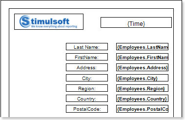
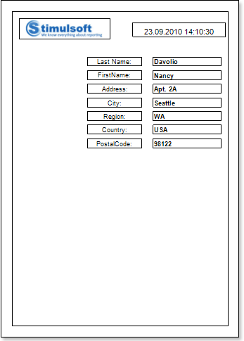
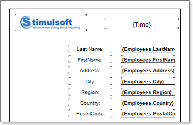
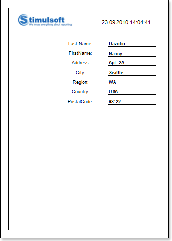

## Report without Bands

If it is necessary to display data from only one entry of the data source or data from variables or other data sources that are not lists, the report can be created without the bands. In this case, components are placed directly on a report page.

1. Run the designer;

2. Connect the data:

2.1. Create a **New Connection**;

2.2. Create a **New Data Source**;

3. Put the **Image** component with the image on a page;

4. Edit the **Image** component and an image:

4.1. Drag and drop the **Image** component on the report page;

4.2. Align the **Image** component by height and width;

4.3. Set the background color of the **Image** component;

4.4. Align the image in the component;

4.5. Change values of the properties of the **Image** component. For example to set the **Print** property to **true**, if you want this component be printed;

4.6. If necessary, set **Borders** of the **Image** component;

4.7. Set the border color.

5. Put **TextBoxes** with the text on a page. In this report, put 15 Text components. The **TextBox1** contains the **{Time}** system variable, which will display the current time and date. **2-8 TextBoxes** contain the row names in the address box, and **9-15 TextBoxes** will include links to data sources;

6. Edit text and text components:

6.1. Drag and drop the text component in the band;

6.2. Change font options: size, type, color;

6.3. Align text component by height and width;

6.4. Change the background of the text component;

6.5. Align text in the text component;

6.6. Change values of text component properties, if required;

6.7. Enable **Borders** of the text component, if required;

6.8. Set the border color.

7. Click the **Preview** button or invoke the **Viewer**, clicking the **Preview** menu item:

8. Go back to the report template;

9. Disable **Borders** of all components. Enable bottom borders for **9-15 TextBoxes**:

10. Click the **Preview** button or invoke the **Viewer**, clicking the **Preview** menu item.

