## Side-by-Side Report

The **Side-by-side** report is a type of independent data lists, located side by side. Do the following steps to create such a report:

1. Run the designer;
2. Connect data:

2.1. Create **New Connection**;

2.2. Create **New Data Source**;

3. Add **Sub-Report** components to a report on a page of the report template:

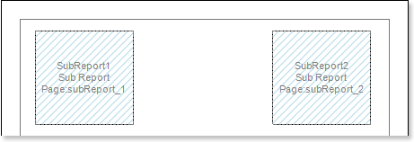

4. Edit **Sub-Report** components:

4.1. Stretch **Sub-Report** components as seen on the picture below;

4.2. Change the value of properties of **Sub-Report**. For example, set the **Keep Sub-Report Together** property to **true**, if you want the sub-report to be kept together;

4.3. Change the background color of the component.

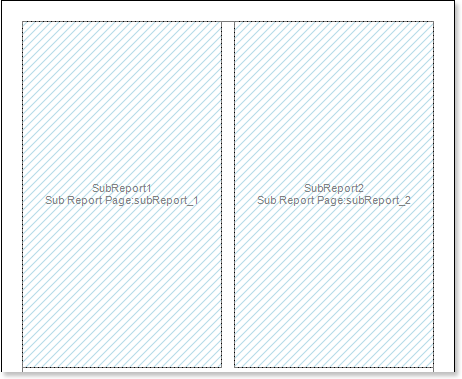

5. Go to the sub-report page;

6. Add two **DataBands** to the sub-report page. Add **DataBand1** to the **Sub Report1** and **DataBand2** to the **Sub Report2**;

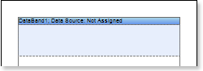

7. Edit the **DataBands**:

7.1. Align the **DataBands** vertically;

7.2. Change values of properties of the **DataBands**.

7.3. Change background color of the band;

7.4. Set **Borders**, if necessary;

7.5. Change the border color.

8. Specify the data source for the **DataBand** using the **Data Source** property. For example, set the **Customers** data source for the **DataBand1**, and the **Products** data source for the **DataBand2**:

 

9. Put text components with expressions in the **DataBands**. Where an expression is a reference to a data field. For example, put the following expressions to the **DataBand1**: **{Customers.CompanyName}** and **{Customers.City}**. put the following expressions to the **DataBand2**: **{Products.ProductName}** and **{Products.UnitPrice}**;

10. Edit **Text** and **TextBoxes**:

10.1. Drag the text component to the required place in the **DataBand**;

10.2. Set the text font: size, style, color;

10.3. Align text component vertically and horizontally;

10.4. Set the background color of the text component;

10.5. Align text in the component;

10.6. Set values of the properties of text components. For example to set the **Word Wrap** property to **true**, if you want the text to be wrapped;

10.7. Set **Borders** of a text component.

10.8. Set the border color.

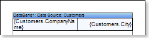

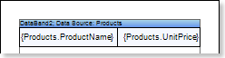

11. Click the **Preview** button or call **Viewer**, using the **Preview** menu item to see how the report will look like:

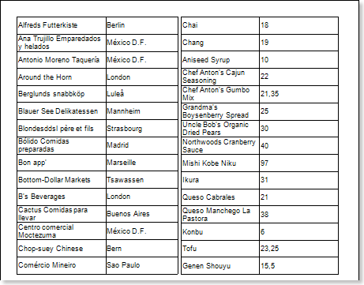

As can be seen from the picture above, the report generator rendered the report, which was located in the nested page and placed it on the report page but not in the Sub-Report component.

12. Go back to the report template;

13. If necessary, add some bands to the report template, for example, the **HeaderBand**;

14. Edit this band:

14.1. Align vertically this band;

14.2. Set values of the properties of the **HeaderBand**, if necessary;

14.3. Set the background color;

14.4. Set **Borders** of a text component.

14.5. Set the border color.

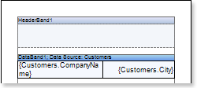

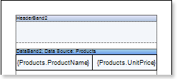

15. Put a text component with expression where the expression of the text component in the **HeaderBand** will be the page title.

16. Edit the text component:

16.1. Drag the text component to the required place in the band;

16.2. Set the text font: size, style, color;

16.3. Align text component vertically and horizontally;

16.4. Set the background color of the text component;

16.5. Align text in the component;

16.6. Set values of the properties of text components;

16.7. Set **Borders** of a text component.

16.8. Set the border color.

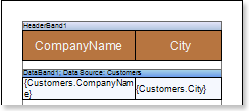

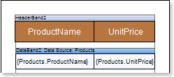

17. Click the **Preview** button or call **Viewer**, using the **Preview** menu item to see how the report will look like:

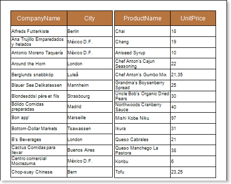

**Adding styles**

1. Go back to the report template;
2. Select the sub-report;
3. Select the **DataBand**;
4. Change values of **Even style** and **Odd style** properties. If values of these properties are not set, then select the **Edit Styles** in the list of values of these properties and, using **Style Designer**, create a new style. The picture below shows the **Style Designer**.

Click the **Add Style** button to start creating a style. Select **Component** from the drop down list. Set the **Brush.Color** property to change the background color of a row. The picture below shows a sample of the **Style Designer** with the list of values of the **Brush.Color** property:

Click **Close**. Then a new value in the list of **Even style** and **Odd style** properties (a style of a list of odd and even rows) will appear.

5. To render the report, click the **Preview** button or invoke the **Viewer**, clicking the **Preview** menu item. The picture below shows a sample of a rendered side-by-side report with alternative color of rows:

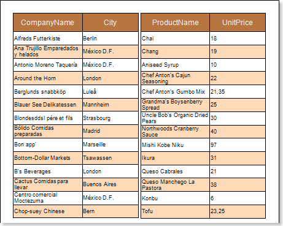
