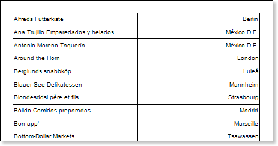
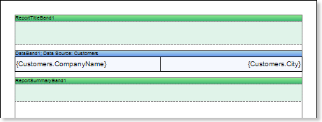
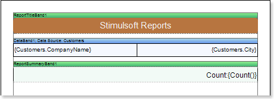
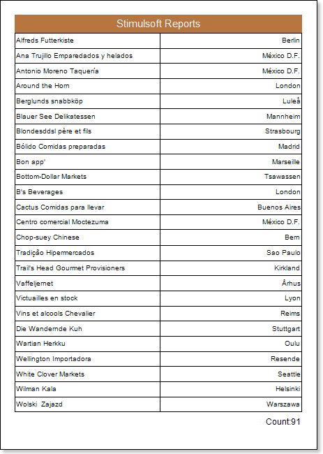
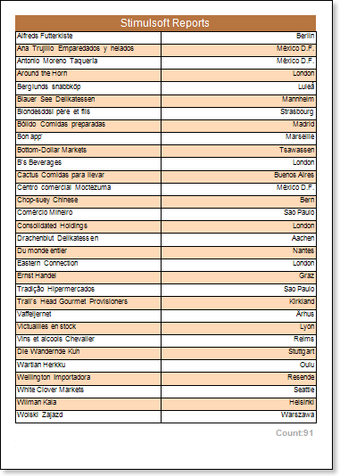

## Simple List Report

Do the following steps to create a simple list report:

1. Run the designer;
2. Connect data:

2.1. Create New Connection;

2.2. Create New Data Source;

1. Put a DataBand on a page of a report template.

1. Edit DataBand:

4.1. Align the DataBand by height;

4.2. Change values of band properties. For example, set the Can Break property to true, if you wish the data band to be broken;

4.3. Change the DataBand background;

4.4. Enable Borders for the DataBand, if required;

4.5. Change the border color.

1. Define the data source for the DataBand using the Data Source property:

1. Put text components with expressions in the DataBand. Where expression is a reference to the data field. For example, put two text components with expressions: {Customers.CompanyName} and {Customers.City};
2. Edit Text  and TextBox component:

7.1. Drag and drop the text component in the DataBand;

7.2. Change parameters of the text font: size, type, color;

7.3. Align the text component by width and height;

7.4. Change the background of the text component;

7.5. Align text in the text component;

7.6. Change the value of properties of the text component. For example, set the Word Wrap property to true, if you need a text to be wrapped;

7.7. Enable Borders for the text component, if required.

7.8. Change the border color.

The picture below shows a report template with the list:

1. Click the Preview button or invoke the Viewer, clicking the Preview menu item. After rendering all references to data fields will be changed on data form specified fields. Data will be output in consecutive order from the database that was defined for this report. The amount of copies of the DataBand in the rendered report will be the same as the amount of data rows in the database. The picture below shows a sample of a simple list report:

1. Go back to the report template;
2. If needed, add other bands to the report template, for example, ReportTitleBand and ReportSummaryBand;
3. Edit these bands:

11.1. Align them by height;

11.2. Change values of properties, if required;

11.3. Change the background of bands;

11.4. Enable Borders, if required;

11.5. Set the border color.

The picture below shows a simple list report template with ReportTitleBand and ReportSummaryBand:

1. Put text components with expressions in the these bands. The expression in the text component is a title in the ReportTitleBand, and a summary in the ReportSummaryBand.
2. Edit text and text components:

13.1. Drag and drop the text component in the band;

13.2. Change font options: size, type, color;

13.3. Align text component by height and width;

13.4. Change the background of the text component;

13.5. Align text in the text component;

13.6. Change values of text component properties, if required;

13.7. Enable Borders of the text component, if required;

13.8. Set the border color.

The picture below shows a sample of the simple list report template:

1. Click the Preview button or invoke the Viewer, clicking the Preview menu item. After rendering all references to data fields will be changed on data form specified fields. Data will be output in consecutive order from the database that was defined for this report. The amount of copies of the DataBand in the rendered report will be the same as the amount of data rows in the database. The picture below shows a sample of a simple list report with the title and summary:

**Adding styles**

1. Go back to the report template;
2. Select DataBand;
3. Change values of Even style and Odd style properties. If values of these properties are not set, then select the Edit Styles in the list of values of these properties and, using Style Designer, create a new style. The picture below shows the Style Designer:

Click the Add Style button to start creating a style. Select Component from the drop down list. Set the Brush.Color property to change the background color of a row. The picture below shows a sample of the Style Designer with the list of values of the Brush.Color property:

Click Close. Then a new value in the list of Even style and Odd style properties (a style of a list of odd and even rows) will appear.

1. To render the report, click the Preview button or invoke the Viewer, clicking the Preview menu item. The picture below shows a sample of a rendered simple list report with alternative color of rows:

