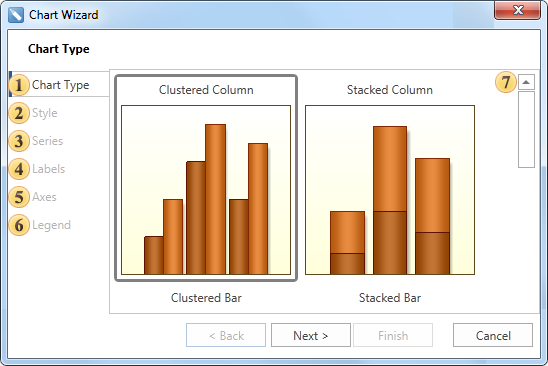

## Wizard Chart

The **Chart** wizard is used to create reports with charts. The picture below shows a window of the **Chart** wizard.

 **Chart Type**. Select the chart type.

 **Style**. Select the chart style from multiple templates.

 **Series**. Add series using the series editor. Also, it is possible to specify the column of values and arguments for the data source.

 **Labels**. The following parameters are defined on this step: series position, **Value Type** of series, **Text before/after** the series, and a rotation **Angle**.

 **Axes**. This step is available only if selected chart type is in **Axes Area**. The following options are set on this step: axis **Title** and its **Alignment**, **Ticks** length and their **Visibility**, **Grid Lines** and its **Interlaced**, **Labels** and their **Visible** property. Also, a chart can be shown vertically or horizontally. The Reverse property for X or Y axis should be applied for this.

 **Legend**. On this step legend parameters and charts such as **Title**, legend **Alignment** horizontally and vertically, **Direction** of rows in legend, **Visible** and **Size** of a marker, **Spacing**, **Visible** of the legend.

 The **Description Panel**. Shows description for the current step.
