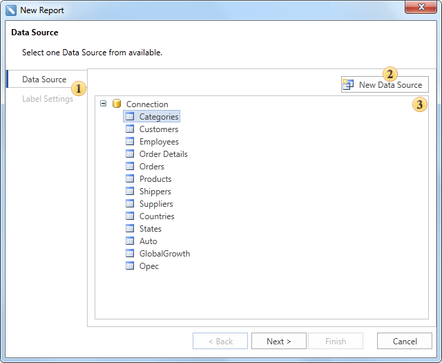
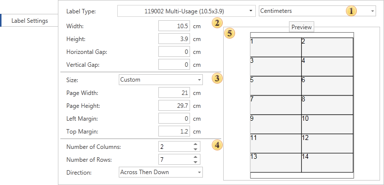

## Wizard Label Report

The **Label Report** wizard is used to create reports which have labels. The picture below shows a window of the **Label Report** wizard:

 The **Description Panel**. Shows description for the current step.

 The **Steps Panel** shows step of report creation.

 The **Selection Parameters** **Panel** shows options, actions, settings available on this step.

A **Label Report** is created in two steps. The **Data Source** is defined on the first step, **Label Settings** are defined on the second step. The picture below shows the **Selection Parameters Panel** on the second step of the **Label Settings**.

 The **Type Panel** is used to select the **Label Type** and units.

 The **Size Label Panel** is used to change the label size.

 The **Size Pages Panel** is used to select the page size or manually set width and height and margins of a page.

 The **Configuration Label Panel** is used to set a number of rows, columns and direction of labels.

 The **Preview Panel** is used to preview how labels are placed on a page.
