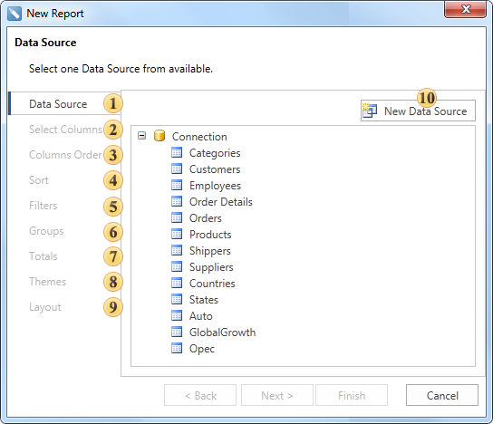
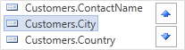
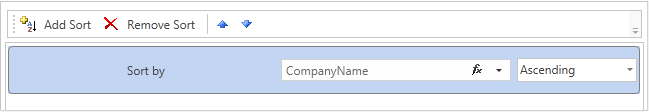
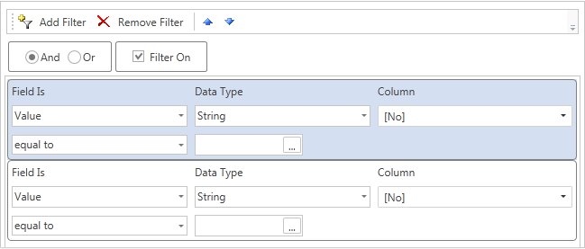
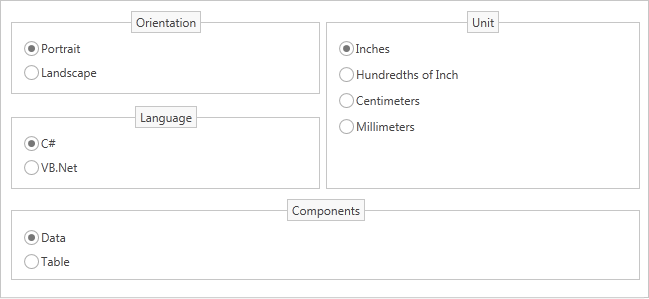

## Wizard Standard Report

| **Important** |
| --- |
| Scripts can be a security risk, so they are disabled in the [Interpretation mode](../../Reports_Designer/Template/Calculation_Mode.md). However, if you are confident in the safety of your scripts, you can use them in the [Compilation mode](../../Reports_Designer/Template/Calculation_Mode.md). |

When creating a report using the **Standard Report** wizard, this report will contain one **DataBand** or one data **Table** (depends on what is selected). The picture below shows a window of the **Standard Report** wizard:

 **Data Source**. On this step the data source is defined. This step is obligatory.

 **Select Columns**. On this step columns of a data source are selected. This step is obligatory.

 **Columns Order**. This step defines position of columns in the **DataBand**. Data columns selected in the second stage will be shown as a list on the **Selection Parameters Panel**. The top-down order of columns shown in the panel corresponds to their left-to-right position in a report. It is possible to change the position of data columns by dragging them or by clicking the buttons on the control panel of this step. The picture below shows the order of columns on the **Selection Parameters Panel**:

 **Sort**. On this step, it is possible to specify elements and sorting direction. The picture below shows a sample of the **Selection Parameters Panel** of sorting:

 **Filters**. On this step, it is possible to set the conditions of filtering. The picture below shows a sample of selection filtering parameters:

 **Groups**. This step defines the condition of grouping. It is necessary to select a data column by what conditions of grouping will be created.

 **Totals**. On this step, it is possible to select a function for calculating totals by any data source column. For each data column its own function of aggregation can be set.

 **Themes**. This step defines the report style.

 **Layout**. On this step, the basic report options are set. Among them are: page **Orientation**, script **Language**, a **Component** that will be used for report rendering (DataBand or Table), report **Units**. The picture below shows a sample of the **Selection Parameters Panel** layout:

 The **New Data Source** button is used to create a new data source.
