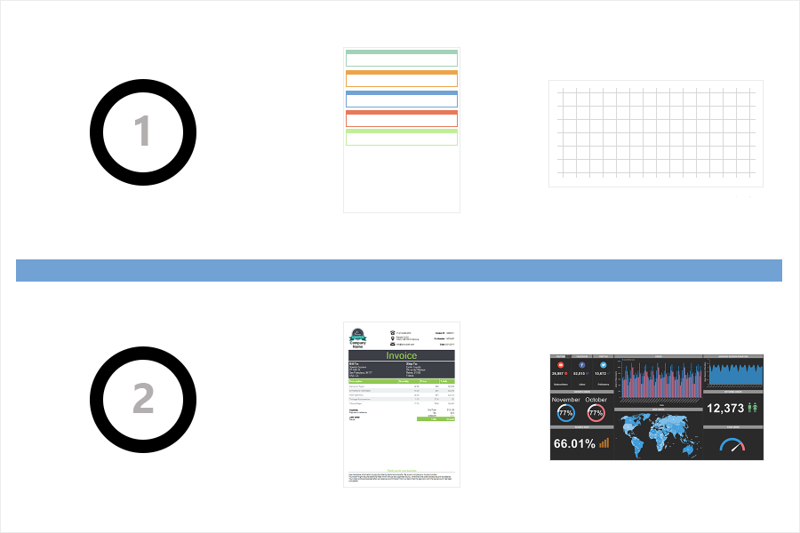

## Getting Started

This section describes step-by-step approaches in designing reports and dashboards.

Creating a report or dashboard ready for printing consists of the following steps:

* Creating a [report](../Report_Internals/index.md) or [dashboard](../Dashboards/index.md) template (structure) in the report designer;

* Viewing the [report](../Viewer/Reports/index.md) or [dashboard](../Viewer/Dashboards.md) template in the report viewer or on the Preview tab.
