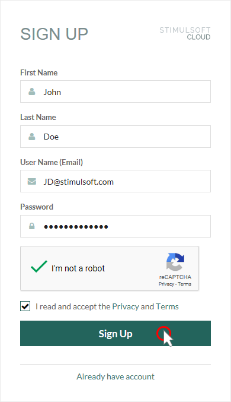
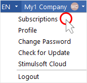
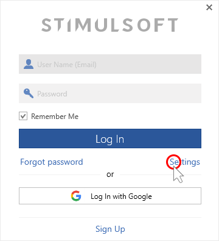
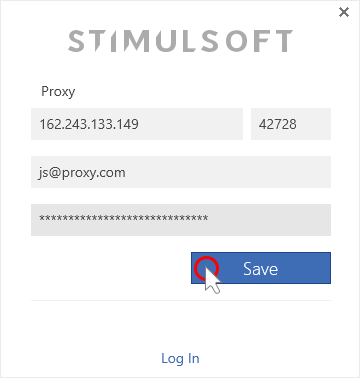

## Activation

**Trial version**

The free trial of Stimulsoft software is a full-featured version. It has a few limitations, which are as follows:

* The evaluation period is limited in 30 days which starts from the date of the account registration;

* The Trial watermark is printed on each report page or the dashboard panel.

> **Information**
>
> It is impossible to run the designer without logging into the user account. You can create a free account to start the report creation.

This chapter will cover the following:
* [Registering a user account on the website](#registeringauseraccountonthewebsite);

* [Report Designer Activation](#reportdesigneractivation);
* [Logging in to the account using a proxy server](#loggingintotheaccountusingaproxyserver);

* [Contacts](#contacts).

**Registering a user account on the website**

**Step 1**: Go to the **Stimulsoft** website at [https://stimulsoft.com](https://stimulsoft.com).

**Step 2**: Find the **Sign Up** button on top of the start page and click it;

**Step 3**: Fill in the required fields - first name, last name, email address, and account password.
**Step 4**: Confirm “**I'm not a robot**”;

**Step 5**: Read the license agreement. Check the box that you have read and accepted the license agreement.

**Step 6**: Click the **Sign Up** button, if you agree and accept the [privacy policy](https://www.stimulsoft.com/en/privacy-policy) and [terms of use](https://www.stimulsoft.com/en/terms-of-use).

> **Information**
>
> You can [register a user account from the report designer](../Getting_Started/Install_and_First_Run.md#signupfromdesigner). In addition, you can [log in using your Google account](../Getting_Started/Install_and_First_Run.md#loginwithgoogle).

**Report Designer Activation**

The report designer will be activated when you log in to an  user account with subscription. If, after authentication, the Trial watermark is present on the report pages and dashboards, you probably do not have a subscription for this product.

**Purchasing or renewing a report designer**

**Step 1**: Click on the **Account** menu in the upper right corner of the report designer and select the **Subscription** item;

**Step 2**: In the **Subscriptions** dialog, hover over the subscription you want to renew and click the **Renew** button;

**Step 3**: After that, you will be redirected to the [Online store](https://www.stimulsoft.com/en/online-store#reports/ultimate);

**Step 4**: Select the subscription option you need and click the **Request Quote** button;

**Step 5**: Fill in the required fields and click the **Get Quote** button;

**Step 6**: Click the **Purchase** button in the PDF file you get;

**Step 7**: Make the payment.

**Purchasing a new subscription or updating it from the personal account**

**Step 1**: Log in to your personal account and click the **Purchase** button for a specific product;

**Step 2**: After that, you will be redirected to the [Online store](https://www.stimulsoft.com/en/online-store#reports/ultimate);

**Step 3**: Select the subscription type you need and click the **Request Quote** button;

**Step 4**: Fill in the required fields and click the **Get Quote** button;

**Step 5**: click the **Purchase** button in the PDF file you get;

**Step 6**: Make the payment.

**Logging in to the account using a proxy server**

**Step 1**: Run the report designer;

**Step 2**: Click the **Settings** button in the login window;

**Step 3**: Enter the proxy server address, port, username and password in the appropriate fields;

**Step 4**: Click the **Save** button;

**Step 5**: Log in to the designer using your account credentials.

In case of any other situation or if you have any questions, please contact us.

| **Phone**: +1-209-734-0001 +48-690-104-472 | **Email**: info@stimulsoft.com sales@stimulsoft.com support@stimulsoft.com |
| --- | --- |
| **Telegram**: [t.me/stimulsoft](https://t.me/stimulsoft) | **Teams**: [stimulsoft@gmail.com](https://teams.microsoft.com/l/chat/0/0?users=stimulsoft@gmail.com) |
