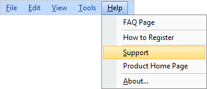

## Technical Support

Users with active subscription and users who are evaluating the software (pre-sale) may get technical support.

For technical questions, please send requests to [support@stimulsoft.com](mailto:support@stimulsoft.com)

For subscription, payment questions, send your questions [sales@stimulsoft.com](mailto:sales@stimulsoft.com)

For other inquiries, please use the e-mail address: [info@stimulsoft.com](mailto:info@stimulsoft.com)

If you have issues with our products, you may contact us through our feedback form at [http://www.stimulsoft.com/support.aspx](<%LINK_CAPTION%>)

It is possible to send questions from the standard UI of the report designer. To do this, select the Help menu -&gt; Support.

If you are an user with active subscription and you contact us for technical support, use the same email address you used when you purchased our product. Otherwise, it won't be easy to identify you as a client. This can slow down our response. Please let us know when your email address changes.

To solve your problem quickly, we need the following information:

* Product name and its version;

* A detailed description of the problem and how to reproduce it;

* Your operating system (98, ME, 2000, XP, Vista, Window 7, etc.), its version, and the localization of established service packs;

* The version of Microsoft .NET Framework or other development environment and installed service packs;

* A name of your development environment and its version;

* Additional information that can help us solve the problem.
