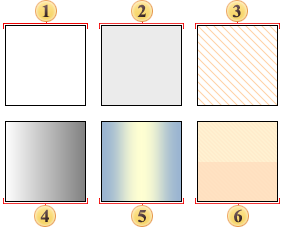

## Brush

To fill background and text drawing you can use various brushes. Each **Brush** is a separate facture, which can be filled both with one color and several.

To change a brush you should:
* Select a component in a report or a style in the designer of styles;
* Click the Browse button of the Brush property in the property panel;

* Select a definite brush in the drop-down menu.

When setting design of components, the following brushes are available:

* Empty;

* Solid;

* Hatch;

* Gradient;

* Glare;

* Glass.

Below you can see examples of the Brush.

 Empty

Component background is not filled with and remains transparent.

 Solid

Component background is filled with the color you specify.

 Hatch

Component background is filled with hatch. In addition, hatch background color and hatch color are specified.

 Gradient

Background is filled with gradient color transition. Gradient beginning is specified, the color of gradient ending and gradient angle.

 Glare

Background is filled with using the «Glare» effect.

 Glass

Background is filled with using the «Glass» effect.
