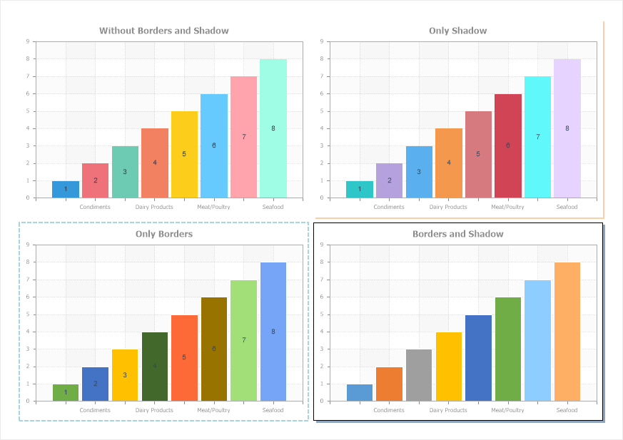
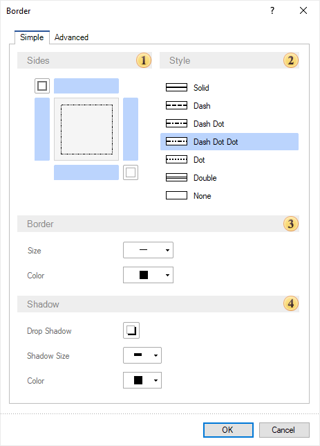
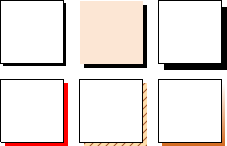
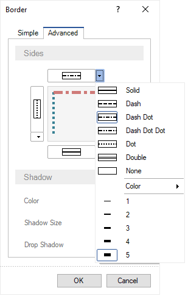
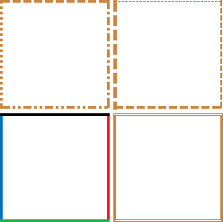

## Borders

Each component has borders. Since all components in a report are a rectangular area on the page, each component has top, bottom, left and right border. When creating reports, component borders can be displayed or not displayed in a rendered report. Besides, you can display component shadows.

Component borders are set:
* Using component properties from the **Borders** group in the property panel;

* Using commands on the Home tab of the Ribbon panel in the report designer;
* In the border editor and component shadows.

Component shadow is set:
* Using component properties from the **Borders** group in the property panel;

* In the Border editor and component shadow.

> **Information**
>
> If the **Style** is assigned for a component, border settings and component shadows can be taken from this style.

To call the border editor and component shadows, you should:
* Select a component in a report template;
* Click the **Browse** button on the Home Ribbon tab of the report designer panel in the **Borders** settings group.

* Or click the **Browse** button for the header of the Borders group in the property panel.

**Borders and component shadow editor**

This editor contains the parameters, which allow you to set borders and component shadows of a report. Also, the border and shadow editor contains two tabs:

* The **Simple**, i.e. settings of style, color, and size will be the same for all enabled component borders;

* The **Advanced,** i.e. you can define style, color and size for each component border.

You can define a uniform style, color, size for all component borders on the **Simple** tab.

 You can enable or disable the display of a definite component border in the **Sides** field using controls. Also, there is the button, which allows you to enable all borders and the button for disabling all borders.

 You can change the style of enabled component borders in the **Styles** field.

 The **Border** field contains several parameters:

* The **Size** parameter allows you to change border width;

* The **Color** parameter allows you to change component borders color.

 The **Shadow** field contains the parameters of component shadow settings:

* The **Drop Shadow** parameter allows you to enable or disable the display of component shadow.

* The **Shadow Size** parameter allows you to change component shadow width;

* The **Color** parameter allows you to change component shadow color.

> **Information**
>
> Border size is ignored, if border style is defined as the **Double**.

Examples of component sides borders:

Examples of different sizes of component borders:

Examples of different border colors:

Examples component shadow:

There is the **Browse** button on the **Advanced** tab of the border and component shadow editor, near the control for enabling and disabling the display of component borders. If you click this button, the drop down menu will be displayed, where you can change style, color, size only for the current border.

Also, there are parameters of component shadow setting on this tab.

The example of advanced setting of borders.

