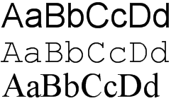
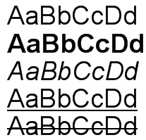
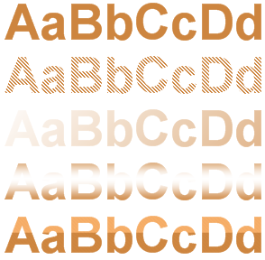
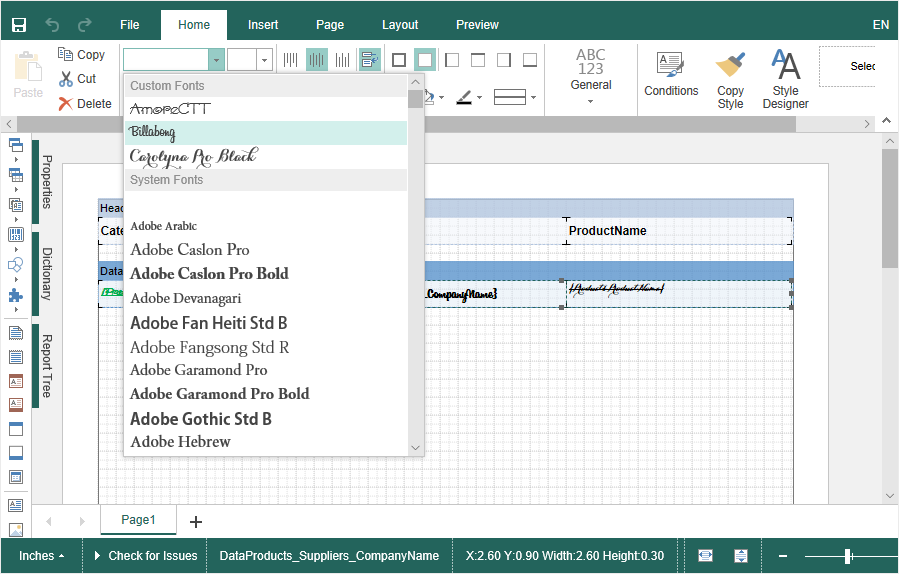
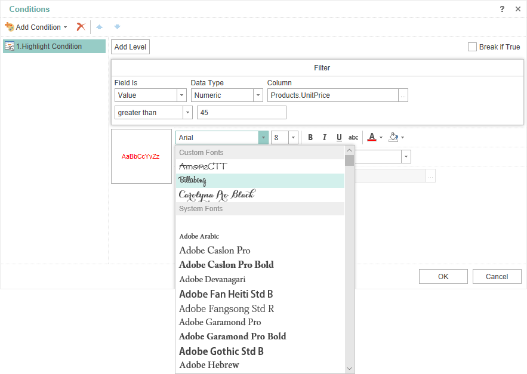
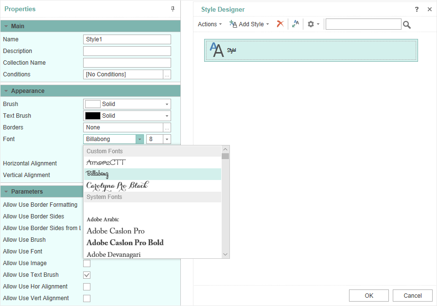

## Font

Basic tool of transferring information in reports is text. There are two components in the Stimulsoft Reports which are able to set and output some text using various kinds of font, they are Text and Rich Text. Font for typing text is set using the Font property. You can type some text using various font types. A font type is specified using the Font.Name property. You can see three types of font in the image below.

> **Information**
>
> The list of fonts, which is available in the report designer is formed from fonts, set to current operating system. For web products, it is formed from set fonts of the server operating system.

You can output some text using a font of different size. Sizes are specified using the Font.Size property. For example:

Also, when outputting you can use various text styles. Generally, five styles are available: regular, bold, underline and strikeout. Styles are controlled with the help of the following properties: Font.Bold, Font.Italic, Font.Underline, Font.Strikeout. Below you can see the examples of text outputting with the help of different styles:

Five kinds of brushes are available for text drawing: Solid, Hatch, Gradient, Glare, and Glass. The brush text is controlled using the Text Brush property. The example of using various brushes:

Custom fonts

When creating reports you can use custom fonts, which are absent in the list of fonts, i.e. they are not set to operating system by default. To do that, you should add font files (*.ttf, *.otf) to report sources. In this case, a font will be embedded to a report and can be used:

* When directly assigning a font to a text component. To do that you should make the following steps:

Step 1: Select a text component or several components;

Step 2: Select an added font on the Home tab of the ribbon report designer panel in the drop down menu

The font you select will be applied to all selected components.

* When conditional formatting of a component. To do that you should make the following steps:

Step 1: Select a text component;

Step 2: Click the Condition button on the Home tab of the ribbon report designer panel;

Step 3: Add a condition of the Highlight condition type;

Step 4: Define logical conditions of applying design settings;

Step 5: Click the Change Font button and select a custom font. Custom fonts are displayed in the top of the font list.

Step 6: Click the Ok button in the Font option, then click the button in the condition editor.

Now, when performing a logical condition, the custom font will be applied to the component.

* In report styles. To do that, you should make the following steps:

Step 1: Click the Style Designer on the Home ribbon of the report designer panel.

Step 2: Select a style and create a new one in the condition editor.

Step 3: Select a custom font for the Font property in the property panel. Custom fonts are displayed in the top of the font list.

Step 4: Click the Ok button in the condition editor.

The font will be changed for all components, for which this style is assigned, if another one is not defined with style settings or highlight condition.
